

**Porównanie istniejących algorytmów analityki obrazu - na podstawie algorytmów użytych w systemie Kamerdyner**

** **

<table class="MsoNormalTable" border="0" cellspacing="0" cellpadding="0" align="right" style="border-collapse:collapse;margin-left:6.75pt;margin-right:6.75pt">

<tbody>

<tr>

<td width="319" style="width:239.25pt;border:none;border-bottom:solid #BFBFBF 1.0pt;  padding:0cm 5.4pt 0cm 5.4pt">

Face recognition, human silhouette recognition and fall detection

</td>

</tr>

<tr>

<td width="319" style="width:239.25pt;border:none;border-bottom:solid #BFBFBF 1.0pt;
  padding:0cm 5.4pt 0cm 5.4pt">

Version 1.5

</td>

</tr>

<tr>

<td width="319" style="width:239.25pt;border:none;padding:0cm 5.4pt 0cm 5.4pt">

On 2017-10-01

</td>

</tr>

</tbody>

</table>

**  
**

<a name="_Toc488734921">Informacje o dokumencie</a>

<table class="MsoNormalTable" border="1" cellspacing="0" cellpadding="0" width="0" style="width:489.05pt;margin-left:5.4pt;background:#CCCCCC;border-collapse:
 collapse;border:none">

<tbody>

<tr style="height:1.0cm">

<td width="198" style="width:148.85pt;border:solid #BFBFBF 1.0pt;border-right:  none;background:#F3F3F3;padding:0cm 5.4pt 0cm 5.4pt;height:1.0cm">

**Wersja**

</td>

<td width="454" style="width:12.0cm;border:solid #BFBFBF 1.0pt;border-left:  none;background:white;padding:0cm 5.4pt 0cm 5.4pt;height:1.0cm">

**0.15**

</td>

</tr>

<tr style="height:1.0cm">

<td width="198" style="width:148.85pt;border-top:none;border-left:solid #BFBFBF 1.0pt;
  border-bottom:solid #BFBFBF 1.0pt;border-right:none;background:#F3F3F3;
  padding:0cm 5.4pt 0cm 5.4pt;height:1.0cm">

**Data**

</td>

<td width="454" style="width:12.0cm;border-top:none;border-left:none;
  border-bottom:solid #BFBFBF 1.0pt;border-right:solid #BFBFBF 1.0pt;
  background:white;padding:0cm 5.4pt 0cm 5.4pt;height:1.0cm">

**2017-10-01**

</td>

</tbody>

</table>

**  
****Historia zmian**

<table class="MsoNormalTable" border="1" cellspacing="0" cellpadding="0" width="0" style="width:489.05pt;margin-left:5.4pt;border-collapse:collapse;border:none">

<tbody>

<tr style="height:36.0pt">

<td width="66" style="width:49.65pt;border:solid #BFBFBF 1.0pt;border-right:  none;background:#F3F3F3;padding:0cm 5.4pt 0cm 5.4pt;height:36.0pt">

**Wersja**

</td>

<td width="340" style="width:9.0cm;border-top:solid #BFBFBF 1.0pt;border-left:  none;border-bottom:solid #BFBFBF 1.0pt;border-right:none;background:#F3F3F3;
  padding:0cm 5.4pt 0cm 5.4pt;height:36.0pt">

**Opis**

</td>

<td width="246" style="width:184.25pt;border:solid #BFBFBF 1.0pt;border-left:  none;background:#F3F3F3;padding:0cm 5.4pt 0cm 5.4pt;height:36.0pt">

**Data**

</td>

</tr>

<tr style="height:36.0pt">

<td width="66" style="width:49.65pt;border-top:none;border-left:solid #BFBFBF 1.0pt;
  border-bottom:solid #BFBFBF 1.0pt;border-right:none;background:white;
  padding:0cm 5.4pt 0cm 5.4pt;height:36.0pt">

**0.1**

</td>

<td width="340" style="width:9.0cm;border:none;border-bottom:solid #BFBFBF 1.0pt;
  background:white;padding:0cm 5.4pt 0cm 5.4pt;height:36.0pt">

Utworzenie dokumentu

</td>

<td width="246" style="width:184.25pt;border-top:none;border-left:none;
  border-bottom:solid #BFBFBF 1.0pt;border-right:solid #BFBFBF 1.0pt;
  padding:0cm 5.4pt 0cm 5.4pt;height:36.0pt">

2017-07-27

</td>

</tr>

<tr style="height:36.0pt">

<td width="66" style="width:49.65pt;border-top:none;border-left:solid #BFBFBF 1.0pt;
  border-bottom:solid #BFBFBF 1.0pt;border-right:none;background:white;
  padding:0cm 5.4pt 0cm 5.4pt;height:36.0pt">

**0.2**

</td>

<td width="340" style="width:9.0cm;border:none;border-bottom:solid #BFBFBF 1.0pt;
  background:white;padding:0cm 5.4pt 0cm 5.4pt;height:36.0pt">

Wstępne informacje o EmguCV, LBP, Optical Flow, OpenCV

</td>

<td width="246" style="width:184.25pt;border-top:none;border-left:none;
  border-bottom:solid #BFBFBF 1.0pt;border-right:solid #BFBFBF 1.0pt;
  padding:0cm 5.4pt 0cm 5.4pt;height:36.0pt">

2017-09-18

</td>

</tr>

<tr style="height:36.0pt">

<td width="66" style="width:49.65pt;border-top:none;border-left:solid #BFBFBF 1.0pt;
  border-bottom:solid #BFBFBF 1.0pt;border-right:none;background:white;
  padding:0cm 5.4pt 0cm 5.4pt;height:36.0pt">

**1.0**

</td>

<td width="340" style="width:9.0cm;border:none;border-bottom:solid #BFBFBF 1.0pt;
  background:white;padding:0cm 5.4pt 0cm 5.4pt;height:36.0pt">

Uzupełnienie dokumentacji o wyniki eksperymentów z algorytmem LBP

</td>

<td width="246" style="width:184.25pt;border-top:none;border-left:none;
  border-bottom:solid #BFBFBF 1.0pt;border-right:solid #BFBFBF 1.0pt;
  padding:0cm 5.4pt 0cm 5.4pt;height:36.0pt">

2017-09-20

</td>

</tr>

<tr style="height:36.0pt">

<td width="66" style="width:49.65pt;border-top:none;border-left:solid #BFBFBF 1.0pt;
  border-bottom:solid #BFBFBF 1.0pt;border-right:none;background:white;
  padding:0cm 5.4pt 0cm 5.4pt;height:36.0pt">

**1.1**

</td>

<td width="340" style="width:9.0cm;border:none;border-bottom:solid #BFBFBF 1.0pt;
  background:white;padding:0cm 5.4pt 0cm 5.4pt;height:36.0pt">

Dodanie opisu algorytmu Haar

</td>

<td width="246" style="width:184.25pt;border-top:none;border-left:none;
  border-bottom:solid #BFBFBF 1.0pt;border-right:solid #BFBFBF 1.0pt;
  padding:0cm 5.4pt 0cm 5.4pt;height:36.0pt">

2017-09-21

</td>

</tr>

<tr style="height:36.0pt">

<td width="66" style="width:49.65pt;border-top:none;border-left:solid #BFBFBF 1.0pt;
  border-bottom:solid #BFBFBF 1.0pt;border-right:none;background:white;
  padding:0cm 5.4pt 0cm 5.4pt;height:36.0pt">

**1.2**

</td>

<td width="340" style="width:9.0cm;border:none;border-bottom:solid #BFBFBF 1.0pt;
  background:white;padding:0cm 5.4pt 0cm 5.4pt;height:36.0pt">

Opracowanie wyników badań algorytmów rozpoznawania twarzy

</td>

<td width="246" style="width:184.25pt;border-top:none;border-left:none;
  border-bottom:solid #BFBFBF 1.0pt;border-right:solid #BFBFBF 1.0pt;
  padding:0cm 5.4pt 0cm 5.4pt;height:36.0pt">

2017-09-25

</td>

</tr>

<tr style="height:36.0pt">

<td width="66" style="width:49.65pt;border-top:none;border-left:solid #BFBFBF 1.0pt;
  border-bottom:solid #BFBFBF 1.0pt;border-right:none;background:white;
  padding:0cm 5.4pt 0cm 5.4pt;height:36.0pt">

**1.3**

</td>

<td width="340" style="width:9.0cm;border:none;border-bottom:solid #BFBFBF 1.0pt;
  background:white;padding:0cm 5.4pt 0cm 5.4pt;height:36.0pt">

Opracowanie detekcji upadku

</td>

<td width="246" style="width:184.25pt;border-top:none;border-left:none;
  border-bottom:solid #BFBFBF 1.0pt;border-right:solid #BFBFBF 1.0pt;
  padding:0cm 5.4pt 0cm 5.4pt;height:36.0pt">

2017-09-28

</td>

</tr>

<tr style="height:36.0pt">

<td width="66" style="width:49.65pt;border-top:none;border-left:solid #BFBFBF 1.0pt;
  border-bottom:solid #BFBFBF 1.0pt;border-right:none;background:white;
  padding:0cm 5.4pt 0cm 5.4pt;height:36.0pt">

**1.4**

</td>

<td width="340" style="width:9.0cm;border:none;border-bottom:solid #BFBFBF 1.0pt;
  background:white;padding:0cm 5.4pt 0cm 5.4pt;height:36.0pt">

Opracowanie wpływu parametrów algorytmów rozpoznawania twarzy i śledzenia obiektów na ich skuteczność.

</td>

<td width="246" style="width:184.25pt;border-top:none;border-left:none;
  border-bottom:solid #BFBFBF 1.0pt;border-right:solid #BFBFBF 1.0pt;
  padding:0cm 5.4pt 0cm 5.4pt;height:36.0pt">

2017-09-29

</td>

</tr>

<tr style="height:36.0pt">

<td width="66" style="width:49.65pt;border-top:none;border-left:solid #BFBFBF 1.0pt;
  border-bottom:solid #BFBFBF 1.0pt;border-right:none;background:white;
  padding:0cm 5.4pt 0cm 5.4pt;height:36.0pt">

**1.5**

</td>

<td width="340" style="width:9.0cm;border:none;border-bottom:solid #BFBFBF 1.0pt;
  background:white;padding:0cm 5.4pt 0cm 5.4pt;height:36.0pt">

Ukończenie dokumentu

</td>

<td width="246" style="width:184.25pt;border-top:none;border-left:none;
  border-bottom:solid #BFBFBF 1.0pt;border-right:solid #BFBFBF 1.0pt;
  padding:0cm 5.4pt 0cm 5.4pt;height:36.0pt">

2017-10-01

</td>

</tr>

</tbody>

</table>

  

Spis treści

[1. OpenCV.. 9](#_Toc494697037)

[1.1. Wstęp. 9](#_Toc494697038)

[1.2. Historia. 9](#_Toc494697039)

[1.3. Aplikacje. 10](#_Toc494697040)

[1.4. Języki programowania. 11](#_Toc494697041)

[2. EmguCV.. 12](#_Toc494697042)

[2.1. Wstęp. 12](#_Toc494697043)

[2.2. Zalety. 12](#_Toc494697044)

[2.3. Budowa EmguCV.. 13](#_Toc494697045)

[2.4. Licencja. 14](#_Toc494697046)

[2.5. Wydajność. 14](#_Toc494697047)

[2.6. Rozpoznawanie krawędzi i konturów.. 14](#_Toc494697048)

[2.7. Rozpoznawanie twarzy. 15](#_Toc494697049)

[2.8. Algorytmy nauczania maszynowego udostępniane przez EmguCV. 15](#_Toc494697050)

[3. Metody śledzenia/wykrywania ruchu. 16](#_Toc494697051)

[3.1. Metody różnicowe. 20](#_Toc494697052)

[3.2. Metody gradientowe. 22](#_Toc494697053)

[3.3. Metody częstotliwościowe. 26](#_Toc494697054)

[3.4. Metody korelacyjne. 27](#_Toc494697055)

[4. Algorytmy śledzenia rozpoznanych obiektów- wpływ wyboru parametrów na poszczególne algorytmy 33](#_Toc494697056)

[4.1. Poszukiwanie informacji  33](#_Toc494697057)

[4.2. Optical flow.. 33](#_Toc494697058)

[4.2.1. Algorytmy Meanshift oraz Camshift. 34](#_Toc494697059)

[4.3. Lucas-Kanade Optical Flow.. 37](#_Toc494697060)

[4.3.1. Przeprowadzone testy. 40](#_Toc494697061)

[4.3.2. Wyniki dla zmian parametrów Lucas-Kanade. 40](#_Toc494697062)

[4.4. Farneback (Dense) Optical Flow.. 46](#_Toc494697063)

[4.4.1. Wyniki dla zmian parametrów Farneback. 48](#_Toc494697064)

[5. Algorytmy śledzenia twarzy w płaszczyźnie. 55](#_Toc494697065)

[5.1. Śledzenie oczu. 55](#_Toc494697066)

[5.1.1. Wykrywanie zmian. 57](#_Toc494697067)

[5.1.2. Test symetrii  57](#_Toc494697068)

[5.1.3. Śledzenie źrenic. 58](#_Toc494697069)

[5.2. Algorytm Lucas-Kanade. 61](#_Toc494697070)

[5.3. Algorytm Horn-Schunck. 65](#_Toc494697071)

[5.4. Algorytmy Mean-Shift i Camshift. 67](#_Toc494697072)

[5.5. Filtr Kalmana. 70](#_Toc494697073)

[5.6. Przykład zastosowania. 70](#_Toc494697074)

[5.6.1. Inicjalizacja. 70](#_Toc494697075)

[5.7. Obserwacje / porównanie algorytmów.. 74](#_Toc494697076)

[5.7.1. Algorytm CAMSHIFT. 74](#_Toc494697077)

[5.7.2. Algorytm Lucas-Kanade. 74](#_Toc494697078)

[5.7.3. CAMSIFT I Lucas-Kanade. 75](#_Toc494697079)

[5.7.4. Śledzenie źrenic. 76](#_Toc494697080)

[5.7.5. Porównanie algroytmów.. 77](#_Toc494697081)

[6. Detekcja upadku (kamera statyczna RGB). 78](#_Toc494697082)

[6.1. Wstęp. 78](#_Toc494697083)

[6.2. Wstępne przetwarzanie sygnału wideo. 79](#_Toc494697084)

[6.3. Często występujące problemy. 79](#_Toc494697085)

[6.4. Ogólny podział metod (kontekst pojedynczej klatki, kontekst sekwencji).  85](#_Toc494697086)

[6.4.1. Podział ze względu na rodzaj kamer. 86](#_Toc494697087)

[6.4.2. Podział ze względu na ilość kamer. 88](#_Toc494697088)

[6.4.3. Podział ze względu na umiejscowienie kamer. 89](#_Toc494697089)

[6.4.4. Podział ze względu na rodzaj algorytmu. 89](#_Toc494697090)

[6.5. Analiza poszczególnych algorytmów detekcji upadku. 90](#_Toc494697091)

[6.5.1. Podstawowa estymacja postawy oraz detekcja ruchu obserwowanej osoby.  90](#_Toc494697092)

[6.5.2. Śledzenie pozycji głowy.  108](#_Toc494697093)

[6.5.3. Estymacja postawy za środka ciężkości sylwetki (centroidu) oraz VPS (Vertical Projection Histogram).  128](#_Toc494697094)

[6.5.4. Analiza aktywności i strefy pomieszczeń.  136](#_Toc494697095)

[6.5.5. Analiza ruchu po upadku. 145](#_Toc494697096)

[6.5.6. Ukryte modele markowa korzystające z wideo i audio.  148](#_Toc494697097)

[6.5.7. PCANet + SVM... 155](#_Toc494697098)

[6.5.8. Spatial temporal interest points.  162](#_Toc494697099)

[6.5.9. Pictorial Structures for Articulated Pose Estimation. 173](#_Toc494697100)

[6.5.10. Wnioskowanie rozmyte bazujące na upadku i czasu nieaktywności osoby.  178](#_Toc494697101)

[7. LBP. 183](#_Toc494697102)

[7.1. Wstęp. 183](#_Toc494697103)

[7.2. Działanie algorytmu. 183](#_Toc494697104)

[7.3. LBP Extended. 184](#_Toc494697105)

[7.4. Porównywanie histogramów.. 184](#_Toc494697106)

[7.5. Jednorodność. 186](#_Toc494697107)

[7.6. LBP i rozpoznawanie twarzy. 186](#_Toc494697108)

[7.7. Zależność efektywności wykrywania obrazu od kolejnych parametrów.. 188](#_Toc494697109)

[7.8. Analiza parametrów dla LBP. 198](#_Toc494697110)

[8. Porównanie algorytmów LBP i Haar. 202](#_Toc494697111)

[9. Wstępne przetwarzanie obrazu dla algorytmów Eigenfaces oraz Fisherfaces. 204](#_Toc494697112)

[9.1. Obróbka obrazu dla detekcji twarzy. 204](#_Toc494697113)

[9.2. Rozpoznawanie twarzy. 208](#_Toc494697114)

[9.3. Przetwarzanie wykrytej twarzy. 210](#_Toc494697115)

[9.4. Wykrywanie obszaru oczu. 211](#_Toc494697116)

[9.5. Kombinacja transformacji  214](#_Toc494697117)

[9.6. Oddzielne wyrównywanie histogramów dla prawej oraz lewej strony. 217](#_Toc494697118)

[9.7. Wygładzanie. 220](#_Toc494697119)

[9.8. Maska eliptyczna. 221](#_Toc494697120)

[10. Wykorzystanie sieci neuronowych w rozpoznawaniu twarzy. 223](#_Toc494697121)

[10.1. Wstęp. 223](#_Toc494697122)

[10.2. Typy sieci neuronowych w rozpoznawaniu twarzy. 225](#_Toc494697123)

[10.3. Zastosowanie. 226](#_Toc494697124)

[11. Łączenie klasyfikatorów detekcji twarzy w celu polepszenia wyników.. 229](#_Toc494697125)

[11.1. Framework. 229](#_Toc494697126)

[11.2. Rezultaty eksperymentalne. 231](#_Toc494697127)

[11.3. Spostrzeżenia. 236](#_Toc494697128)

[12. Wpływ niskiej rozdzielczości na jakość detekcji i rozpoznawania twarzy. 242](#_Toc494697129)

[12.1. Biometryczne standardy rozpoznawania twarzy odnoszące się do CCTV.. 242](#_Toc494697130)

[12.2. Wpływ na detekcję twarzy. 246](#_Toc494697131)

[12.3. Doświadczalny wpływ rozdzielczości na proces detekcji twarzy. 250](#_Toc494697132)

[12.4. Badanie wpływu źródła światła na detekcję twarzy. 251](#_Toc494697133)

[12.5. Rozpoznawanie twarzy. 256](#_Toc494697134)

[12.6. Wpływ rozdzielczości obrazu na rozpoznawanie twarzy. 258](#_Toc494697135)

[13. Algorytmy detekcji źródła i kąta padania światła w kontekście rozpoznawania twarzy. 265](#_Toc494697136)

[13.1. Poszukiwanie informacji  265](#_Toc494697137)

[13.2. Jak sprawić, by oświetlenie nie wpływało negatywnie na działanie algorytmów rozpoznawania twarzy? 265](#_Toc494697138)

[13.3. Normalizacja światła. 266](#_Toc494697139)

[13.4. Optymalny kąt padania światła. 275](#_Toc494697140)

[13.5. Zwiększanie skuteczności algorytmu przez dobór oświetlenia. 277](#_Toc494697141)

[14. Literatura. 281](#_Toc494697142)

# <a name="_Toc494697037">1. OpenCV</a>

## <a name="_Toc494697038">1.1. Wstęp</a>

OpenCV (ang. Open Source Computer Vision Library) - to biblioteka funkcji, przeznaczonych głównie do przetwarzania obrazu w czasie rzeczywistym. Początkowo opracowana przez firmę Intel, później wspierana przez Willow Garage, a teraz prowadzona przez Itseez. Biblioteka jest multiplatformowa i dopuszczona do wolnego użytku na licencji BSD, dlatego jest bezpłatna do celów akademickich, jak i komercyjnych. OpenCV wspiera frameworki Deep Learning, TensorFlow, Torch/PyTorch i Caffe.

Biblioteka posiada interfejsy do języków: C++, C, Java i Python oraz obsługuje systemy Windows, Linux, Mac OS, iOS i Android. Napisana jest w języku C/C++, co pozwala korzystać z przetwarzania wielordzeniowego.

## <a name="_Toc494697039">1.2. Historia</a>

Oficjalnie uruchomiony w 1999 roku projekt OpenCV był początkowo inicjatywą Intel Research w celu przyspieszenia aplikacji wymagających dużej ilości CPU.

Głównymi jego celami były:

· Zaawansowane badania wizualne, które zapewnią nie tylko otwarty, ale także zoptymalizowany kod, dla podstawowej infrastruktury wizualnej.

· Propagowanie wiedzy na temat rozpoznawania obrazu poprzez udostępnianie wspólnej infrastruktury, którą programiści mogliby wykorzystać, dzięki czemu kod byłby bardziej czytelny i przenośny.

· Zaawansowane aplikacje komercyjne oparte na przetwarzaniu obrazu, dzięki udostępnieniu bezpłatnego, przenośnego kodu, zoptymalizowanego pod kątem wydajności.

Pierwsza wersja alfa OpenCv została udostępniona opinii publicznej w 2000 roku podczas konferencji IEEE Conference on Computer Vision and Pattern Recognition. Kolejne pięć wersji beta powstały w latach 2001 - 2005\. Wersja 1.0 została wydana w 2006 roku. Wersja 1.1 "pre-release" w 2008 r.

W październiku 2009 roku wydano drugą wersję biblioteki OpenCV, która zawierała w sobie duże zmiany dotyczące interfejsu w C++, które miały na celu uproszczenia go, usprawnienie i dodanie nowych funkcji.

W sierpniu 2012 roku wsparcie dla OpenCV zostało przejęte przez organizację non-profit OpenCV.org.

## <a name="_Toc494697040">1.3. Aplikacje</a>

Obszary zastosowań OpenCV obejmują:

· Zestawy narzędzi 2D i 3D

· Oszacowanie egomotyczne

· System rozpoznawania twarzy

· Rozpoznawanie gestów

· Interakcja człowiek-komputer

· Robotyka mobilna

· Zrozumienie ruchu

· Identyfikacja obiektu

· Segmentacja i rozpoznawanie

· Stereofis stereofoniczny wizji: percepcja głębokości z dwóch kamer

· Struktura z ruchu

· Rozszerzona rzeczywistość

Aby wspierać niektóre z powyższych obszarów, OpenCV ma w sobie statystyczną bibliotekę nauczania maszynowego, która zawiera:

· Nauka drzewa decyzyjnego

· Gradient pobudzający drzewa

· Algorytm maksymalizacji oczekiwania k-najbliższy algorytm sąsiedztwa

· Klasyfikator Naive Bayes

· Sztuczne sieci neuronowe

· Losowy las

· Maszyna wektora nośnego

· Głębokie sieci neuronowe

## <a name="_Toc494697041">1.4. Języki programowania</a>

OpenCV jest napisane w języku C++, który jest równocześnie jego głównym interfejsem, lecz wciąż zachowuje mniej wszechstronny, ale szeroki interfejs w języku C. Istnieją powiązania z językiem Python, Java i MATLAB/OCTAVE. API tych interfejsów może być znalezione w dokumentacji online. Wrappery do innych języków takich jak C#, Perl, Ch, Haskell i Ruby zostały opracowane w celu zachęcenia szerszej publiczności. Wszystkie nowe algorytmy oraz usprawnienia w OpenCV są teraz rozwijane w interfejsie C++.

# <a name="_Toc494697042">2. EmguCV</a>

## <a name="_Toc494697043">2.1. Wstęp</a>

Emgu CV to platforma cross-platform .Net do biblioteki przetwarzania obrazu OpenCV. Dzięki niej możemy przetwarzać i analizować statyczne i ruchome obrazy oraz inne sygnały cyfrowe.

Korzystając z takiego wrappera jak Emgu CV możliwe jest wykorzystanie bardzo zoptymalizowanej biblioteki bezpośrednio z C#, bez konieczności schodzenia do niskopoziomowej implementacji w C.

Do przykładowych zastosowań Emgu CV należą aplikacje do sprawdzania jakości produktów w fabrykach, medyczne przetwarzanie obrazów, kalibracje kamer i zastosowania w szeroko pojętej robotyce. Poza przetwarzaniem obrazu wrapper również pozwala korzystać z biblioteki nauczania maszynowego pochodzącej z OpenCV. (“Emgu CV Essentials”, Shin Shi, 2013)

Pakiet może być kompilowany przez Visual Studio, Xamarin Studio i Unity, może działać na systemach Windows, Linux, Mac OS X, iOS, Android i Windows Phone.

## <a name="_Toc494697044">2.2. Zalety</a>

Główne zalety platformy:

· Emgu CV jest w całości napisany w C#. Korzyścią jest to, że można go skompilować w Mono, a zatem może działać na dowolnych platformach Mono, w tym iOS, Android, Windows Phone, Mac OS X i Linux.

· Image Class z ogólnym kolorem i głębokością

· Automatyczne gromadzenie śmieci.

· XML Serializable Image

· Dokumentacja XML i pomoc techniczna

## <a name="_Toc494697045">2.3. Budowa EmguCV</a>

Emgu CV ma dwie główne warstwy, jak pokazano na schemacie:

Ogólny zarys architektury

· Warstwa podstawowa (layer 1) zawiera odwzorowania funkcji, struktur i wyliczeń, które bezpośrednio odzwierciedlają te w OpenCV

· Druga warstwa (layer 2) zawiera klasy łączące zalety świata .NET

## <a name="_Toc494697046">2.4. Licencja</a>

EmguCV oparta jest na licencji GPLv3, co znaczy, że produkt oparty na niej musi być open-source i darmowy. Możliwe jest uzyskanie licencji komercyjnej po umieszczeniu opłaty. (“Emgu CV Essentials”, Shin Shi, 2013).

## <a name="_Toc494697047">2.5. Wydajność</a>

Według (“Emgu CV Essentials”, Shin Shi, 2013) na podstawie prostych operacji na obrazach czarno-białych Emgu CV zajmuje trzecie miejsce pod względem szybkości przetwarzania (po bibliotece OpenCV napisanej w C oraz trudnej metody wywoływania jej za pomocą P/Invoke w C#).

## <a name="_Toc494697048">2.6. Rozpoznawanie krawędzi i konturów</a>

W EmguCV możliwe jest korzystanie z detektora Canny Edge w celu rozpoznawania krawędzi. Poniższy kod z książki (“Emgu CV Essentials”, Shin Shi, 2013) pozwoli na stworzenie prostego czarno-białego outline’u obrazu.

Zastosowanie algorytmu wykrywania krawędzi Canny

Po wykryciu krawędzi w formie osobnych pikseli możliwe jest też ich połączenie w kontury. Odpowiada za to funkcja FindCountours(). Wynik tej funkcji może zostać przetransformowany w łańcuch Freemana, czyli sekwencji kolejnych kroków wartości. 

Dodatkową funkcjonalnością EmguCV jest możliwość konwertowania konturów do polygonów.

## <a name="_Toc494697049">2.7. Rozpoznawanie twarzy</a>

Proces rozpoznawania twarzy składa się z Preprocessingu obrazu lub wideo, detekcji twarzy, rozpoznawania cech charakterystycznych oraz dopasowywania ich do danych z bazy.

Ważną częścią rozpoznawania twarzy są algorytmy nauczania maszynowego. Są one w stanie na podstawie obrazów treningowych nauczyć się rozróżniać pomiędzy obrazami zawierającymi twarze a inne obiekty.

## <a name="_Toc494697050">2.8. Algorytmy nauczania maszynowego udostępniane przez EmguCV</a>

· ANN_MLP

· Boost

· DTree

· EM

· GBTrees

· KNearest

· NormalBayesClassifier

· HaarCascade

· CascadeClassifer

· Facerecognizer

# <a name="_Toc494697051">3. Metody śledzenia/wykrywania ruchu</a>

Podstawowym zagadnieniem przy parametryzacji ruchu jest wyznaczanie wektora ruchu pomiędzy dwoma następującymi po sobie obrazami z sekwencji. W celu opisania tego procesu, warto zwrócić uwagę na następujące terminy.

· pole ruchu (ang. motion field) - pojęcie czysto geometryczne, definiowane jako zrzutowanie przestrzeni rzeczywistych trójwymiarowych wektorów na płaszczyznę obrazu. Otrzymane pole wektorowe zawiera informacje o składowej wektora ruchu obiektu równoległej do płaszczyzny obrazu. Brak informacji o składowej prostopadłej powoduje, ˙ze nie jest możliwe odtworzenie z niego pierwotnej informacji - rzeczywistego wektora ruchu.

· przepływ optyczny (ang. optical flow) - jest to pole wektorowe zawierające informacje umożliwiające przekształcenie jednego obrazu w drugi poprzez wykonanie transformacji przemieszczającej obszary z pierwszego obrazu zgodnie z wektorem przepływu optycznego do drugiego obrazu. A zatem przepływ optyczny nie jest ściśle zdeterminowany, a co za tym idzie, możliwe jest znalezienie wielu pól wektorowych umożliwiających transformacje obrazu pierwszego w drugi. Przykładową interpretację przedstawiono na rysunku.

Róznica pomiędzy polem ruchu, a przepływem optycznym

Wydaje się, że powyższe definicje są jednakowe, w rzeczywistości istnieje znacząca różnica pomiędzy nimi. Mianowicie: pole ruchu mówi o rzeczywistym ruchu obiektów, natomiast przepływ optyczny jest interpretacją zmieniającego się obrazu.

Można jednak przy pewnych założeniach przyjąć, że pole przepływu jest aproksymacją pola ruchu, który jest wygodnym i łatwym w interpretacji sposobem reprezentacji ruchu na obrazie. Dzisiejsze procesory są w stanie bez większych problemów analizować obrazy nadchodzące ze standardowych kamer nawet w czasie rzeczywistym, zapewniając użytkownikowi możliwość efektywnego wykorzystania skomplikowanych algorytmów obróbki i analizy obrazu.

Nie zmienia to faktu, że metody estymacji przepływu optycznego obarczone są różnego rodzaju problemami Do najważniejszych z nich należą:

· problem szczelinowy _(ang. aperture problem) __- _problem błędnego określenia ruchu w przypadku lokalnych zmian jasności obrazu, które mają charakter jednowymiarowy.

· jednolita barwa lub przeźroczystość - brak tekstury może skutkować błędnym określeniem wektora przepływu, gdyż na obrazie ruch takiego obiektu może być niezauważalny, np. obrót kuli o jednolitym ubarwieniu;

· zmienne oświetlenie - może być powodem powstania pozornych ruchów związanych z przesuwaniem się cieni na powierzchniach obiektów, bądź z przemieszczaniem się gra­dientów jasności wykorzystywanych przez znaczną część algorytmów śledzenia ruchu; pomocne w takich sytuacjach mogą być techniki kompensacji oświetlenia oraz posługiwanie się kolorem obrazu w dziedzinie HSV ;

· zachodzenie obiektów na siebie - powoduje zanikanie, pojawianie się, bądź iluzję zmiany obiektów poruszających się na obrazie; w takich przypadkach wyjątkowo trudno jest znaleźć transformację, gdy poszczególne obszary z pierwszego obrazu nie mają swoich odpo­wiedników na kolejnym obrazie. Prowadzi to do błędnego wskazania wektora przepływu; niemniej jednak taką informację także można wykorzystać do analizy ruchu na obrazie, tzn.: przepływ optyczny wyznaczony na krawędzi obszaru zachodzenia obiektów może zostać wykorzystany do wyznaczenia kierunku jej translacji i segmentacji sceny na niezależnie poruszające się przedmioty;

· specyficzne teksturowanie - zmiany jasności na obiekcie, które występują wzdłuż tylko jednego kierunku mogą prowadzić do utraty informacji o ruchu. Czasami zmiany takie są wywołane specyficznym wzorem, który znajduje się na poruszającym się obiekcie.

Problem szczelinowy

Istnieje wiele metod wykrywania i śledzenia ruchu na obrazie. W dalszej części pracy zostaną przedstawione głównie metody zaimplementowane w wykorzystywanej w części praktycznej bibliotece OpenCV. Metody detekcji/śledzenia ruchu możemy podzielić na 4 podstawowe grupy ze względu na sposób działania:

· różnicowe - umożliwiające detekcję i śledzenie ruchu dzięki różnicom pomiędzy następującymi klatkami,

· gradientowe - opierające się na wyznaczaniu pochodnych czasowych i przestrzennych obrazu,

· częstotliwościowe - bazujące na filtrach operujących w dziedzinie częstotliwości,

· korelacyjne - przeszukujące obraz w poszukiwaniu dopasowania regionów.

Pomimo zróżnicowania opisywanych metod można wyróżnić 3 wspólne etapy przetwarzania:

· wstępne filtrowanie lub wygładzanie przy użyciu dolno- lub pasmowo-przepustowych filtrów w celu uwydatnienia interesujących nas sygnałów oraz wzmocnienia stosunku sygnału do szumu (SNR-Signal to Noise Ratio);

· przeprowadzenie podstawowych pomiarów takich jak: pochodne czasoprzestrzenne lub lokalne powierzchnie korelacji;

· integracja powyższych danych w celu stworzenia 2-wymiarowego pola przepływu

Wstępna obróbka obrazu okazuje się być bardzo ważną czynnością, pozwalającą znacznie zwiększyć zarówno jakość jak i wydajność algorytmów.

## <a name="_Toc494697052">3.1. Metody różnicowe</a>

Pierwszą z metod i zarazem najbardziej podstawową jest metoda różnicowa. Jest to bardzo wydajna i czuła metoda detekcji zmian zachodzących w kolejnych sekwencjach obrazów. Cechy te sprawiły, że stała się bardzo popularna w systemach detekcji (a po rozwinięciu, także śledzenia) ruchu, w przypadkach, gdy korzysta się ze stacjonarnych kamer wykorzystywanych do obserwowania dynamicznej sceny. Metody różnicowe nie skupiają się na wyliczeniu pola przepływu optycznego, a na prostym wyodrębnieniu poruszającego się obiektu.

Wynik działania algorytmu różnicowego – białe pola oznaczają wykryte zmiany na obrazie

Zasadniczą wadą algorytmów różnicowych jest ograniczenie ich zastosowania do sekwencji pobranych ze stacjonarnych kamer. W przypadku, gdyby kamera, z której jest pobierany obraz była w ruchu, po odjęciu klatek, okazałoby się, że prawie każdy piksel obrazu uległ zmianie. Zasadniczym rozwinięciem podstawowego algorytmu różnicowego było stworzenie metody budowania obrazu historii ruchu (ang. MHI - Motion History Image). Na obrazie takim intensywność piksela zależy od chwilowego ruchu w tym punkcie, tzn.: poruszający się obiekt pozostawia, w każdej kolejnej klatce, swoją sylwetkę rzutowaną na płaszczyznę (na zasadzie zwykłego algorytmu różnicowego), a z każdą następną klatką jasność starszych sylwetek jest zmniejszana. Przy takim podejściu, gradient obrazu MHI wyznacza bezpośrednio kierunek ruchu, a nawet w pewnym sensie jego prędkość. Reprezentacja ruchu za pomocą obrazu MHI jest bardzo wydajną techniką śledzenia.

Proces tworzenia obrazu historii ruchu - MHI

## <a name="_Toc494697053">3.2. Metody gradientowe</a>

Techniki gradientowe są jedną z najbardziej rozwiniętych grup algorytmów wyznaczających przepływ optyczny. Obliczenia te są oparte o pochodne przestrzenno-czasowe intensywności obrazu. Ich zastosowanie zakłada, że dziedzina obrazu jest ciągła (lub różniczkowalna) w przestrzeni i czasie. Algorytmy z dziedziny metod gradientowych opierają się na 3 głównych założeniach:

· stałe oświetlenie - jasność piksela danego obiektu nie zmienia się podczas ewentualnego ruchu pomiędzy kolejnymi klatkami obrazu;

· niewielkie przesunięcia - w praktyce oznacza to, że obiekty nie poruszają się zbyt szybko na obrazie;

· spójność przestrzenna - sąsiadujące punkty należą do tych samych powierzchni i wykonują podobne ruchy.

Założenia metod gradientowych: stałe oświetlenie (góra), powolny ruch w stosunku do ilości klatek (lewy róg), spójność sąsiadujących punktów (prawy róg)

Założenia te pozwalają stworzyć efektywne algorytmy śledzenia ruchu. Pierwsze z nich zakłada, że jasność śledzonego punktu nie będzie się zmieniała w czasie

Niezmienność jasności w czasie

Drugie założenie mówi, że ruch jest mały w następujących po sobie klatkach. Założenie to gwarantuje, że w przypadku jednolitego oświetlenia, pierwsze z nich także będzie spełnione, poza szczególnymi sytuacjami takimi jak zachodzące na siebie krawędzie. Po kolejnych przekształceniach, otrzymujemy:

Równanie ograniczenia przepływu optycznego

Równanie to nazywane jest: równaniem ograniczenia przepływu optycznego i definiuje pojedyncze, lokalne ograniczenie na wektor prędkości optycznej. Poniższy rysunek przedstawia prostą zdefiniowaną przez to ograniczenie.

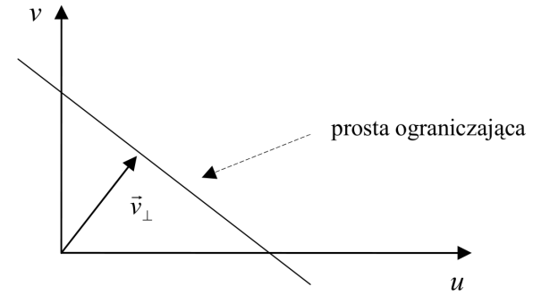

Prosta ograniczająca w przestrzeni prędkości

Wśród metod gradientowych należy wyróżnić dwa podejścia: globalne i lokalne. Pierwsze z nich wykorzystują równanie ograniczające przepływ optyczny wraz z dodatkowymi globalnymi ograniczeniami, zazwyczaj na szybkość zmian prędkości optycznej. W efekcie otrzymuje się tzw. "gęste pole przepływu" określające ruch dla większej ilości punktów (często dla wszystkich punktów obrazu). Metody lokalne opierają się na informacjach dotyczących prędkości normalnych z sąsiedztwa, które wykorzystuje się do minimalizacji określonego funkcjonału pozwalającego znaleźć prędkość optyczną punktu. Ich zaletą jest fakt, że pole przepływu może być obliczane dla niewielkiej liczby punktów z obrazu, a co za tym idzie wymagają znacznie mniejszego nakładu obliczeniowego. W niektórych zastosowaniach można by jednak uznać to za wadę. Warto dodać, że gdy nie jest zapewniony wspomniany na początku rozdziału warunek spójności przestrzennej, metody te dają niedokładne wyniki.

Stosowanie metod gradientowych powoduje konieczność wprowadzenia dodatkowych zabiegów. Wstępne filtrowanie obrazu jest konieczne, aby uniknąć efektu aliasingu, a obliczenia numeryczne muszą być wykonywane z odpowiednią dokładnością. Jakość ich działania często jest uzależniona od wymagań jakie powinny spełniać dane wejściowe:

· zmiany intensywności powinny mieć charakter liniowy,

· prędkości optyczne nie powinny być większe niż 1 piksel na klatkę.

Wymagania te wywodzą się z ograniczenia jakim jest wykorzystanie tylko 2 klatek obrazu, niewłaściwych metod numerycznych różniczkowania lub zakłóconych aliasingiem danych wejściowych. Dlatego też większość pierwotnych metod zostało zmodyfikowanych w celu poprawienia jakości działania a także zwiększenia ich wydajności.

Często stosowaną techniką do poprawy działania algorytmów gradientowych jest dekompozycja hierarchiczna (piramidalna). Polega ona na wykonaniu najpierw obliczeń na pomniejszonym obrazie i późniejszym wykorzystaniu ich w obliczeniach na obrazie o coraz to wyższej rozdzielczości, do obrazu pierwotnego włącznie. Wykorzystanie obrazu o mniejszej skali pozwala zredukować problem aliasingu, a także redukuje prędkości optyczne obiektów, co zwiększa szanse spełnienia warunku na niewielkie przemieszczenia wymagane przez algorytmy gradientowe.

Wykorzystanie dekompozycji hierarchicznej do analizy obrazu

## <a name="_Toc494697054">3.3. Metody częstotliwościowe</a>

Kolejną klasą technik służących do wyliczania pola przepływu optycznego są metody częstotliwościowe oparte na użyciu filtrów częstotliwościowych. Wykorzystują one filtry czułe na kierunek ruchu w przestrzeni fourierowskiej. Główną zaletą takiego podejścia (wykorzystania czułego na ruch mechanizmu operującego na czasowo-przestrzennym rozkładzie energii w przestrzeni fourierowskiej) jest możliwość wykrycia ruchu w sygnale obrazu, który nie byłby wykrywalny dla metod gradientowych czy korelacyjnych. Dla przykładu, ruch wzorów losowo rozmieszczonych punktów mógłby zostać błędnie określony przy użyciu metod gradientowych bądź korelacyjnych, natomiast w przestrzeni Fouriera skutkuje on powstaniem zorientowanej energii, z której można wydobyć informacje umożliwiające wyliczenie przepływu optycznego.

Transformata Fouriera przesuwającego się dwuwymiarowego sygnału intensywności przybiera postać:

Równanie 1 Iloczyn transformaty Fouriera funkcji intensywności oraz funkcją delty Diraca

Z transformaty tej wynika równanie:

Równanie 2 Równanie ograniczające przepływu optycznego w przestrzeni częstotliwościowej

które pokazuje, że prędkość przesuwającego się dwuwymiarowego wzoru jest funkcją jego czasowo-przestrzennych częstości i tworzy płaszczyznę na obrazie źródłowym w przestrzeni fourierowskiej.

## 3.4.  <a name="_Toc494697055">Metody korelacyjne</a>

Następną grupą metod obliczania pola przepływu optycznego są metody korelacyjne. Ich ogólnym założeniem jest wyznaczenie przemieszczenia dającego najlepsze dopasowanie regionów obrazów następujących po sobie w czasie. Wcześniejsze metody wymagały specyficznych cech, np.: naroży, aby poprawnie móc wyznaczać przepływ optyczny. Jak łatwo się domyślić w rzeczywistym obrazie cechy takie są dość rzadkie, chociażby w porównaniu z krawędziami. Zdarza się, że nawet przy pomocy tych unikalnych elementów obrazu trudno jest wyznaczyć odpowiednie dopasowanie. Do tego wszystkiego dochodzi jeszcze problem zachodzących na siebie obiektów, który może prowadzić do powstania przekłamań w wynikach. Podstawową zaletą metod korelacyjnych jest ich zmniejszona wrażliwość na wymienione powyżej problemy. Ponieważ nie bazują one na występowaniu tych unikatowych cech, nadają się do generowania gęstego pola przepływu optycznego, a dzięki możliwości manipulowania wielkością okna korelacji, mogą być wykorzystane w okolicach zachodzących na siebie obiektów - do śledzenia złożonych ruchów. Występowanie szumów, niewielka liczba klatek albo aliasing występujący w procesie akwizycji obrazu, mogą spowodować, że numeryczne różniczkowanie będzie obarczone sporymi błędami. Dlatego też naturalnym wydaje się być zastosowanie w takich sytuacjach metod opartych o dopasowywanie regionów.

Technika dopasowywania obrazów znacząco rozwinęła się dzięki stereowizji, gdzie głównym zadaniem była korelacja odpowiednich regionów zdjęć, które były zrobione z różnych perspektyw. Przyjmuje się, że przynajmniej lokalnie, zniekształcenia spowodowane różnicą kąta patrzenia są pomijalne. Podstawowym sposobem dopasowania takich regionów jest maksymalizacja zadanego kryterium. W szczególności, współczynnik korelacji pomiędzy dwiema funkcjami _f_ i _g_ można zdefiniować następująco:

Współczynnik korelacji

Metody korelacyjne można podzielić na dwie grupy: metody bazujące na dopasowaniu fragmentów obrazu i metody oparte na dopasowaniu pewnych, określonych cech charakterystycznych obrazu.

W metodach z pierwszej grupy, z założenia proces korelacji danego punktu/regionu obrazu polega na odnalezieniu z wykorzystaniem kryterium korelacji, w określonym sąsiedztwie, odpowiadającego mu punktu/regionu na kolejnej ramce. Dodatkowo proces ten opiera się na założeniu, że sąsiednie punkty obrazu, należące do tego samego obiektu, poruszają się w tym samym kierunku, co zostało zilustrowane na rysunkach:

Obszar poszukiwania i wektor przemieszczenia dla punktu obrazu

Przyjęcie założenia równego przepływu optycznego dla sąsiadujących punktów

Ważnym parametrem algorytmu jest wielkość okna sąsiedztwa. Jego rozmiar ma zasadniczy wpływ na jakość, wydajność i zakres zastosowań algorytmu. Przy dużym oknie możliwa jest detekcja dużych ruchów, jednak należy pamiętać, że zwiększa to zdecydowanie złożoność obliczeniową, a co za tym idzie zmniejsza wydajność algorytmu. Ustalenie odpowiedniego rozmiaru okna poszukiwań staje się zasadniczym problemem technik korelacyjnych. Warto zauważyć, że zarówno stosowanie dużego obszaru jak i małego może powodować wystąpienie pewnych przekłamań. Dla przykładu: w przypadku małego okna, jeżeli korelowany region nie będzie się mieścił w oknie poszukiwań, zamiast niego zostanie wybrany inny, który będzie maksymalizował współczynnik korelacji -prędkość optyczna zostanie błędnie wyznaczona. Z kolei w przypadku dużego obszaru poszukiwań, jeżeli nasz region uległ pewnym zmianom (np. z uwagi na obrót, skalowanie, lub przesłonięcie) także może się okazać, że maksimum funkcji kryterialnej wypadnie w niewłaściwym punkcie. Ważną modyfikacją w takim przypadku jest zastosowanie funkcji wagowej uwzględniającej zmniejszenie dopasowania wraz z odległością od środka okna poszukiwań. Kryterium korelacji może przybierać rożne formy:

· korelacji bezpośredniej, gdzie wartości odpowiednich punktów w obszarze okna są przez siebie mnożone, a następnie sumowane;

· korelacji znormalizowanej, gdzie od wartości punktów odejmowana jest średnia wartość intensywności wyliczona dla danego okna, a następnie są one mnożone i sumowane;

· korelacji znormalizowanej wariancją, gdzie suma iloczynów odpowiednich punktów dzielona jest przez iloczyn wariancji wyliczonych dla obu okien;

· sumy kwadratów różnic, gdzie sumowane są kwadraty różnicy intensywności odpowiednich punktów dla obszaru okna;

W każdym z tych kryteriów można zastosować modyfikację wagową dla funkcji okna.

Drugą grupą metod korelacyjnych są techniki bazujące na dopasowaniu pewnych cech szczególnych obrazu. Opierając się one na analizie obrazu pod kątem cech wyższego poziomu, do korelacji których wykorzystywany jest opis symboliczny struktur geometrycznych obecnych na obrazie. Zakłada się, że strukturom geometrycznym widocznym na obrazie odpowiadają struktury rzeczywiste w przestrzeni zrzutowane na obraz. Założenie to gwarantuje, że struktury takie posiadają pewne cechy charakterystyczne, łatwe do wydobycia i rozróżnienia. Dodatkowo zakłada się, że cechy te nie zmieniają się podczas ruchu. Przy zastosowaniu właściwego opisu oraz miary tych cech możliwe jest ich odnalezienie i dopasowanie. Do interesujących struktur mogą należeć proste obiekty, np.: punkty czy linie, jak też złożone: krawędzie lub obszary. Niestety czasami wyznaczanie cech skomplikowanych może być obarczone dużymi obciążeniami obliczeniowymi.

Podobnie jak w przypadku metod gradientowych, także tutaj wykorzystanie podejścia hierarchicznego pozwala znacznie zwiększyć dokładność i wydajność algorytmów. Przy dużych prędkościach ruchu konieczne jest użycie zwiększonego obszaru poszukiwań, co z kolei prowadzi do zmniejszenia wydajności i zazwyczaj zwiększenia zawodności metody. Przy wy-korzystaniu dekompozycji obrazów i stworzeniu kilku nowych, o coraz to mniejszych rozmiarach, możliwe jest wychwycenie wszystkich ruchów przy użyciu niewielkiego okna poszukiwań. Dodatkowo wstępne dane uzyskane przy analizie obrazów o niskiej rozdzielczości mogą służyć, jako podstawa dla dalszej pracy algorytmu, przez co w kolejnych poziomach zdekomponowanego obrazu możliwe jest coraz to dokładniejsze obliczenie przesunięcia, aż do otrzymania ostatecznego wyniku na pierwotnym obrazie.

O mnogości zastosowań metod korelacyjnych, ze względu na ich znaczną ilość zalet, może chociażby świadczyć fakt, że algorytmy te znalazły szerokie zastosowanie w kompresji wideo i metodach kodowania. Jedną z najbardziej rozpowszechnionych metod korelacyjnych jest algorytm dopasowywania bloków (ang. BMA - Błock Matching Algorithm)

BMA Zastosowanie bloków o stałej (zdjęcie lewe) oraz zmiennej (prawe zdjęcie) wielkości

# <a name="_Toc494315511">4. Algorytmy śledzenia rozpoznanych obiektów</a>- wpływ wyboru parametrów na poszczególne algorytmy

## <a name="_Toc494697057">4.1. Poszukiwanie informacji</a>

Rejestracja obrazu video staje się coraz powszechniejsza w dzisiejszym świecie. Kamery pojawiają się na ulicach, w bankach i siedzibach firm, by na bieżąco rejestrować otaczający świat. Ze względu na dużą ilość otrzymanych w ten sposób danych, poszukuje się automatycznych metod analizy. Celem naszego projektu był przegląd zagadnień związanych ze śledzeniem obiektów na obrazie video. Szczególną uwagę poświęciliśmy zagadnieniu przepływu optycznego (Optical Flow) i algorytmowi Lucas-Kanade, który sprawdza przemieszczenia poszczególnych pikseli obrazu.

## <a name="_Toc494697058">4.2. Optical flow</a>

 Źródło: Bzdawski M., ,,Śledzenie obiektów w sekwencjach obrazów”

1. Pole wektorowe (gradient) opisujące ruch fragmentów obrazu.

2. Transformacja przekształca obraz wejściowy w wyjściowy.

3. Opiera się na dwóch założeniach:

a. Jasność punktu nie zmienia się między klatkami.

b. Sąsiadujące piksele poruszają się z podobną prędkością i w zbliżonym kierunku.

4. Równanie ruchu pikseli rozwinięte w szereg Taylora po przekształceniach daje równanie przepływu optycznego.

5. Jest to równanie liniowe, podczas gdy wektor prędkości optycznej posiada dwie niewiadome.

Wśród metod wyznaczania przepływu optycznego wyróżnia się trzy główne grupy:

· Metody gradientowe (wykorzystujące analizę pochodnych czasowych i przestrzennych obrazu)

· Metody częstotliwościowe (wykorzystujące filtrację częstotliwościową obrazu)

· Metody korelacyjne (dopasowujące odpowiednie fragmenty obrazu).

### <a name="_Toc494697059">4.2.1. Algorytmy Meanshift oraz Camshift</a>

Działanie algorytmu Meanshift oraz zastosowanie tego algorytmu w OpenCV opisano w artykule umieszczonym pod adresem: http://docs.opencv.org/3.2.0/db/df8/tutorial_py_meanshift.html.

Algorytm Meanshift dla danego zbioru punktów ze zdjęcia próbuje znaleźć zbiór o największej gęstości lub wartości punktów na danym obrazie. W OpenCV należy przekazać histogram poszczególnych klatek do algorytmu.

Algorytm CAMshift (Continuously Adaptive Meanshift) dodatkowo dostosowuje rozmiar okna na którym działa (radzi sobie z obiektami, które zbliżają się lub oddalają).

Poniżej znajduje się kod Camshift w OpenCV oraz grafika obrazująca działanie tego algorytmu:

Działanie algorytmu Camshift. Źródło: **[http://docs.opencv.org/3.2.0/db/df8/tutorial_py_meanshift.html](http://docs.opencv.org/3.2.0/db/df8/tutorial_py_meanshift.html)**

## <a name="_Toc494697060">4.3. Lucas-Kanade Optical Flow</a>

Algorytm Lucas-Kanade służy do śledzenia poruszających się obiektów na obrazie video. Zakłada ten sam ruch sąsiedztwa 3x3 poruszających się punktów. Daje to 9 równań z dwiema niewiadomymi – jest to układ nadokreślony.

Lepsze przybliżenia daje metoda najmniejszych kwadratów. Efektem końcowym są dwa równania z dwiema niewiadomymi:

Wykorzystując przedstawiony poniżej kod testowaliśmy wpływ poszczególnych parametrów algorytmu Lucas-Kanade: maxLevel, minDistance, winSize, qualityLevel (…) na skuteczność śledzenia sylwetki człowieka. Do testowania posłużyły nagrane przez nas kilkusekundowe filmy przedstawiające jedną lub kilka osób przechodzących przez pomieszczenie. Kamera została umieszczona w górnym rogu pokoju, aby nasze filmy były zbliżone do nagrań z monitoringu przemysłowego.

### <a name="_Toc494697061">4.3.1. Przeprowadzone testy</a>

Nagrano dwa filmy (VID_20170918_133943.mp4, VID_20170918_134045.mp4) przedstawiające sylwetki chodzących ludzi z kamery pod sufitem w rogu. Jeden z filmów przy włączonym świetle drugi przy wyłączonym, edytowano krótkie 10-15 sekundowe wycinki filmów na których testowano wpływ zmiany parametrów. Wygenerowano filmy porównujące wyniki dla 4 wartości każdego parametru. Poniżej kadry z filmów porównawczych.

### <a name="_Toc494697062">4.3.2. Wyniki dla zmian parametrów Lucas-Kanade</a>

1. Shi-Tomasi dla pierwszej klatki, algorytm do wykrywania wyraźnych narożników

a. qualityLevel - im większa wartość parametru tym program mniej punktów znajduje

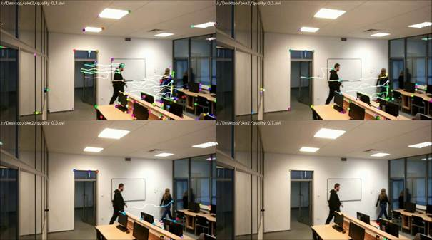

 Wartości qualityLevel od lewej: a) 0,1 b) 0.3 c) 0.5 d) 0.7

b. minDistance - jest to minimalna odległość euklidesowa pomiędzy wykrytymi punktami. Jeżeli jest zbyt duży niektóre mogą zostać pominięte.

c. maxCorners – maksymalna liczba narożników, jeśli znaleziono więcej zostaną odrzucone

Wartości minDistance od lewej: a) 45 b) 100\. Na dole wartości minDistance=5 i maxCorners od lewej: a) 100 b) 30

d. blockSize – wielkość bloku uśredniania do obliczania pochodnej matrycy kowariancji dla każdego piksela sąsiedztwa

Wartości blockSize od lewej: a) 2 b) 15 c) 50 d) 70

 

2. Lucas Kanade

a. winSize - wielkość okna uśredniania, większe wartości uodparniają algorytm na szumy i dają szansę na wykrycie szybkiego ruchu; ale dają bardziej rozmyte pole ruchu

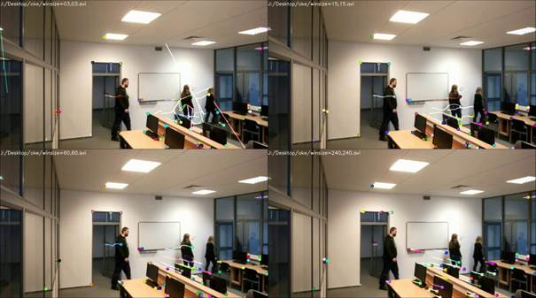

Wartości minSize od lewej: a) 3 i 3 b) 15 i 15 c) 60 i 60 d) 240 i 240

b. maxLevel - liczba użytych piramid obrazu, 0 = brak, 1 = dwie, itd.

 Wartości maxLevel od lewej: a) 0 b) 2 c) 4 d) 12

c. Criteria - parametry definiujące kiedy zakończyć iteracyjny algorytm przeszukiwania. Definiuje maksimum iteracji oraz kiedy okno przeszukiwania przesuwa się o mniej niż ostatni parametr. W jakikolwiek zauważalny sposób wpływają tylko na zachowanie znalezionych punktów w przypadku przenikania się dwóch obiektów na których zostały wyszczególnione śledzone punkty.

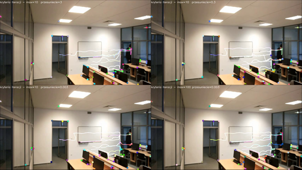

Wartości Criteria max i przesunięcie od lewej: a) 10 i 3 b) 10 i 0.3 c) 10 i 0.003 d) 100 i 0.003

## <a name="_Toc494697063">4.4. Farneback (Dense) Optical Flow</a>

Algorytm Lucas-Kanade działa dla rzadkich (sparse) zbiorów cech charakterystycznych. OpenCV dostarcza algorytm dla gęstego Optical Flow, obliczający przepływ optyczny dla wszystkich punktów w klatce. Jest on opisany w pracy Gunnera Farnebacka "Two-Frame Motion Estimation Based on Polynomial Expansion".

Użyto tych samych filmów co w  oświadczeniu z algorytmem Lucas-Kanade. Wygenerowano filmy porównujące wyniki dla 4 wartości każdego parametru. Poniżej kadry z filmów porównawczych.

<a name="_Toc494111840"> </a>

 

 

 

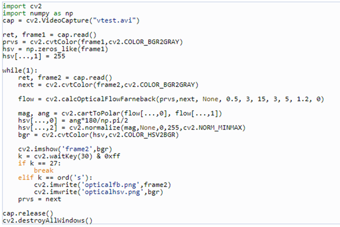  

### <a name="_Toc494697064">4.4.1. Wyniki dla zmian parametrów Farneback</a>

#### pyr_scale

Parametr skali do budowania piramid obrazu. 0.5 oznacza klasyczne piramidy – każda jest o połowę mniejsza od poprzedniej. Na filmie nie widać różnicy między wartościami od 0.001 do 0.75\. Różnica w szybkości działania jest zauważalna.

 Wartości pyr_scale od lewej: a) 0,001 b) 0,25 c) 0,5 d) 0,75

  

 

#### **levels**

Ilość użytych piramid, 1 = brak piramid.

Wartości levels od lewej: a) 3 b) 1 c) 6 d) 20

Wartości pyr_scale i level od lewej: a) 0,5 i 20 b) 0,00000001 i 20 c) 0.9 i 20 d) 0 i 1

 

#### winsize

Wielkość okna uśredniania, większe wartości uodparniają algorytm na szumy i dają szansę na wykrycie szybkiego ruchu; ale dają bardziej rozmyte pole ruchu  

 

#### iterations

Ilość iteracji algorytmu dla każdej piramidy.  

Wartości iterations od lewej: a) 3 b) 10 c) 80 d) 120

#### poly_n

Rozmiar sąsiedztwa piksela użytego do znajdowania rozwinięcia wielomianowego w każdym pikselu, większe wartości oznaczają że obraz będzie przybliżany bardziej łagodnymi powierzchniami

 Wartości poly_n  od lewej: a) 1 b) 5 c) 10 d) 50

#### poly_sigma

Odchylenie standardowe funkcji Gaussa, która jest używana do wygładzania pochodnych bazowych dla rozwinięcia wielomianowego.  

 Wartości poly_sigma od lewej: a) 1,2 b) 3 c) 25 d) 100

# <a name="_Toc494697065">5. Algorytmy śledzenia twarzy w płaszczyźnie</a>

## <a name="_Toc494697066">5.1. Śledzenie oczu</a>

Jednym z proponowanych algorytmów jest metoda oparta na wykrywaniu i śledzeniu oczu. Wstępne odnajdywanie oczu odbywa się przez wykrywanie mrugnięć. Dalej śledzony jest obszar obrazu znajdujący się między oczami, a następnie odnajdywane są źrenice w celu doprecyzowania wyniku śledzenia.

Wygląd oczu jest dość charakterystyczny, duże różnice w jasności między białkiem a źrenicami pozwalają na dość precyzyjne śledzenie oczu pomiędzy klatkami. Z kolei zjawisko mrugania umożliwia odnajdywanie oczu nawet bez wcześniejszej wiedzy o położeniu i rozmiarze twarzy. Mrugnięcia objawiają się nagłą zmianą w dwóch obszarach obrazu naraz. Występują one też na tyle często, iż – nawet utraciwszy śledzoną twarz – można ją szybko odnaleźć ponownie.

Algorytm wykrywania mrugnięć opiera się na wykryciu obszarów zmian w analizowanym obrazie, które mają pożądane cechy i spełniają zestaw warunków. Poniżej opisane są kroki algorytmu:

· Ustalić piksele, w których nastąpiły istotne zmiany w stosunku do poprzedniej klatki, jako binarny obraz różnicowy Cn

· Jeśli liczba pikseli, w których zarejestrowano zmiany, jest większa od zadanego progu, przerwać przetwarzanie tej klatki. Oznacza to, iż prawdopodobnie zarejestrowane zmiany są zbyt duże i raczej nie są ograniczone do obszaru oczu (gwałtowny ruch głową, zmiany w tle).

· Zastosować filtrację na obrazie Cn, aby wyeliminować izolowane piksele. Wybrany został filtr, zerujący każdy piksel, w którego sąsiedztwie o zadanym rozmiarze ilość pikseli niezerowych jest mniejsza od zdefiniowanego progu.

Maska zmian po zastosowaniu filtrowania

· Znaleźć spójne obszary przefiltrowanego obrazu Cn.

· Na każdym ze spójnych obszarów opisać prostokąt. Środki tych prostokątów stanowią kandydatów na położenie oczu w bieżącej klatce.

· Dla każdego kandydata oblicz wielkość zmiany eyeChange, czyli sumę wartości pikseli obrazu różnicowego w prostokącie o zadanych wymiarach. Wybrać dwóch kandydatów o największym eyeChange.

· Sprawdzić poniższe warunki dla dwóch najlepszych kandydatów. Jeśli je spełnią, zostaną uznani za położenie oczu w bieżącej klatce. Niespełnienie któregokolwiek z warunków oznacza, że nie wykryto mrugnięcia i należy kontynuować szukanie w następnej klatce:

o wartość eyeChange dla kandydatów nie może być mniejsza od zadanego progu;

o odległość pomiędzy kandydatami musi zawierać się w zadanym przedziale;

o wartość bezwzględna kąta nachylenia linii łączącej kandydatów do osi x nie może być większa od zadanej wartości;

o kandydaci muszą przejść test symetrii

### <a name="_Toc494697067">5.1.1. Wykrywanie zmian</a>

Aby odnaleźć obszary oczu na obrazie, algorytm wykrywania mrugnięć potrzebuje informacji o zmianach w analizowanym obrazie. Informacja ta jest przekazywana pod postacią obrazu Cn(x,y), traktowanego jako binarny (niezerowa wartość oznacza zmianę). Istnieje wiele metod na obliczenie takiej maski zmian. Kiedy zachodzi mrugnięcie, wybrana metoda powinna zwracać spójne obszary zmian, jednocześnie redukując wpływ szumu i fluktuacje obrazu związane z pracą detektora kamery. W tym przypadku zaimplementowane zostały dwa algorytmy: progowanie adaptacyjne obrazu różnicowego oraz metoda oparta na zależności liniowej wektorów.

### <a name="_Toc494697068">5.1.2. Test symetrii</a>

Test symetrii, służy dodatkowemu upewnieniu się, że faktycznie wykryto mrugnięcie. Bazuje on na założeniu, iż obszar twarzy między oczami jest niemal symetryczny względem osi biegnącej pomiędzy nimi. Test przebiega następująco:

· Należy obrócić obraz tak, aby linia łącząca potencjalne środki oczu stała się równoległa do osi x.

· Pobrać obszar o zadanym rozmiarze z obróconego obrazu, ze środkiem w punkcie leżącym w środku odcinka łączącego oczy.

· Obliczyć funkcję projekcyjną (Integral projection function) w kierunku pionowym – zsumować wartości pikseli dla każdej kolumny obrazu.

· Analizując osobno lewą i prawą połowę obrazu, należy obliczyć, odpowiednio, funkcje _pffl_ i _pffr_, które dla każdego _x_ przyporządkują częstość występowania _ipf(x)_ w analizowanej połowie obrazu.

· Sumując po trzy kolejne wartości _pffl_ i odpowiadające im trzy kolejne wartości _pffr_, sprawdzić czy różnice między wszystkimi sumami odpowiadających sobie trójek są mniejsze od zadanego parametru. Jest to warunek przejścia testu.

### <a name="_Toc494697069">5.1.3. Śledzenie źrenic</a>

Gdy znane jest położenie oczu na podstawie wykrytych mrugnięć, rozpoczyna się ich śledzenie. W każdej kolejnej klatce odnajdywane są oczy na podstawie ich położenia w klatce poprzedniej. Poszukiwanie oczu odbywa się metodą dopasowania szablonu. Aby zmniejszyć ilość obliczeń, zamiast obrazów samych oczu bądź całej twarzy, śledzony jest jedynie prostokątny obszar o stałych rozmiarach znajdujący się pomiędzy oczami.

Śledzony prostokątny obszar oraz położenie źrenic

Algorytm składa się z następujących kroków:

· Predykcja położenia szablonu w bieżącej klatce na podstawie położenia szablonu w poprzednich dwóch klatkach. Niech Xn będzie wektorem zawierającym położeniem środka szablonu w klatce _n_, a Xnp przewidywanym położeniem środka szablonu w klatce n. Wówczas Xnp oblicza się na podstawie:

Równanie 3

przyjmując za położenie początkowe X0 wynik algorytmu wykrywającego mrugnięcia, zaś X-1=X0.

· Określić nowe położenie szablonu Xn , którym jest środek najlepszego dopasowania szablonu wokół punktu Xnp.

· Dopasowanie szablonu polega na znalezieniu obszaru obrazu o rozmiarze szablonu, który jest najbardziej podobny. Mając dany szablon Tn-1 pochodzący z poprzedniej klatki oraz bieżący obraz In, obszar ten znajduje się w punkcie odpowiadającym maksymalnej wartości R(x,y), wyrażającej się wzorem:

· 

· Równanie 4 Maksymalna wartość korelacji

· przy czym x' i y' oznaczają współrzędne zawarte w rozmiarze szablonu, zaś x i y są współrzędnymi w ramach badanego obszaru. Do eksperymentów w ramach tej pracy wybrano ostatecznie sposób liczenia korelacji zaimplementowany w bibliotece OpenCV.

· Zakłada się, iż szablon nie przemieścił się zbytnio od poprzedniej klatki. W celu zmniejszenia ilości obliczeń, poszukiwania przeprowadzane są w obszarze o zdefiniowanym wcześniej rozmiarze.

· Znaleźć nowe położenia oczu Ern i Eln (odpowiednio prawego i lewego) w klatce _n_, na podstawie położenia szablonu Xn i zapamiętanych wektorów przesunięcia oczu względem środka szablonu ern-1 i eln-1 w poprzedniej klatce.

· Wyszukiwanie polega na znalezieniu źrenic, przy założeniu, iż są najciemniejszym fragmentem obrazu oka. W prostokątach o zadanych rozmiarach i środkach odpowiednio w punktach Xn + ern-1 oraz Xn + eln-1, szuka się punktów, w których otoczeniu o wymiarach 5 x 5 średnia jasność jest najmniejsza.

· Dla znalezionych punktów Ern i Eln sprawdzić warunki geometryczne, aby upewnić się czy znalezione punkty mogą być faktycznie położeniem oczu. Niespełnienie choć jednego z warunków oznacza, iż śledzenie nie powiodło się, oczy uznaje się za zgubione, a system powraca do stanu wykrywania mrugnięć.

· Aktualizacja danych algorytmu.

· Środek szablonu Xn zmienia wartość na środek odcinka łączącego Ern i Eln. Należy też zapamiętać położenie źrenic względem Xn (ern i eln) oraz nowy szablon Tn, o środku w Xn i zdefiniowanym rozmiarze.

## <a name="_Toc494697070">5.2. Algorytm Lucas-Kanade</a>

Jednym z podstawowych algorytmów z grupy metod gradientowych jest bardzo popularny algorytm Lucas-Kanade. W swojej podstawowej formie zaproponowanej w 1981 roku próbował generować tzw. "gęste" pole przepływu, czyli obliczał wektor przepływu dla każdego punktu obrazu. Okazało się jednak, że metodę można łatwo wykorzystać do wyliczania wektorów dla zbiorów pojedynczych punktów. Algorytm ten mógł zostać zastosowany do generowania "rzadkiego" pola, gdyż zależy tylko od pewnych lokalnych informacji pochodzących z określonego sąsiedztwa otaczającego każdy interesujący nas punkt. Jest to zasadnicza różnica w porównaniu z globalnym algorytmem Horn and Shunck, który zostanie opisany później. Wadą stosowania małego lokalnego okna do analizy obrazu jest możliwość zgubienia większego ruchu, który w kolejnych klatkach może wyjść poza obszar poszukiwania, a co za tym idzie, okaże się niemożliwy do odnalezienia przez algorytm. Problem ten spowodował rozwinięcie piramidalnego algorytmu LK, który zaczyna analizę od najwyższego poziomu piramidy obrazu (o najmniejszej zawartości detali) i kontynuuje pracę schodząc na niższe poziomy (o większej liczbie szczegółów) - **Błąd! Nie można odnaleźć źródła odwołania.**. Takie podejście pozwala wychwycić zdecydowane ruchy, a także umożliwia przyspieszenie działania algorytmu, jeżeli w kolejnych etapach będą wykorzystywane już uzyskane informacje.

Implementacja algorytmu Lucas-Kanade w bibliotece OpenCV składa się z dwóch głównych etapów działania:

1. znajdź punkty dobre do śledzenia

2. uruchom pętlę śledzącą zadane punkty

Pierwsze z tych zagadnień związane jest ze specyfiką metody Lucas-Kanade opisanej w wcześniej i wiąże się ze znalezieniem punktów, których gradient jasności ma charakter dwuwymiarowy. Do tego celu służy funkcja:

Oprócz podstawowych parametrów takich jak: obraz wejściowy, funkcja ta pozwala określić dokładność z jaką mają być obliczana pozycja naroży, minimalny dystans pomiędzy punktami lub też pozwala zdefiniować interesujący nas region poszukiwań. Dodatkowo, aby wskazać z subpikselową dokładnością położenie wykrytych naroży należy zastosować funkcję:

Posiadając listę interesujących nas punktów do śledzenia możemy uruchomić w pętli funkcję śledzącą, której w każdym kolejnym wywołaniu pozwalamy analizować kolejną klatkę obrazu. W programie zastosowano wersję piramidalną algorytmu Lucas-Kanade:

Jednym z głównych parametrów funkcji jest element _criteria_, pozwalający określić liczbę iteracji i akceptowalny błąd epsilon. Aby ustawić parametry na: 20 iteracji i błąd 0.03 możemy skorzystać z następującego makra: _vTermCriteria(CV_TERMCRIT_ITER|CV_TERMCRIT_EPS,20,0.03)._ Funkcja ta znajduje położenie zadanych punktów z pierwszej klatki na drugiej klatce. Koordynaty tych punktów są podawane z subpikselową dokładnością. Warto zauważyć, że algorytm operuje na obrazie w skali szarości. Do uzyskania takiego obrazu możemy użyć funkcji: cvCvtColor( image, grey, CV_BGR2GRAY );

Przykład działania algorytmu Lucas-Kanade

## <a name="_Toc494697071">5.3. Algorytm Horn-Schunck</a>

Autorzy algorytmu wyszli z założenia, że nie jest możliwe obliczenie przepływu optycznego dla punktu niezależnie od jego sąsiedztwa bez dodatkowych ograniczeń. Dzieje się tak, ponieważ prędkość w każdym punkcie posiada dwie składowe, podczas gdy zmiana jasności punktu na płaszczyźnie obrazu daje tylko jedno ograniczenie. Dla przykładu można podać ekstremalny przypadek: poruszający się wzór, którego jasność zmienia się tylko w jednym wymiarze, natomiast w drugim jest stała. Ruch takiego wzoru w jednym z tych wymiarów skutkuje zmianą jasności w danym punkcie - wykryciem ruchu, natomiast w drugim nie powoduje żadnych zmian.

Pierwszym założeniem postawionym przez autorów metody jest stała jasność punktu poruszającego się obszaru.

Drugie ograniczenie przedstawione przez autorów mówi o gładkości zmian zachodzących na obrazie, tzn. zakłada, że sąsiadujące punkty wykonują podobne ruchy, posiadają zbliżoną prędkość, a pole ruchu zmienia się płynnie na prawie całej powierzchni obrazu. Niestety w miejscach, w których nachodzą na siebie dwa obiekty, będzie występować nieciągłość tego pola, tak więc wiadomym jest, że algorytm ten (jak i inne oparte na takim ograniczeniu) będzie miał problemy w przypadkach zachodzących na siebie krawędzi.

Algorytm Horn-Schunck należy do grupy algorytmów obliczających "gęste" pole przepływu. Z uwagi na to jego wydajność jest wyjątkowo niska w porównaniu choćby z algorytmem Lucas-Kanade. Jak dowiedziono, jego dokładność także znacznie odbiega od większości algorytmów obliczania pola przepływu (dla algorytmu w oryginalnej, niemodyfikowanej wersji).

Implementacja algorytmu Horn-Schunck jest nieco prostsza, sprowadza się bowiem do wywołania jednej funkcji:

Interesującymi parametrami są: mnożnik Lagrange'a - współczynnik wagowy uwzględniany przy minimalizacji błędów związanych ze spełnieniem ograniczeń na: gładkość zmian prze-pływu optycznego i równania pola przepływu. Dodatkowo parametrem _criteria_ możemy ustawić liczbę iteracji dla algorytmu - co w przypadku metody Horn-Schunck jest bardzo ważnym czynnikiem. Obrazy wejściowe imgA i imgB powinny być obrazami w skali szarości.

## 5.4.  <a name="_Toc494697072">Algorytmy Mean-Shift i Camshift</a>

Poniżej zostaną przedstawione dwie techniki, które także zostały zaimplementowane w bibliotece OpenCV. Metoda Mean-shift, która jest ogólną techniką analizy danych oraz algorytm Camshift - wykorzystujący tę technikę w dziedzinie analizy obrazów, tworzą kolejne narzędzie, które pozwala śledzić obiekty poruszające się w sekwencji wideo. Co więcej metody te pozwalają skutecznie podążać za obiektami, których rozmiary zmieniają się w trakcie ruchu.

Algorytm mean-shift jest deterministyczną metodą znajdowania lokalnego ekstremum w rozkładzie gęstości zbioru danych. Dla ciągłych dystrybucji jest to proste zadanie, które sprowadza się do "wspinaczki po zboczu" histogramu danych. Niestety, dla dyskretnych danych, problem ten jest zdecydowanie mniej trywialny.

Określenie "deterministyczny" zostało użyte z powodu pewnych założeń. Mianowicie technika mean-shift ignoruje dane, które znacznie odbiegają od pozostałych. Dzieje się tak ponieważ algorytm analizuje tylko punkty w pewnym określonym lokalnym oknie, które jest przesuwane w trakcie działania algorytmu.

Zasadę działania algorytmu mean-shift można zapisać w następujących punktach:

1. Wybierz okno poszukiwań:

2. jego wstępną lokację;

a. jego charakter (stały, wielomianowy, eksponencjalny, przyjmujący postać funkcji Gaussa);

b. jego kształt (symetryczne albo niesymetryczne), orientację;

c. jego rozmiar.

3. Wylicz środek masy dla danego okna.

4. Wyśrodkuj okno w wyliczonym punkcie.

5. Jeżeli okno się poruszyło w poprzednim kroku, wróć do punktu 2.

Zasada działania algorytmu mean-shift wstępne okno jest umieszczane na dwuwymiarowym obrazie zawierającym zbiór punktów, w kolejnych krokach jest ono centrowane nad lokalnym ekstremum rozkładu punktów, dopóki nie osiągnie zbieżności

Główną funkcją algorytmu Camshift jest:

Pierwszym z parametrów algorytmu jest obraz, którego każdy piksel ma przypisane prawdopodobieństwo należenia do obiektu, dla którego został stworzony histogram. Aby obliczyć taki obraz należy posłużyć się funkcją:

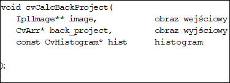

W programie zaimplementowano metodę zaznaczania myszą obszaru, dla którego chcemy obliczyć histogram. Aby zaznaczyć interesujący nas obszar, należy nacisnąć i przytrzymać lewy przycisk myszy po czym rozciągnąć zaznaczenie na interesujący nas obszar. Dla wyznaczonego pola zostanie obliczony histogram przy użyciu funkcji:

Wstępne okno poszukiwań zostanie także przypisane zaznaczonemu obszarowi.

## <a name="_Toc494697073">5.5. Filtr Kalmana</a>

Proces śledzenia na podstawie sekwencji wideo podatny jest na błędy, wynikające zarówno z szumów w obrazie, jak i niedokładności metod śledzenia. Aby temu zaradzić, można zastosować filtr Kalmana. Technika ta służy do reprezentacji procesu przebiegającego w czasie, o którym dostępne są jedynie niedokładne wartości pomiarów stanowiące zniekształconą kombinację właściwych parametrów procesu. Wiedza o przybliżonym położeniu śledzonego obiektu jest potrzebna wielu algorytmom śledzącym, zaś dokładność tego przybliżenia może stanowić o szybkości i dokładności tych algorytmów. W tej pracy filtr Kalmana został zastosowany do wygładzenia wyników śledzenia, opisanymi wcześniej, metodami Lucas-Kanade oraz CAMSHIFT. Użycie filtru Kalmana miało zmniejszyć wpływ niedokładnego śledzenia w pojedynczych klatkach na obserwowany wynik śledzenia.

## <a name="_Toc494697074">5.6. Przykład zastosowania</a>

### <a name="_Toc494697075">5.6.1. Inicjalizacja</a>

Śledzenie w algorytmie CAMSHIFT odbywa się na podstawie kanału H z modelu kolorów HSV, jednak kanały nasycenia (S) oraz intensywności (V) nie są całkiem ignorowane. Autor algorytmu sugeruje wykorzystanie zawartych w nich informacji do ykluczenia z przetwarzania pikseli niedoświetlonych (o jasności poniżej pewnego progu), zbyt jasnych oraz o małym nasyceniu koloru. Takie piksele są wykluczane przy użyciu maski, ponieważ informacje o barwie w nich zawarte nie są wystarczająco pewne. Poniżej przedstawiona jest maska wykluczająca piksele na podstawie jasności i nasycenia. Na ilustracjach obrazy wejściowe do algorytmu CAMSHIFT mają zmniejszoną o połowę rozdzielczość. Wiąże się to z tym, iż algorytm ten był w ramach eksperymentu widocznego na obrazach stosowany jako krok wstępny przed dopasowywaniem obrazu przy pomocy algorytmu Lucas-Kanade; liczyła się więc wydajność, a nie dokładność.

Maska z zaznaczonym oknem śledzenia, utworzona na podstawie jasności i nasycenia

Rozkład prawdopodobieństwa barw twarzy, z uwzględnieniem maski

Wynik śledzenia algorytmem CAMSHIFT

Algorytm CAMSHIFT wymaga określenia rozkładu barw w śledzonym obiekcie. Rozkład ten może ulec zmianie między kolejnymi uruchomieniami systemu, zależy on bowiem od koloru skóry śledzonej twarzy, oświetlenia (uwzględnić trzeba tu również światło padające z ekranu komputera) oraz tła (dotyczy szczególnie zastosowań w komputerach przenośnych). Histogram musi być przygotowany przed rozpoczęciem śledzenia. W testach zastosowana została prosta metoda uzyskania tego histogramu, polegająca na obliczeniu histogramu eliptycznego obszaru o zadanym rozmiarze, znajdującego się na środku obrazu. Zakłada się tu, iż użytkownik w celu inicjacji algorytmu prezentuje swoją twarz kamerze w pozycji neutralnej. Przy tworzeniu histogramu brane są pod uwagę jedynie piksele spełniające warunki na jasność i nasycenie koloru opisane wcześniej.

Kolejną badaną metodą śledzenia twarzy było sformułowanie tego zagadnienia jako problemu dopasowania obrazów. Następnie zastosowany został algorytm _Lucas-Kanade_. Wykorzystanie wersji modelującej przekształcenia afiniczne umożliwia śledzenie zmian w położeniu i obrocie w płaszczyźnie obrazu, możliwe jest również wyśledzenie zmian rozmiaru twarzy. Skalowanie w pewnym stopniu odpowiada odległości od kamery. Jako że obrót względem osi pionowej i poziomej mogą również zmieniać rozmiar widzianego obszaru twarzy, skalowanie ostatecznie nie zostało wykorzystane przy prezentacji wyniku śledzenia.

W celu odnalezienia śledzonego obiektu w klatce bieżącej potrzebny jest szablon oraz położenie obiektu we wcześniejszej klatce; aby rozpocząć śledzenie, potrzebna jest wcześniejsza informacja o położeniu początkowym. Dalsze śledzenie może odbywać się poprzez dopasowanie klatki bieżącej albo do szablonu z klatki poprzedniej, lub też do szablonu z klatki początkowej. Dopasowywanie do klatki poprzedniej pozwala na śledzenie drobnych, stopniowych zmian zachodzących w obrazie (powolna zmiana oświetlenia, mimika), jednak prowadzi również do kumulacji błędów śledzenia.

W tym przypadku filtr Kalmana został wykorzystany przy śledzeniu twarzy metodami _CAMSHIFT_ oraz _Lucas-Kanade_. Filtrowaniu poddane zostały wszystkie możliwe do wyśledzenia obiema algorytmami właściwości obrazu twarzy, a więc położenie, kąt nachylenia oraz wysokość i szerokość.

## <a name="_Toc494697076">5.7. Obserwacje / porównanie algorytmów</a>

### <a name="_Toc494697077">5.7.1. Algorytm CAMSHIFT</a>

Algorytm CAMSHIFT, który prowadzi śledzenie w oparciu o kanał barwy, wykazuje dużą podatność na kolor i oświetlenie obserwowanej sceny. Jeśli pomieszczenie nie jest wystarczająco oświetlone, istotny wpływ na kolor twarzy użytkownika ma światło padające z ekranu komputera. W związku z tym algorytm może utracić śledzoną twarz, jeśli obraz na monitorze ulegnie zbyt dużym zmianom. Oświetlenie powinno być w miarę możliwości jednolite, rozproszone i jasne, aby umożliwiać dokładny pomiar i pełne wykorzystanie zakresu kanału barwy do rozpoznawania obrazu twarzy. Nawet w idealnych warunkach oświetlenia, występowanie za plecami użytkownika obiektów w kolorach beżu, różu albo czerwieni, a więc posiadających zbliżoną barwę (choć odmienną intensywność lub nasycenie) może utrudnić inicjalizację algorytmu, a w skrajnych przypadkach uniemożliwić śledzenie. W innej pracy zaproponowana jest metoda inicjalizacji algorytmu pomagająca odrzucić barwy występujące poza śledzonym obszarem, co może zmniejszyć wpływ obiektów o podobnej barwie do twarzy obecnych w scenie od początku. O ile warunki są sprzyjające, algorytm CAMSHIFT wykazuje dobre właściwości śledzenia położenia twarzy w sekwencji obrazów, szczególnie skutecznie jest w stanie odnajdywać śledzony obszar po chwilowym przesłonięciu. Położenie nie jest odnajdywane z precyzją co do piksela, zaś obrót i skalowanie bardziej wynikają z kształtu obrazu twarzy na ekranie, niż faktycznemu ułożeniu głowy. Wyniki nie są dokładne, jednak algorytm, w sprzyjających warunkach, nie traci śledzonej twarzy – jest więc wiarygodny w zastosowaniach potrzebujących jedynie określenie ogólnego położenia głowy w obrazie.

### <a name="_Toc494697078">5.7.2. Algorytm Lucas-Kanade</a>

Algorytm Lucas-Kanade działa natomiast na podstawie kanału jasności oraz gradientu jasności, dzięki temu nie jest podatny na obecność obszarów o podobnej barwie. Z drugiej strony, algorytm ten do śledzenia wymaga niewielkich zmian w wyglądzie śledzonego obiektu od wzorcowej klatki. Jeśli śledzony obiekt przesunie się w większej części poza obszar, w którym znajdował się poprzednio, najprawdopodobniej jego nowa pozycja nie zostanie rozpoznana poprawnie. Dodatkowo, obecność obiektu podobnego do śledzonego może spowodować, że algorytm zgubi śledzony obiekt i zacznie podążać za niewłaściwym. Zastosowanie aktualizowania obrazu wzorcowego odnalezionym wizerunkiem śledzonego obiektu może zniwelować te zagrożenia w przypadku śledzenia twarzy przy rozsądnej liczbie klatek na sekundę – przemieszczenie między klatkami jest wówczas znacząco mniejsze od wymiarów śledzonego obszaru. Aktualizowanie szablonu na bieżąco jest szczególnie istotne w przypadku śledzenia dużych obiektów, których wygląd może ulec znaczącym zmianom w związku z obrotem względem kamery; bazowanie na wzorcu z klatki poprzedniej powoduje jednak, że algorytm może zaakceptować obce obiekty znajdujące się w tle lub przesłaniające śledzoną twarz.

W podążaniu za szybko przemieszczającymi się obiektami pomaga również zastosowanie piramidy Gaussa. W eksperymentach dało się jednak zauważyć, że wykorzystanie piramidy Gaussa powodowało gromadzenie błędu dopasowania, ponieważ w każdej klatce wykrywane było minimalne przesunięcie i skalowanie w dół. Może to być związane z błędem zaokrąglania lub specyfiką tworzenia piramidy Gaussa.

### <a name="_Toc494697079">5.7.3. CAMSIFT I Lucas-Kanade</a>

Wykorzystanie algorytmu CAMSHIFT do wyznaczenia początkowego przybliżenia zniekształcenia obrazu twarzy względem poprzedniej klatki na potrzeby algorytmu LK dało bardziej stabilne rezultaty niż zastosowanie owych algorytmów z osobna. Przy przetwarzaniu tej samej testowej sekwencji obrazów nastąpiło zmniejszenie tendencji do oscylacji czy ucieczki wyniku śledzenia. Ponadto wykorzystanie obu algorytmów nie obniżyło znacząco szybkości działania systemu.

### <a name="_Toc494697080">5.7.4. Śledzenie źrenic</a>

Specyficzną cechą algorytmu śledzenia źrenic wykorzystującego wykrywanie mrugnięć, jest brak potrzeby wykonania ręcznej inicjalizacji. W trybie detekcji mrugnięć położenie twarzy nie jest znane, jednak zaraz po wykryciu oczu rozpoczyna się śledzenie. Co więcej, w przypadku utraty śledzonych źrenic, algorytm wraca do trybu wykrywania, aby podjąć śledzenie po następnym rozpoznanym mrugnięciu. Z drugiej strony, żadna z badanych metod wykrywania mrugnięć nie jest doskonała i zdarza się wykrycie fałszywych mrugnięć, szczególnie w obecności silnych szumów. Nawet jeśli faktyczne obszary mrugnięć znajdą się na liście potencjalnych wyników, nie zawsze wygrywają w rankingu wielkości zmiany (eyeChange). Na przykład jako jedna ze źrenic, rozpoznawana była wystarczająco ruchliwa brew. Algorytm miał również problemy w wykryciu mrugnięć w przypadku oczu przysłoniętych okularami. Obie metody wykrywania zmian okazały się również wrażliwe na właściwy dobór parametrów.

W praktyce metoda wykrywania zmian, oparta o liniową zależność wektorów wykazywała większą skuteczność przy wykrywaniu mrugnięć, jak również zwracała mniej fałszywych wyników. Jest ona też bardziej skomplikowana obliczeniowo – dało się zauważyć kilkukrotny spadek szybkości przetwarzania systemu względem metody progowania adaptacyjnego. Ta druga technika wymagała z kolei zastosowania pomijania klatek w przypadku źródeł obrazu pracujących z częstotliwością większą niż 7 Hz (optymalną dla wykrywania mrugnięć).

### <a name="_Toc494697081">5.7.5. Porównanie algroytmów</a>

W poniższej tabeli przedstawione jest porównanie zaobserwowanych cech algorytmów. Z braku wyznaczonej skali, porównanie odbyło się względem obserwacji pozostałych algorytmów.

<table class="MsoNormalTable" border="1" cellspacing="0" cellpadding="0" width="0" style="width:467.45pt;margin-left:-5.4pt;border-collapse:collapse;border:none">

<tbody>

<tr style="height:20.3pt">

<td width="162" valign="top" style="width:121.25pt;border-top:2.25pt;border-left:
  2.25pt;border-bottom:1.0pt;border-right:1.0pt;border-color:windowtext;
  border-style:solid;padding:0cm 5.4pt 0cm 5.4pt;height:20.3pt">

**Metoda**

</td>

<td width="150" valign="top" style="width:112.5pt;border-top:solid windowtext 2.25pt;
  border-left:none;border-bottom:solid windowtext 1.0pt;border-right:solid windowtext 1.0pt;
  padding:0cm 5.4pt 0cm 5.4pt;height:20.3pt">

**Inicjalizacja**

</td>

<td width="156" valign="top" style="width:117.0pt;border-top:solid windowtext 2.25pt;
  border-left:none;border-bottom:solid windowtext 1.0pt;border-right:solid windowtext 1.0pt;
  padding:0cm 5.4pt 0cm 5.4pt;height:20.3pt">

**Dokładność**

</td>

<td width="156" valign="top" style="width:116.7pt;border-top:solid windowtext 2.25pt;
  border-left:none;border-bottom:solid windowtext 1.0pt;border-right:solid windowtext 2.25pt;
  padding:0cm 5.4pt 0cm 5.4pt;height:20.3pt">

**Niezawodność**

</td>

</tr>

<tr style="height:19.3pt">

<td width="162" valign="top" style="width:121.25pt;border-top:none;border-left:
  solid windowtext 2.25pt;border-bottom:solid windowtext 1.0pt;border-right:
  solid windowtext 1.0pt;padding:0cm 5.4pt 0cm 5.4pt;height:19.3pt">

CAMSHIFT

</td>

<td width="150" valign="top" style="width:112.5pt;border-top:none;border-left:  none;border-bottom:solid windowtext 1.0pt;border-right:solid windowtext 1.0pt;
  padding:0cm 5.4pt 0cm 5.4pt;height:19.3pt">

Wymaga wzorca

</td>

<td width="156" valign="top" style="width:117.0pt;border-top:none;border-left:  none;border-bottom:solid windowtext 1.0pt;border-right:solid windowtext 1.0pt;
  padding:0cm 5.4pt 0cm 5.4pt;height:19.3pt">

Mała

</td>

<td width="156" valign="top" style="width:116.7pt;border-top:none;border-left:  none;border-bottom:solid windowtext 1.0pt;border-right:solid windowtext 2.25pt;
  padding:0cm 5.4pt 0cm 5.4pt;height:19.3pt">

Wysoka

</td>

</tr>

<tr style="height:19.3pt">

<td width="162" valign="top" style="width:121.25pt;border-top:none;border-left:
  solid windowtext 2.25pt;border-bottom:solid windowtext 1.0pt;border-right:
  solid windowtext 1.0pt;padding:0cm 5.4pt 0cm 5.4pt;height:19.3pt">

Lucas-Kanade

</td>

<td width="150" valign="top" style="width:112.5pt;border-top:none;border-left:  none;border-bottom:solid windowtext 1.0pt;border-right:solid windowtext 1.0pt;
  padding:0cm 5.4pt 0cm 5.4pt;height:19.3pt">

Wymaga wzorca

</td>

<td width="156" valign="top" style="width:117.0pt;border-top:none;border-left:  none;border-bottom:solid windowtext 1.0pt;border-right:solid windowtext 1.0pt;
  padding:0cm 5.4pt 0cm 5.4pt;height:19.3pt">

Średnia

</td>

<td width="156" valign="top" style="width:116.7pt;border-top:none;border-left:  none;border-bottom:solid windowtext 1.0pt;border-right:solid windowtext 2.25pt;
  padding:0cm 5.4pt 0cm 5.4pt;height:19.3pt">

Średnia

</td>

</tr>

<tr style="height:33.1pt">

<td width="162" valign="top" style="width:121.25pt;border-top:none;border-left:
  solid windowtext 2.25pt;border-bottom:solid windowtext 1.0pt;border-right:
  solid windowtext 1.0pt;padding:0cm 5.4pt 0cm 5.4pt;height:33.1pt">

CAMSHIFT

Lucas-Kanade

</td>

<td width="150" valign="top" style="width:112.5pt;border-top:none;border-left:  none;border-bottom:solid windowtext 1.0pt;border-right:solid windowtext 1.0pt;
  padding:0cm 5.4pt 0cm 5.4pt;height:33.1pt">

Wymaga wzorca

</td>

<td width="156" valign="top" style="width:117.0pt;border-top:none;border-left:  none;border-bottom:solid windowtext 1.0pt;border-right:solid windowtext 1.0pt;
  padding:0cm 5.4pt 0cm 5.4pt;height:33.1pt">

Średnia

</td>

<td width="156" valign="top" style="width:116.7pt;border-top:none;border-left:  none;border-bottom:solid windowtext 1.0pt;border-right:solid windowtext 2.25pt;
  padding:0cm 5.4pt 0cm 5.4pt;height:33.1pt">

Średnia

</td>

</tr>

<tr style="height:19.3pt">

<td width="162" valign="top" style="width:121.25pt;border-top:none;border-left:
  solid windowtext 2.25pt;border-bottom:solid windowtext 2.25pt;border-right:
  solid windowtext 1.0pt;padding:0cm 5.4pt 0cm 5.4pt;height:19.3pt">

Śledzenie oczu

</td>

<td width="150" valign="top" style="width:112.5pt;border-top:none;border-left:  none;border-bottom:solid windowtext 2.25pt;border-right:solid windowtext 1.0pt;
  padding:0cm 5.4pt 0cm 5.4pt;height:19.3pt">

Samoczynna

</td>

<td width="156" valign="top" style="width:117.0pt;border-top:none;border-left:  none;border-bottom:solid windowtext 2.25pt;border-right:solid windowtext 1.0pt;
  padding:0cm 5.4pt 0cm 5.4pt;height:19.3pt">

Wysoka

</td>

<td width="156" valign="top" style="width:116.7pt;border-top:none;border-left:  none;border-bottom:solid windowtext 2.25pt;border-right:solid windowtext 2.25pt;
  padding:0cm 5.4pt 0cm 5.4pt;height:19.3pt">

Średnia

</td>

</tr>

</tbody>

</table>

Porównanie algorytmów

  

 

# <a name="_Toc494697082">6. Detekcja upadku (kamera statyczna RGB)</a>

## <a name="_Toc494697083">6.1. Wstęp</a>

Zagadnienie zautomatyzowanego rozpoznawania upadków jest dziedziną, na temat której istnieje sporo artykułów. Szczególnie uwzględniają one opiekę nad osobami starszymi w szpitalu lub domu.

Obecne systemy zautomatyzowanego rozpoznawania (detekcji) upadków polegają na:

· Systemach wizyjnych (kamery w skali szarości, kamery RGB, kamery głębi),

· czujnikach ruchu noszonych przez osobę (czujniki specjalnie stworzone w tym celu, smartfony)- najczęściej są nimi akcelerometry,

· systemach monitorujących parametry życiowe osób,

· mikrofonach- zazwyczaj jako wspomaganie do kamer).

Niewątpliwą zaletą systemów wizyjnych jest fakt, że nie wymagają od obserwowanych osób żadnych działań (w przeciwieństwie do czujników ruchu). Urządzenia noszone przy sobie mogą mieć w zastosowaniach praktycznych obniżoną efektywność, wynikającą z konieczności ich noszenia przy sobie i ładowania do nich baterii, o czym często osoby zapominają.

W niniejszym rozdziale skupiam się na opracowaniu wizyjnych systemów detekcji upadków, ze szczególnym uwzględnieniem jednej kamery RGB umiejscowionej w pomieszczeniu, w rogu pokoju, przy suficie. Zaprezentuje opracowane w literaturze fachowej algorytmy (metody) detekcji upadku, a także systemy detekcji upadku, które najczęściej wykorzystują wiele metod równocześnie w celu podniesienia ich skuteczności rozpoznawania i wyeliminowania fałszywych alarmów.

Istnieje wiele komercyjnych systemów o zamkniętym kodzie źródłowym służących rozpoznawaniu upadków (szczególnie opierających się na czujnikach ruchu), jednakże trudno znaleźć takie otwarto-źródłowe systemy lub metody. W szczególności biblioteka OpenCV zawiera wiele metod służących wyabstrahowaniu sylwetki osoby i śledzenia go, które okazują się bardzo przydatne do detekcji upadku, jednakże nie posiada narzędzi służących konkretnie detekcji upadku.

## <a name="_Toc494697084">6.2. Wstępne przetwarzanie sygnału wideo</a>

Do analizy i klasyfikowania zachowań badanej osoby konieczne jest wykrycie jej sylwetki na obrazie z kamery. Często wykorzystuje się również metody podnoszące skuteczność wykrywania sylwetki takie jak usuwanie cieni. Ponieważ większość skutecznych metod detekcji upadku analizuje zachowanie osoby w czasie (w odróżnieniu do analizy pojedynczej klatki filmu) konieczne jest też śledzenie sylwetki osoby na filmie wideo. Niektóre metody detekcji upadku wykorzystują śledzenie głowy osoby (wynika to z tego, że gwałtowne ruchy głową rejestruje się bardzo rzadko podczas codziennych czynności, a często towarzyszą one przewróceniu się). Biblioteka OpenCV posiada zaimplementowane funkcjonalności bezpośrednio wykonujące wspomniane czynności (wyabstrahowanie sylwetki z tła) lub pomagające przy ich implementacji (np. śledzenie punktów kluczowych). Ponieważ temat wykrywania sylwetki oraz głowy, a także ich śledzenia jest obszerny i nie jest tematem tego opracowania, w dalszej części pracy zakładam, że te wspomniane algorytmy są opracowane.

## <a name="_Toc494697085">6.3. Często występujące problemy</a>

Poniżej omawiam częste problemy, które często napotyka się podczas opracowania wizyjnych systemów detekcji upadków. Często utrudniają one

wykrycie upadku lub powodują powstawanie fałszywych alarmów (klasyfikacji upadku przez system, podczas gdy w rzeczywistości upadek nie występuje). Część z nich wynika z niedoskonałości systemów wydzielających sylwetkę osoby z tła.

· Akcje lub pozy osoby nie będące upadkiem (szybkie siadanie, spanie na łóżku). Systemy polegające na analizie pozy osoby często klasyfikują pozycję leżącą człowieka jako upadek. Natomiast systemy, które analizują zachowanie człowieka w czasie, źle klasyfikują błędnie gwałtowne zmiany położenia człowieka. Mogą nimi być na przykład:

o       gwałtowne siadanie,

o       schylanie się w celu na przykład zawiązania buta.

· Błędna klasyfikacja otoczenia. Błędne wydzielenie sylwetki osoby od tła ma wpływ na większość systemów detekcji upadku, szczególnie na te, które analizują postawę osoby oraz jej zachowanie w czasie.

o       rozpoznanie sylwetki zwierząt (np. psa) jako człowieka,

o       rozpoznanie zmian tła jako sylwetka człowieka lub jej część (np. otwarta szafka, która wcześniej była zamknięta),

o       rozpoznanie cienia osoby jako części jego sylwetki,

o       rozpoznanie odbicia w lustrze/szybie jako części sylwetki człowieka,

o       rozpoznanie elementów otoczenia, z którymi osoba wchodzi w interakcję jako część jej sylwetki- na przykład niesiony karton lub przenoszone krzesło,

o       rozpoznanie dwóch osób wchodzących w interakcję lub przebywających blisko jako sylwetkę jednej osoby.

· Częściowo przysłonięta sylwetka osoby przez przedmiot lub jej sylwetka niemieszcząca się w pełni w kadrze. Skutki są podobne jak powyższym punkcie.

· Możliwości urządzeń (pamięć i moc do przechowania i analizy pewnego fragmentu wideo). Przykładowo niewystarczająca moc obliczeniowa urządzenia lub pamięć niepozwalająca na przechowanie dłuższego fragmentu filmu (metody sprawdzające jak długo w danej pozie znajduje się człowiek).

· Niedostateczna jakość obrazu kamery wynikająca ze złego naświetlenia,

· Zbyt mała ilość danych trenujących dla metod bazujących na uczeniu maszynowym.

Klatka przedstawiająca tło, źródło: [3]

Klatka przedstawiająca zmienione otoczenie, źródło: [3]

Zobrazowana różnica klatki drugiej i pierwszej, źródło: [3]

Przedstawione poniżej ilustracje przedstawiają wydzieloną sylwetkę razem z cieniem. Cień może zaburzyć sylwetkę do stopnia, w którym niemożliwe będzie stwierdzenie w jakiej pozycji znajduje się dana osoba.

Klatka przedstawiająca upadającą osobę, źródło: [4]

Sylwetka wraz z cieniem, źródło: [4]

Jeżeli obiekty z którymi osoba wchodzi w interakcję interpretowane są jako jego sylwetka, system detekcji może mieć problem z rozpoznaniem kąta głównej osi człowieka i tym samym zaklasyfikowaniem czy dana osoba stoi (oś prostopadła do podłogi), czy leży (oś równoległa do podłogi). Poniżej przedstawiona jest sylwetka wyznaczona przez program (wraz z obiektami, które błędnie interpretowane są również jako sylwetka człowieka. Zielona linia obrazuje nakreśloną przez program główną oś osoby. Wyniki są wyraźnie zaburzone błędną interpretacją sylwetki.

Sylwetka wraz z cieniem, źródło: [1]

## <a name="_Toc494697086">6.4. Ogólny podział metod (kontekst pojedynczej klatki, kontekst sekwencji).</a>

Systemy wizyjne rozpoznawania upadku znacznie różnią się w zależności od zakładanych warunków instalacji kamer i rodzaju używanych urządzeń.

Systemy można dzielić ze względu na:

· rodzaj użytych kamer (i ewentualnie inne urządzenia wspomagające jak na przykład mikrofony),

· ilość kamer,

· umiejscowienie kamery lub kamer,

· rodzaj algorytmu- bazujące na analizie pojedynczej klatki filmu lub ich sekwencji.

### <a name="_Toc494697087">6.4.1. Podział ze względu na rodzaj kamer</a>

W literaturze fachowej często napotkać można na systemy wykorzystujące kamery głębi. Sprawdzają się one lepiej od kamer z obrazem czarno-białym oraz kamer RGB, ze względu na to możliwości bardziej precyzyjnego wyznaczenia sylwetki osoby. Wynika to z faktu, że są dość niewrażliwe na oświetlenie sceny, a zatem zmianę pory dnia, zmianę sztucznych źródeł światła (żarówki). Co więcej, problem klasyfikowania cienia osoby jako części sylwetki nie występuje. Kamery takie znacznie ułatwiają również wykrywanie płaszczyzny podłogi, co pozwala na wyznaczenie kąta osi głównej osoby w stosunku do podłogi. Ma to szczególne znaczenie gdy kamera nie jest skierowana na wprost (czyli jej oś nie jest równoległa do podłogi), a znajduje się na przykład w rogu pokoju i skierowana jest do niej pod kątem.

Szczególny wpływ na rozwój systemów z kamerą głębi miało powstanie i upowszechnienie się kamery Xbox Kinect.

Standardowe kamery z obrazem czarno-białym lub kamery RGB są również często opisywane w artykułach na temat detekcji upadku, ze względu na powszechność ich stosowania i stosunkowo niskie koszty.

Część systemów polega na kamerach IR (dzięki czemu są skuteczne w ciemności) lub kamerach termowizyjnych (które również są skuteczne w ciemności, dodatkowo dobrze wydzielają sylwetkę człowieka).

Czasami napotkać można na systemy działające ze wspomaganiem przez mikrofon. Sama analiza dźwięku raczej nie pozwala na precyzyjne określenie, czy obserwowana osoba upadła, natomiast występuje w roli wspomagającej systemy wizyjne. Użycie mikrofonu opisane jest na przykład w artykule [2].

Poniższe obrazy kamer wskazują na różnicę w obrazie kamery w zależności od oświetlenia. Prześwietlenie zdjęcia powoduje ograniczenie ilości informacji z niego płynących i może znacznie obniżyć skuteczność metod detekcji upadków, szczególnie jeżeli wpływa na metody wydzielania sylwetki lub szukania punktów kluczowych na zdjęciu.

· Górny lewy róg- światło słoneczne powoduje prześwietlenie w miejscu okna.

· Górny prawy róg- prześwietlenie spowodowane lampami halogenowymi

· Lewy dolny róg- zdjęcie prześwietlone w lekkim stopniu.

· Prawy dolny róg- zdjęcie w nocy wykonane przy pomocy światła podczerwonego.

Kadry obrazujące wpływ oświetlenia sceny na obraz kamery, źródło: [6]

### <a name="_Toc494697088">6.4.2. Podział ze względu na ilość kamer</a>

Spora część opracowań opisuje systemy używające jednej kamery. Istnieją jednak opracowania systemów korzystających z dwóch kamer. Znacznie zmniejsza to ilość fałszywych alarmów, ponieważ nawet jeżeli jedna kamera nie posiada pełnego obrazu sylwetki człowieka, druga kamera umiejscowiona w innym miejscu weryfikuje wnioski pierwszej. Dodatkowo system wyposażony w dwie kamery lepiej radzi sobie z wykrywaniem głowy, co również jest bardzo pomocne w wykryciu upadku.

### <a name="_Toc494697089">6.4.3. Podział ze względu na umiejscowienie kamer</a>

Zazwyczaj kamerę w pomieszczeniu umieszcza się w jednej z pozycji:

1. w rogu pokoju, przy suficie,

2. na wysokości wzroku, z osią kamery równoległą do podłogi,

3. na suficie pomieszczenia, skierowaną centralnie do dołu.

Wydaje się, że najwyższą skutecznością charakteryzują się systemy z umiejscowieniem kamery w drugiej pozycji. Wynika to z faktu, że łatwo jest oszacować czy sylwetka obserwowanej osoby jest pionowa czy pozioma. W praktycznych zastosowaniach takie umiejscowienie kamery może nie być praktyczne, co wynika z małego pola widzenia tak umiejscowionej kamery oraz zajmowanej powierzchni na ścianie.

Istnieje wiele publikacji na temat systemów, w których kamery umiejscowione są w rogu pomieszczenia. Wynika to głównie z powszechności tego rozwiązania montażu w obecnych kamerach bezpieczeństwa i niskiej inwazyjności w pomieszczenie.

### <a name="_Toc494697090">6.4.4. Podział ze względu na rodzaj algorytmu</a>

Oczywistym jest, że rodzaj algorytmu ma kluczowy wpływ na skuteczność systemu. Wybór odpowiedniego algorytmu uwarunkowany jest wspomnianymi wyżej parametrami (typ, ilość kamer, ich umiejscowieniem), specyfiką pomieszczeń (czyli między innymi ich wielkością, ilością mebli lub przedmiotów mogących zaburzyć rozpoznanie sylwetki), a także ilością monitorowanych osób.  Istnieje wiele podejść do problemu detekcji upadku. Od najprostszych analizujących jedynie pojedynczą klatkę w celu klasyfikacji pozy osoby, po systemy polegające na badaniu przyspieszenia poszczególnych części ciała. Najczęściej jednak największym powodzeniem cieszą się systemy które łączą różne metody i klasyfikują zachowanie osoby w oparciu o opracowany specjalnie w tym celu model wnioskowania.

Następny podrozdział stanowi przedstawienie metod detekcji upadku.

## <a name="_Toc494697091">6.5. Analiza poszczególnych algorytmów detekcji upadku</a>

Niniejszy rozdział przedstawia algorytmy służące detekcji upadku, które zostały opisane w publikacjach naukowych. Większość publikacji opisuje cały system składający się z kilku metod i system wnioskujący wykorzystujący zastosowane algorytmy. Ze szczególnym uwzględnieniem zostaną opisane algorytmy korzystające z jednej kamery RGB w rogu pomieszczenia.

### <a name="_Toc494697092">6.5.1. Podstawowa estymacja postawy oraz detekcja ruchu obserwowanej osoby.</a>

Najbardziej podstawowym algorytmem analizy upadku jest analiza sylwetki człowieka na pojedynczej klatce. Pozwala ona zaklasyfikować pozycję jako na przykład stojącą, leżącą lub siedzącą. W praktycznych zastosowaniach często wykorzystuje się ją równocześnie mierząc jak długo i w jakiej miejscu znajduje się człowiek. Niektórych obszarów kadru można nie brać pod uwagę (przykładowo łóżko). Z drugiej analiza takich obszarów pozwala na stwierdzenie czy obserwowana osoba nie jest w stanie zagrożenia innym niż upadek (na przykład nie wstaje i nie rusza się w łóżku dłużej niż 12 godzin). Przykład: [3] (http://tunn.us/arduino/falldetector2.php).

Wspomniane wykrywanie ruchu człowieka wykorzystuje się w połączeniu z algorytmami analizującymi zachowanie obserwowanej osoby w czasie (na przykład przyspieszenie). Jeżeli po gwałtownym przyspieszeniu osoba nie rusza się, można przyjąć że uległa wypadkowi (lub straciła przytomność), gdyż zazwyczaj po innych gwałtownych czynnościach (siadanie, schylenie się w celu zawiązania buta) osoba zazwyczaj rusza się.

Poniższy obrazek ilustruje następujące metody:

· fioletowy kolor- prostokąt ROI,

· biały kolor- wpisana elipsa,

· zielony kolor- środek ciężkości,

· niebieski kolor- pozycja głowy.

Czarny prostokąt zakrywa twarz w celu zapewnienia anonimowości prezentowanej osobie.

Ilustracja różnych metod analizy postawy człowieka, źródło: [6]

#### Stosunek wysokość/szerokość prostokąta ROI.

Obszar zainteresowania definiuje się jako część obrazu, w której znajduje się obiekt będący podmiotem analizy. W literaturze anglojęzycznej nazywa się go ROI (Region of Interest) lub salient region. W zależności od skuteczności algorytmów wydzielających sylwetkę człowieka oraz stawianym wymaganiom, ROI może przybierać różny kształt. Najbardziej podstawowy to prostokąt.

Według autorów artykułu [8] sprawdzanie stosunku wysokość/szerokość prostokąta przynosi dobre efekty, jeżeli modelu wyboru prostokąta jest wyznaczony w odpowiedni sposób. Trywialne sposoby wyznaczania prostokąta, które jako współrzędne wierzchołków biorą współrzędne najbardziej wysuniętych pikseli sylwetki okazują się niewystarczające ze względu na wpływ wartości odstających, które pojawiają się przez niedoskonałość algorytmów wydzielających sylwetkę.

Zamiast tego autorzy proponują model przedstawiony poniżej.

Załóżmy, że mamy wydzieloną sylwetkę. Niech funkcja 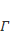 dla argumentu  przyjmuje ilość pikseli należących do sylwetki w kolumnie . Jest to funkcja podobna do histogramu, ale zliczająca piksele tylko w kolumnach obrazu. Funkcja na rysunku niżej oznaczona jest jako x-projection. oznacza taki argument , dla którego funkcja  przyjmuje wartość maksymalną, czyli 

Wtedy 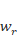 (współrzędne  prawych wierzchołków prostokąta ROI) i  (dolnych) wyznaczamy w sposób następujący:

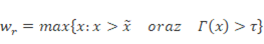

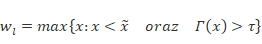

gdzie 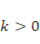 jest pewnym współczynnikiem (może być wyznaczony eksperymentalnie w zależności od warunków.

W analogiczny sposób wyznaczamy  (współrzędne  górnych wierzchołków prostokąta ROI) i  (dolnych).

Poniższy rysunek dobrze obrazuje ogólną koncepcję oraz wyznaczone parametry.

Zobrazowany wybór wierzchołków prostokąta ROI, źródło: [8]

Opis rysunku 1:

(a) obraz binarny z wydzieloną sylwetką i funkcje x-projection (w formułach jako  oraz y-projection,

(b) histogram osi  oraz wybór współrzędnych  wierchołków prostokąta ROI,

(c) ilustracja prostokąta ROI.

Stosunek wysokość/szerokość  można wyliczyć w następujący sposób:

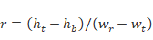

Poniższy rysunek obrazuje rozkład parametru  w zależności od postaw:

· stojącej lub osoby chodzącej,

· siedzącej lub kucającej,

· leżącej.

Porównanie rozkładów parametru r (stosunku wysokość/szerokość prostokąta ROI sylwetki) w zależności pozycji monitorowanej osoby, źródło [8].

Autorzy pracy [8] proponują następnie detekcję upadku opartą o dwu-stanowy automat.

Jak widać na poniższym rysunku umiejscowienie kamery może mieć kluczowe znaczenie, jeżeli korzysta się z metody prostokąta do analizy pojedynczej klatki. Przy wysoko umiejscowionej kamerze, w zależności od kąta stosunek wysokość/szerokość sylwetki człowieka może niezmienić się istotnie podczas upadku.

Przykład detekcji upadku przy kamerze umiejscowionej 2 metry nad podłogą, źródło [8]

#### Analiza elipsy ROI

Autorzy pracy [11] proponują zbudowanie elipsy, w którą będzie wpisana sylwetka człowieka.

Elipsę definiuje się przy pomocy środka , orientacji , długości wielkiej półosi  oraz małej półosi .

Dla obrazu traktowanego jako ciągła funkcja z przestrzeni dwuwymiarowej do przestrzeni jednowymiarowej (obraz w skali szarości) wspomniane momenty możemy zdefiniować następująco:

dla 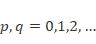.

Środek elipsy jest wyznaczany za pomocą momentów  w sposób następujący:

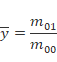

Moment centralny oblicza się analizy sylwetki za pomocą współrzędnych środka elipsy:

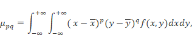

Kąt między główną osią elipsy sylwetki, a osią  obrazu liczymy w sposób następujący:

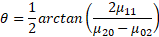

Aby obliczyć długość wielkiej półosi  oraz długość małej półosi  elipsy, należy obliczyć najmniejszy moment bezwładności 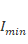 oraz największy moment bezwładności 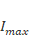. Można to zrobić przy pomocy wartości własnych macierzy kowariancji:

Wartości własne powyższej macierzy dane są wzorami:

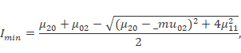

Następnie długość wielkiej półosi  i długość małej półosi  elipsy liczy się:

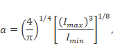

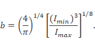

Obliczamy parametr  jako stosunek wielkiej półosi do małej półosi elipsy:

Tak wyznaczona elipsa może służyć do analizy pojedynczego kadru z obrazu wideo lub analizy zachowania osoby na przestrzeni fragmentu wideo. Wtedy brana jest pod uwagę zmiana parametrów elipsy w czasie.

Jeżeli chodzi o rozpoznanie sylwetki, metoda wyznaczania elipsy jest w stanie klasyfikować klatki wideo jako momenty upadku, kiedy kąt  między wielką półosią elipsy, a osią  jest zbliżony do 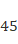 stopni. Metoda polegająca na prostokącie w tym przypadku okazuje się nieskuteczna.

Poniższy rysunek ilustruje porównanie metody prostokąta i elipsy w kontekście wykrywania momentu upadku.

Dopasowanie prostokąta ROI i elipsy ROI w chwili upadku osoby, źródło: [11].

Metoda elipsy jednak najlepiej sprawdza się przy analizie fragmentu wideo, na którym możemy obliczyć odchylenie standardowe stosunku  oraz kąta . Wysokie odchylenia standardowe wskazują na gwałtowne ruchy, oznaczające często upadek. Metody wykorzystywania zmian elipsy ROI w czasie do detekcji upadku zostaną zostały opisane w [10], [11].

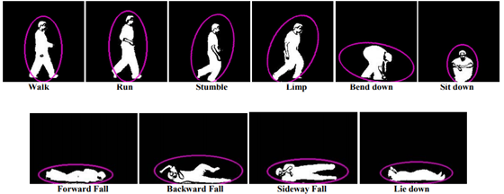

Elipsy opisujące sylwetkę człowieka  w różnych pozycjach i podczas różnych akcji, źródło: [10].

Poniższa ilustracja przedstawia zmiany w czasie wariancji parametrów  oraz .

Parametr 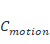 reprezentuje generalną zmianę pozycji wydzielonej sylwetki (czyli ruch).

Gdzie 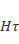 to obraz zmian (motion history image). Współczynnik jest następnie skalowany, 0% oznacza brak ruchu, a 100% pełny ruch. Blob oznacza wydzieloną sylwetkę.

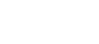

Ilustracja zmian współczynników w czasie, źródło: [11].

Osoba w następujących punktach oznaczonych na wykresie:

1. siada,

2. wstaje,

3. przewraca się,

4. nie rusza się.

Ponieważ system w artykule [11] analizuje również to, czy osoba rusza się po upadku, detekcja następuje w punkcie czwartym. Na wykresie widać także progi parametrów które twórcy wyznaczyli eksperymentalnie w celu detekcji upadku.

Jak widać zmiana sylwetki człowieka w czasie może skutecznie służyć detekcji upadku.

Autorzy artykułu [11] przeanalizowali 24 filmy na których widać codzienne czynności (chodzenie, siadanie, wstawanie, kucanie) oraz 17 symulowanych upadków (upadki do przodu, do tyłu, upadki podczas siadania, stracenie równowagi). Wyniki są następujące:

· True Positive (upadek wystąpił i został poprawnie zaklasyfikowany): 15

· False Negative (upadek wystąpił, ale czynność nie została zaklasyfikowana jako upadek przez algorytm): 2

· False Positive (upadek nie wystąpił, ale czynność została zaklasyfikowana jako upadek algorytm): 3

· True Negative (upadek nie wystąpił i czynność nie została zaklasyfikowana jako upadek algorytm): 21

Wyniki badań są obiecujące. Skuteczność wykrywania to 88%, przy niskiej ilości czynności codziennych zaklasyfikowanych jako upadek przez aglorytm. Autorzy sugerują, że dodatkowo można obniżyć ilość fałszywych alarmów przez zdefiniowanie na obrazie miejsca braku aktywności osoby (kanapa, łóżko). Wspomniane miejsca można określić w sposób automatyczny.

#### Wyznaczenie kąta głównej osi sylwetki

Autorzy artykułu [1] proponują metodę polegającą na wyznaczaniu głównej osi sylwetki oraz stosunku wariancji w osiach poziomej i pionowej. Warto zaznaczyć, że system który prezentują polega jednak na dwóch kamerach w pomieszczeniu.

Najpierw należy wyznaczyć macierz kowariancji 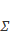:

gdzie  oznacza średnią średnią, a  oraz 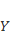 są rozkładami prawdopodobieństwa pikseli sylwetki zmiennych w osi  oraz .  oznacza wartość oczekiwaną.

Stosunek wariancji w osi poziomej pionowej  opisujemy wzorem:

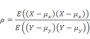

Kąt głównej osi może być znaleziony za pomocą rozkładu macierzy kowariancji  na wartości osobliwe (SVD- Singular Value Decomposition):

Kąt pomiędzy osią poziomą kadru, a główną osią  oblicza się w sposób następujący:

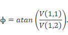

Proces jest podobny do analizy głównych składowych (PCA- principal component analysis). Główna oś jest zdeterminowana przez składową o największej wariancji.

Dla sylwetki osoby stojącej 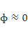

Jedna kamera może mierzyć kąt głównej osi tylko w swojej płaszczyźnie. Zatem przynajmniej dwie prawie prostopadłe kamery potrzebne są do mierzenia orientacji głównej osi w dwóch ortogonalnych płaszczyznach.

Z pierwszej kamery otrzymujemy 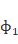, oraz . Podobnie z drugiej kamery otrzymujemy 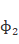, oraz . Ta przestrzeń czterowymiarowa może być zredukowana do przestrzeni dwuwymiarowej w następujący sposób:

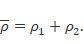

Następnie autorzy pracy [1] proponują wykrycie głowy człowieka oraz system który polega na śledzeniu zmian położenia głowy oraz zachowania głównej w osi sylwetki w czasie. Wykrycie głowy opiera się częściowo na analizie koloru skóry głowy.

Przykładowe rozpoznanie sylwetki za pomocą głównej osi oraz rozpoznania głowy, źródło: [1].

Rysunek przedstawia:

• A, E- kolorowe obrazy,

• B, F- główna oś (na zielono) oraz wykryta skóra osoby,

• C- część skóry najbardziej zbliżona do głowy według modelu

• D, G- pozycja głowy według modelu

Przykładowe obrazy, na których osoba wchodzi w interakcję z przedmiotami (nie kwalifikujące się jako upadek), źródło: [1].

Opis ilustracji:

· pierwszy i drugi kadr przedstawia tą samą sytuację z dwóch perspektyw- osoba przenosi torbę, 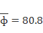°, ,

· podobnie trzeci i czwarty kadr- osoba przesuwa krzesło, °, 

Jak widać, w przypadku niedokładnego wydzielenia sylwetki z tła (wraz z przedmiotami) kąt  zbliżony do 90, może sugerować upadek. Przy zastosowaniu drugiej kamery (dla której kąt odpowiada pozycji stojącej) można nie kwalifikować powyższych sytuacji jako upadek, szczególnie gdy weźmie się pod uwagę pozycję głowy.

Przykładowe obrazy, które system kwalifikuje jako upadek, źródło: [1].

Opis ilustracji:

pierwszy i drugi kadr- obserwowana osoba czyta i jest zasłonięta przez biurko na obrazach z dwóch kamer, 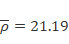°, 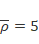,

trzeci i czwarty kadr- obserwowana jest częściowo zasłonięty na obydwu kadrach, jednakże sytuacja jest zakwalifikowana jako upadek, °, ,

podobnie trzeci i czwarty kadr- przesuwa krzesło- °, 

Jak widać, w przypadku niedokładnego wydzielenia sylwetki z tła (wraz z przedmiotami) kąt  zbliżony do 90, może sugerować upadek. Przy zastosowaniu drugiej kamery (dla której kąt odpowiada pozycji stojącej) można nie kwalifikować powyższych sytuacji jako upadek, szczególnie gdy weźmie się pod uwagę pozycję głowy.

Błędna segmentacja (wydzielenie sylwetki z tła) będąca przyczyną złej klasyfikacji, źródło: [1]

Opis ilustracji: Powyższy rysunek przedstawia błędną segmentację zdjęcia. Środek osoby nie jest rozpoznany.

Lewy obrazek- maska sylwetki po wydzieleniu.

Środkowy obrazek- rezultat kwalifikacji całej maski jako jednego obiektu (zielona linia obrazuje główną oś).

Prawy obrazek- rezultat kwalifikacji maski jako dwóch osobnych obiektów (zielone linie obrazują główne osie obu obiektów).

Autorzy pracy przeprowadzili analizę zależności kąta głównej osi sylwetki w stosunku do osi poziomej 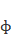, oraz stosunku wariancji w osi poziomej do osi pionowej  w zależności od wykonywanej czynności. Wyniki prezentowane są poniżej.

 Wykres zależności kąta głównej osi sylwetki ɸ i stosunku wariancji w osi poziomej pionowej  w zależności od wykonywanej czynności, źródło: [1].

### <a name="_Toc494697093">6.5.2. Śledzenie pozycji głowy.</a>

W niektórych pracach (między innymi [1], [6]) śledzenie głowy osoby pełni rolę wspomagającą główny system podejmowania decyzji, czy upadek nastąpił czy nie. Istnieją także prace (np. [16]), które opisują algorytm polegający jedynie na śledzeniu głowy i jej prędkości w czasie.

Motywacją badania prędkości głowy jest fakt, że ludzie rzadko wykonują nią gwałtowne ruchy. Jeżeli sama głowa ma dużą prędkość podczas normalnych czynności, nie wiąże się to ze zmianą kąta głównej osi człowieka. Przykładem codziennych czynności, podczas których zmienia się prędkość głowy, może być kucanie (np. w celu wiązania butów), siadanie lub wstawanie z krzesła. Na charakterystykę prędkości głowy w zależności od wykonywanej czynności ma również wpływ wiek obserwowanej osoby. Oczywiście osoby starsze nie będą gwałtownie zmieniać pozycji.

Dodatkowo warto zwrócić uwagę na fakt, że zazwyczaj głowa jest widoczna na obrazie z kamery. Rozpoznawanie sylwetki może zawodzić, kiedy jest ona częściowo zasłonięta, a zdarza się to często (niepełny kadr, meble, itp.). Jednak na kamerach umieszczonych w rogu pomieszczenia głowa jest widoczna cały czas w całości, co czyni ją obiektem odpornym na różne zakłócenia.

Autorzy pracy [1] traktują śledzenie jako dodatkowa weryfikacja działania głównego algorytmu. Czasami zdarza się, że kamera rejestruje gwałtowne zmiany kąta głównej osi sylwetki. Na przykład osoba stojąca za stołem (czyli widoczna jedynie od pasa w górę) może wyciągnąć ręce. Powoduje to bardzo szybką zmianą kąta głównej osi sylwetki  nawet o 90 stopni. Zazwyczaj podczas takich czynności pozycja głowy nie zmienia się znacznie. Warto przypomnieć, że autorzy pracy [1] w swoim systemie używają dwóch kamer, co oznacza że zazwyczaj głowa jest rozpoznana na przynajmniej jednej z nich, ponieważ twarz jest przynajmniej częściowo zwrócona do któreś z kamer. Zazwyczaj zatem głowa jest śledzona przez cały czas. Jeżeli system detekcji zakwalifikuje zachowanie osoby jako upadek, ale równocześnie na co najmniej jednej z kamer widać, że pozycja głowy nie zmieniła się, klasyfikacja jako upadek jest odrzucana. Ma to znaczny wpływ na zmniejszenie ilości błędnych klasyfikacji upadku (False Positive).

W celu znalezienia głowy na scenie, autorzy pracy [1] korzystają z modelu CrCb opartego na kolorze skóry, opisanego w [9]. Model uczony jest na fotografiach zawierających różne części ciała z odsłoniętą skórą. W ten sposób uzyskany jest model gaussowski oparty na kolorze skóry. Piksele z wartościach , 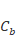 jest klasyfikowany jako skóra, jeżeli równanie

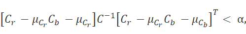

 

gdzie 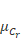, 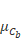to wartości średnie, oraz macierz kowariancji  z modelu gaussowskiego.

Próg 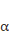 jest wybrany doświadczalnie i wynosi 10.

W czasie szukania głowy, obszary z widoczną skórą są łączone z sylwetką. Największy obszar skóry najbardziej oddalony od głównej osii sylwetki jest kandydatem na głowę.

Ilustracja dopasowywania głowdy do sylwetki

 

Kandydat na głowę powinien spełniał 2 kryteria:

zawierać co najmniej 15 pikseli o kolorze skóry oraz być nie większy 5% całej wielkości obiektu,

jego mimośród powinien mieścić się między 0.5, a 2.

Kiedy głowa już zostanie znaleziona, może być śledzona w czasie nagrania. Na kolejnych klatkach obszar o kolorze skóry zbliżony pozycją najbardziej do poprzedniej pozycji głowy traktowany jest jako głowa. Autorzy pracy [1] zawężają obszar przeszukiwania ze względu na  niską ilość klatek na sekundę kamery, w celu uniknięcia pomyłki np. głowy z ręką podczas gwałtownych ruchów. Jeżeli żaden z obszarów nie jest klasyfikowany jako głowa, ze względu na powyższy warunek, procedura szukania głowy wykonywana jest od nowa. Opisany system polegający na kolorze skóry wg autorów sprawdza się dobrze ze względu na zastosowanie przez nich dwóch kamer. W sytuacji, gdy osoba nie jest zwrócona twarzą chociaż częściowo do kamery i przy zastosowanie tylko jednej kamery, mogą wystąpić problemy. Istnieją jednak inne algorytmy śledzenia głowy (artykuł [16]), które według ich autorów sprawdzają się dobrze pomimo zastosowania jednej kamery o niskiej jakości. Artykuł [16] zostanie opisany w dalszej części tego podrozdziału.

Istnieją także próby integracji algorytmu śledzenia głowy wraz z estymacją postawy poprzez stosunek wysokość/szerokość prostokąta ROI. Autorzy pracy [6] przeanalizowali 24 20-minutowe filmy na których upadek pojawił się podczas ostatnich 2 minut trwania filmu. Ostatecznie uzyskano 240 klasyfikowanych zachowań, z czego 24 były upadkami. Warunki eksperymentów były raczej trudne, ponieważ obejmowały zmiany oświetlenia, prześwietlenia oraz analizę więcej niż jednej osoby na filmie. Poniższy wykres obrazuje parametry zarejstrowane przez system w kontekście wystąpienia rzeczywistego upadku lub zdarzenia nie będącego upadkiem.

Analiza prędkości głowy wraz ze stosunkiem prostokąta ROI w kontekście zdarzeń upadków i nie-upadków, źródło: [6].

  

Na wykresie łatwo zauważyć, że wiele upadków ma charakterystykę zbliżoną do nie-upadków. Autorzy pracy [6] po analizie doszli do wniosku, że 90% takich przypadków ma następujące przyczyny:

1. w 25 % przypadków 2 osoby były obecne w pomieszczeniu,

2. w 20% przypadków inny obiekt w tle miał zbliżone rozmiary do śledzonej osoby.

W obu przypadkach, system przeskakiwał ze śledzenia osoby na drugą osobę lub wspomniany obiekt, wykrywając gwałtowne ruchy i zmiany stosunku wysokość/szerokość prostokąta ROI.

3. W 25% przypadków, sylwetka osoby była rozpoznawana jako 2 obiekty o podobnym kształcie. Spowodowane było to prześwietleniem sceny, noszeniem przez osobę koszulki o kolorze zbliżonym do tła, błędnym klasyfikowaniem części osoby jako tła spowodowanym mechanizmem aktualizacji tła. Prowadziło to do zmiany stosunku prostokąta ROI i wykrywaniem szybkiego ruchu przez przeskakiwanie sytemu między dwoma rozpoznanymi częściami sylwetki.

4. W 20% pozostałych przypadków błędy wynikały ze z interferencją odbicia lub przesuwanymi meblami.

Praca [16] natomiast opisuje system, który polega wyłącznie na śledzeniu głowy. Co więcej, mimo zastosowania jednej, niskiej jakości kamery pozycja głowy śledzona jest w trzech wymiarach.

Kamera umieszczona jest w rogu pomieszczenia przy suficie. Autorzy pracy używają niskiej jakości kamery internetowej USB o kącie widzenia 70 stopni, co dodatkowo powoduje zniekształcenia geometryczne.

Główne cechy systemu to:

1. Śledzenie głowy osoby. Wybór podyktowany jest tym, że głowa zazwyczaj jest widoczna w kamerze i przemieszcza się w szybkim tempie podczas upadku.

2. Śledzenie głowy 3D za pomocą jednej skalibrowanej kamery. Śledzenie 2D okazuje się niewystarczająca, z tego względu autorzy zdecydowali się na śledzenie 3D dla uzyskania lepszych efektów. Zazwyczaj do śledzenia 3D wykorzystuje się co najmniej 2 kamery, chociaż autorzy twierdzą, że ich system działa dobrze w oparciu o tylko jedną kamerę.

3. Detekcja upadku w oparciu o charakterystykę prędkości za pomocą śladu głowy 3D.

Zgodnie z cytowaną pracą [17] autorzy opisywanej pracy [16] twierdzą że na obrazie 2D głowa jest dobrze opisywana przez elipsę. Zgodnie z tym duchem reprezentują głowę w 3D jako elipsoidę.

Do zlokalizowania głowy używają algorytmu „POSIT”, który jako wejście przyjmuje:

· Model 3D głowy zdefiniowany za pomocą danych antropometrycznych.

· Zrzutowane do 2D dane odpowiadających punktów oraz po korekcji zniekształceń.

· dane kamery pobrane z pomocą Matlaba, służące do korekcji zniekształceń.

Lewy kadr pokazuje obraz z kamery, prawy obraz jest już po korekcji zniekształceń, źródło: [18].

Algorytm POSIT zwraca dane pozycji głowy w relatywnym (względem kamery) układzie współrzędnych, tak że mogą być reprezentowane przez jednorodną macierz 4x4 (homogeneous matrix). Ponieważ chcemy znać pozycję głowy w standardowym układzie współrzędnych, musimy przekształcić dane z układu jednorodnego w sposób następujący:

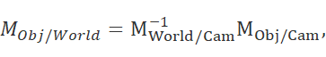

Gdzie:

·  to znana pozycja w układzie jednorodnym kamery,

·  to pozycja głowy w układzie jednorodym obliczonym przez algorytm „POSIT”,

·  to szukana pozycja w standardowym układzie współrzędnych.

Dzięki obliczeniu pozycji głowy, można śledzić głowę reprezentowaną jako elipsę dzięki filtrowi cząsteczkowemu (particle filter).

Poniższa ilustracja przedstawia pozycję głowy (reprezentowaną jako elipsę podczas upadku na dwóch następujących po sobie klatkach.  Przemieszczenie to 70 pikseli, przy 30 FPS i obrazie w rozdzielczości 640x480.

Reprezentacja głowy jako elipsy, źródło: [16].

Istnieje wiele algorytmów śledzenia głowy na filmie. Autorzy pracy [16] zdecydowali się użyć algorytmu filtra cząstekowego (w literaturze anglojęzycznej: „particle filter”, ”Condensation algorithm” lub „Conditional Density Propagation”). Polega on na aproksymowaniu funkcji gęstości prawdopodobieństwa stanu systemu poprzez zbiór przykładowych próbek (cząstek) z nałożonymi wagami. Celem jest estymacja rozkładu prawdopodobieństwa 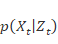 danego wektora  śledzonego obiektu oraz wektora 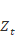 reprezentującego wszystkie obserwacje w czasie . Prawdopodobieństwo może być aproksymowane przez zbiór  ważonych próbek

Kroki algorytmu to:

1. Znadź nową próbkę 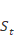 poprzez resampling starej próbki  za pomocą wag 

2. Oblicz przewidywaną pozycję nowej próbki za pomocą dynamicznego modelu stochastycznego.

3. Oblicz nowe wagi 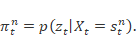

Średni stan systemu może być szacowany w czasie  za pomocą wzoru;

Opisana metoda używająca filtra cząsteczkowego działa dobrze przy małym ruchu, jednak podczas upadku następuje duży ruch (szczególnie jeżeli odświeżanie kamery jest niskie).

Żeby poradzić sobie z tym problemem może być konieczne użycie wielu próbek (cząstek) w celu znalezienia nowej pozycji głowy na obrazie. Może być to wymagać dużej mocy obliczeniowej, przez co być nieefektywne w systemach czasu rzeczywistego. Co więcej, pozycja głowy może nie być dokładna. W związku z czym autorzy pracy [16] proponują kilka poprawek algorytmu.

Sugerują oni, że warto nałożyć 3 filtry cząsteczkowe z własną charakterystyką i zastosowaniem. Każda z próbek to elipsa reprezentowana jako wektor 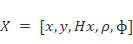, gdzie:

·  to środek elipsy,

·   to długość małej osi,

·  to stosunek wielkiej osi elipsy do jej małej osi.

·  to kierunek zorientowania elipsy.

Wagi próbek wynikają z gradientu Sobela. Również przedni plan wydzielany jest lokalnie w celu weryfikacji granic elipsy. Ostatecznie znalezione są „rozsądne” wagi.

Pierwszy filtr cząsteczkowy używany jest w celu sprawdzenia, czy pozycja głowy znajduje się w tym samym miejscu. W tym celu do pozycji  dodaje się mały szum. Jeżeli pierwszy filtr nie zwróci twierdzącej odpowiedzi, drugi filtr używany jest do przeszukiwania bardziej oddalonych punktów w celu znalezienia aproksymacji nowej pozycji głowy przy większym szumie. Trzeci filtr poprawia aproksymację drugiego filtru używając słabego szumu na parametrach wektora stanu.

Ilustracja działania filtrów w postaci schematu blokowego, źródło: [16].

Poniżej znajdują się dwa kadry z upadku. Pierwszy rysunek przedstawia pierwszą klatkę. Następne 4 rysunki przedstawiają drugą klatkę z ilustracją kolejnych kroków algorytmu. Poniższe ilustracje pochodzą z [16].

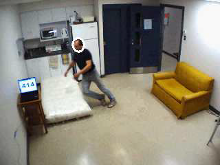

Czas t-1\. Głowa reprezentowana jest jako elipsa

Pierwszy filtr

Drugi filtr.

Trzeci filtr.

Czas t. Pozycja głowy została zaktualizowana.

Badania upadków przy pomocy czujników ruchu pokazują, że upadki mają inną charakterystykę prędkości od codziennych czynności, więc klasyfikator oparty o charakterystykę prędkości powinien dobrze sprawdzać się w celu wykrycia upadków.

Autorzy proponują posługiwanie się prędkością pionową (vertical velocity) , oraz prędkością poziomą  (horizontal velocity). Za pomocą trajektorii elipsy w 3D można obliczyć te prędkości.

Trajektoria 3D głowy uzyskana z filmu, źródło: [16].

  

Poniższy rysunek ilustruje charakterystykę prędkości podczas wykonywania różnych czynności. Zielona linia oznacza prędkość poziomą , natomiast niebieska lina reprezentuje prędkość pionową .  Prezentowane czynności to:

a. wstawanie,

b. siadanie,

c. osoba siedzi,

d. ponowne wstawanie,

e. chodzenie,

f. upadek.

Jak widać wypadek mocno odróżnia się od reszty czynności. Przy pomocy funkcji progowej z odpowiednimi parametrami progowych prędkości można zaklasyfikować czynność jako upadek.

Ilustracja zmiany prędkości pionowej i poziomej podczas różnych czynności, źródło: [16].

Autorzy artykułu przetestowali swój algorytm na 19 filmach prezentujących codzienne czynności oraz symulowane upadki. 9 filmów przedstawiało różne upadki (do przodu, do tyłu, upadek w trakcie siadania, stracenie równowagi). 10 filmów przedstawiało codzienne czynności takie jak siadanie, wstawanie, kucanie. Rozdzielczość filmików to 640x480 pikseli i częstotliwość to 30 klatek na sekundę.  Pozycja głowy jest początkowo inicjalizowana ręcznie na pierwszej klatce, a następnie śledzona przy pomocy filtra cząsteczkowego opisanego powyżej. Trajektoria głowy 3D obliczana jest dla każdego filmu, dzięki czemu można było przeanalizować prędkość poziomą oraz pionową. Czynność upadku jest wykrywana, jeżeli w tym samym czasie pojawia się szczyt funkcji prędkości zarówno poziomej i pionowej i jeżeli ujemne wychylenie prędkości pionowej  wynosi mniej niż -1,5 , a wychylenie prędkości poziomej  wynosi ponad 2 . Wyniki są następujące

· True Positive (upadek wystąpił i został poprawnie zaklasyfikowany): 6

· False Negative (upadek wystąpił, ale czynność nie została zaklasyfikowana jako upadek): 3

· False Positive (upadek nie wystąpił, ale czynność została zaklasyfikowana jako uapde): 1

· True Negative (upadek nie wystąpił i czynność nie została zaklasyfikowana jako upadek): 9

System spełnia oczekiwania twórców. Większość codziennych czynności nie jest klasyfikowana jako upadek i dwie trzecie upadków klasyfikowanych jest poprawnie. Czasami zdarza się, że podczas upadków system traci pozycję głowy, ale nie jest to dużym problemem, ponieważ początkowa zmiana prędkości głowy jest wystarczająca, żeby wykryć upadek. Błędy zazwyczaj powstają kiedy osoba upada z pozycji siedzącej (wtedy prędkość głowy jest zbyt mała) lub kiedy system śledzenia głowy nie działa prawidłowo.

W pracy [18] (rok 2011) ci sami autorzy opisują wyniki swoich badań i moduł śledzenia głowy w celu detekcji upadku zaimplementowany w OpenCV, w C++. Opisane tam są badania z bardziej szczegółowymi wynikami samego algorytmu śledzenia głowy i wyniki na korpusie wideo HumanEva data set.

Poniżej prezentowane jest działanie algorytmu w praktyce. Rysunki pochodzą z [18].

Chodzenie (klatki 300-400). Chodząca osoba generuje w przybliżeniu zerową prędkość pionową głowy, jej wysokość jest około 1,5 metra ponad podłogą.

Siadanie (klatka 420). Wysokość głowy obniża się do 1 metra z małą prędkością pionową.

Upadek (klatka 558) Osoba wstaje i upada z dużą absolutną prędkością pionową głowy (mniej niż -1 m/s). Na końcu upadku głowa znajduje się na wysokosci 50cm.

Wertykalna prędkość głowy oraz jej poziom wysokości podczas czynności prezentowanych na kadrach powyżej.

  

_ _

### <a name="_Toc494697094">6.5.3. Estymacja postawy za środka ciężkości sylwetki (centroidu) oraz VPS (Vertical Projection Histogram).</a>

Autorzy pracy [15] do wykrycia upadku używają trzech informacji:

· środka ciężkości człowieka (centroidu) w sensie figury geometrycznej 2D,

· histogramu pionowego jego sylwetki (Vertical Projection Histogram),

· długości wykrytej czynności.

Histogram pionowy wylicza się w sposób następujący:

Ponieważ  ma jednowymiarowy, można użyć metryki do obliczenia odległości dwóch histogramów  oraz   z dwóch następujących po sobie klatek, może być to odległość Bhattacharya:

Jednak ze względów obliczeniowych autorzy proponują porównywanie po prostu porównywanie histogramów za pomocą wartości maksymalnych (czyli po prostu wysokości sylwetki):

Analiza 3 parametrów czynności- długości trwania (a), pozycji środka ciężkości (b) o raz wysokosci sylwetki (c), źródło: [15].

Pozycja centroidu w zależności od czasu podczas upadku, chodzenia, kucania, źródło: [15].

Wysokość sylwetki w zależności od czasu podczas upadku, chodzenia, kucania, źródło: [15].

Oczywiście wielkość sylwetki i pozycja centroidu może zmieniać się w zależność od zmiany pozycji w stosunku do kamery (kiedy osoba na przykład zbliża się lub oddala).

W celu detekcji upadku zamiast wektora pozycji centroidu oraz wysokości histogramu, używa się wektora ich znormalizowanych wartości:

 

Gdzie:

·  to środek centroidu w n-tej klatce

·  oznacza wysokość sylwetki (maksymalną wartość VPS) w n-tej klatce

· SW to długość czasu okna śledzącego obiektu (np. liczba klatek).

Ponizsze rysunki pochodzą z [15] i przedstawiają rozkład zmian pionowego histogramu oraz centroidu w zależności od wykonywanej czynnosci dla trzech różnych czynności:

· Ruch w kierunku do kamery (Motion Type 1),

· Ruch w kierunku od kamery (Motion Type 2),

· Ruch w osii poziomej kamery (Motion Type 3).

  

 

  

 

Autorzy na tej podstawie wyznaczyli progi:

Progi dla każdego z typu ruchów, źródło: [15].

W celu analizy skuteczności algorytmu użyto 30 filmików (15 upadków i 15 filmików przedstawiających chodzenie). 28 czynności zostało poprawnie rozpoznanych, dwa upadki nie zostały rozpoznane.

Na podstawie opisu algorytmu i faktu, że autorzy do ewaluacji nie sprawdzili innych typów czynności (siadanie, kucanie) można domyślać się, że algorytm nie jest specjalnie skuteczny. Na pewno jego zaletą jest prostota implementacji i niskie wymagania obliczeniowe. Ze względów oczywistych algorytm może sprawdzać się źle w przypadku zasłonięcia osoby przez inny obiekt, interakcje z otoczeniem lub niepełny kadr.

### <a name="_Toc494697095">6.5.4. Analiza aktywności i strefy pomieszczeń.</a>

Inne podejście do ropoznawania upadków mają autorzy pracy [14]. Proponują tworzenie modelu stref aktywności osoby w danym pomieszczeniu. Po wyuczeniu modelu (przez obserwację danego pomieszczenia przez dłuższy czas i przy różnym oświetleniu) można stworzyć klasyfikator, który pozwala na odróżnienie standardowych czynności od anomalii (upadków). Motywacją jest fakt, że ludzie dużą część czasu spędzają w niektórych miejscach (kanapa, fotel, łóżko), więc wpływ czynnika takiej strefy jest bardzo istotny w modelu detekcji upadku.

Wyróżniające się miejsca: sofa (S), krzesło (C), drzwi od korytarza (H), drzwi tylne (R), źródło: [14].

Autorzy oparli swój system o kamerę o bardzo szerokim kącie widzenia znajdującą się na suficie, w centrum pomieszczenia. Kamera była nieskalibrowana.

Człowiek jest reprezentowany jako elipsa (wektor 5-elementowy), podobnie jak w sposób opisany w dziale „Analiza elipsy” niniejszej pracy. Śledzenie odbywa się przy pomocy filtra cząsteczkowego. Szczególne znaczenie dla analizy hipotetycznej elipsy miał pierścień wokół niej (do określonej ilości pikseli). Ilości pikseli wewnątrz elipsy (i ilość pikseli w tym pierścieniu) stanowi wejście dla funkcji oceniającej elipsę.

Reprezentacja człowieka jako elipsy, źródło: [14].

 

Wewnętrzna elipsa wyznaczona jest na podstawie najmocniejszych próbek (cząstek), zewnętrzna to pierścień na podstawie którego elipsa jest oceniana, źródło: [14].

  

Podczas śledzenia czynności osoby bierze się pod uwagę jego prędkość i wygładzone trajektorie za pomocą filtra średniej ruchomej (średnia krocząca, moving average filter). Trajektoria brana jest ze środka elipsy.

W zależności od pomieszczenia można wyróżnić kilka miejsc, w których osoba spędza najwięcej czasu. W salonie to, na przykład, krzesła i kanapy. Te miejsca oznaczone są jako strefy bezruchu (inactivity zones). Dla osoby zajmującej te miejsca często nie wykazuje znacznych ruchów. Wyróżniamy również strefy (niezmienne) wejść (entry zones).

Typowa czynność obejmuje wejście do pomieszczenia przez strefę wejść, skorzystanie z jednej lub większej ilości stref bezruchu i ostatecznie wyjście z pomieszczenia również przez strefę wejść. Oczywiście występują inne schematy czynności, jednak ten schemat jest najczęściej powtarzający się. W związku z tym, autorzy proponują żeby oprzeć model zachowania na schemacie semantycznym, w którym cała czynność reprezentowana będzie przez:

1. skorzystanie ze strefy wejścia (wejście do pomieszczenia),

2. brak aktywności w strefie bezruchu,

3. przemieszczanie się między strefami bezruchu,

4. skorzystanie ze strefy wejście (wyjście z pomieszczenia).

W celu wykrycia czynności odstających od typowych, autorzy wyuczyli model kontekstu przestrzennego (spatial context model) za pomocą estymacji MAP (Maximum a posteriori estimation) modelu mieszanek gaussowskich (Gaussian Mixture model). Dzięki temu możliwe jest oznaczenie charakterystycznych stref bezruchu i stref wejścia. Wyuczony model kontekstu przestrzennego używa się także do automatycznej segmentacji trajektorii ruchu i wykrycia zachowań nietypowych.

Wygładzone trajektorie, strefy bezruchu, oraz strefy wejść, źródło: [14].

Składowe modelu gaussowskiego odpowiadają za oznaczenie stref bezruchu oraz stref wejścia. Każda ze funkcji gęstości prawdopodobieństwa (gęstości prawdopodobieństwa, PDF, Probability Density Function),  dostarcza model przestrzennego przedłużenia strefy .

Strefy wejść mogą być użyte do inicjalizacji i oznaczenia semantycznego etykietami punktów wejścia i wyjścia. Kiedy prędkość osoby spada do poziomu oznaczającego brak aktywności, PDF strefy pozwala na sprawdzenie czy brak aktywności następuje w strefie bezruchu. Do rozpoznania, czy brak aktywności występuje w strefie bezruchu wykorzystuje się prosty algorytm. Prędkość, , dla każdego kroku szacuje się za pomocą skończonej różnicy ponad 40 okien czasowych i sprawdza się czy wyrażenie  przekracza wartość progową.

W celu demonstracji możliwości opisanej metody, poproszono aktora o przeprowadzenie serii symulacji polegającej na wykonaniu czynności oznaczanych przez H,R,C,S (jak w opisie w jednym z powyższych rysunków. Przykładowo (HSR):

· wejdź przez korytarz do pomieszczenia,

· usiądź i użyj telefonu,

· wyjdź przez tylne drzwi.

Inny przykład (HCSH):

· wejdź przez korytarz to pomieszczenia,

· usiądź i użyj telefonu,

· usiądź na sofie,

· wyjdź przez korytarz z pomieszczenia.

Poniższa tabela prezentuje zbiór opisanych sekwencji, długość ich trwania i błędy w rozpoznaniu przez system. Fall oznacza symulację upadku przez aktora (autorzy pracy nie mogli zdobyć nagrań prawdziwych upadków starszych ludzi z oczywistych względów).

Oznaczone sekwencje, źródło: [14].

Błędy w rozpoznaniu nastąpiły w 3 spośród 73 sekwencji. Strefy wejść i strefy bezruchu były wyuczone na podstawie danych trenujących przez przestrzenne modele kontekstowe (spatial context models). Zastosowanie metody uczenia Bayesa w konsekwencji pozwoliło na oznaczenie stref w taki sposób, że relacja opisu stref była taka sama jak w instrukcjach danych aktorowi.

Poniższe ilustracje prezentują trajektorie w oznakowanych przez algorytm strefach, oraz rozpoznanie nietypowego zachowania (upadku). Źródło: [14].

  

Zaprezentowana metoda wydaje się dobrym wsparciem dla innych metod detekcji upadku. Autorzy zastosowali dość nietypowe umieszczenie kamery (w centrum pokoju) i o dość nietypowych parametrach (bardzo szerokokątnej).  Trudno domyślić się jak metoda sprawdzać w kontekście kamery w rogu pokoju. Na pewno jednak automatyczne oznaczanie stref braku aktywności może okazać się przydatne, szczególnie że kamera nie wymaga kalibracji (natomiast minusem jest konieczność uczenia modelu dla każdego pomieszczenia i umiejscowienia kamery).

### <a name="_Toc494697096">6.5.5. Analiza ruchu po upadku</a>

Większość systemów detekcji upadku skupia się na analizie samego upadku. Niektórzy autorzy starają się jednak sprawdzać również, czy po upadku następuje okres czasu w których osoba się nie rusza. Taki test na wykrycie ruchu w fazie po upadku co prawda nie wpływa na skuteczność detekcji upadku, jednak pozwala na odróżnienie upadków niebezpiecznych (po których człowiek traci przytomność lub nie jest w stanie samodzielnie wstać) od upadków po których osoba może wstać samodzielnie (lub z pomocą) i nie ma potrzeby alarmowania przez system komputerowy.

  

Schemat algorytmu, który alarmuje tylko w poważnych  wypadkach, źródło: [18].

Zmiana parametrów w czasie dla poważnych upadków. źródło: [18].

Niektórzy autorzy polegają głównie na czasie bezruchu człowieka w zależności od miejsca w pomieszczeniu ( przykładowo [3] - [http://tunn.us/arduino/falldetector2.php](http://tunn.us/arduino/falldetector2.php)).  Co prawda trudno mówić tu o detekcji upadku, ale taki system według autorów [3] może lepiej sprawdzać się by stwierdzić, czy dana osoba potrzebuje pomocy. Dla kanapy sugerują, że czas może wynosić 2 godziny, natomiast dla łóżka 12 godzin. Dla podłogi rozsądny próg czasowy może wynosić 2 minuty.

System polegjący na Motion History Image by określić czy osoba pozostaje w bezruchu, źródło: [3].

### <a name="_Toc494697097">6.5.6. Ukryte modele markowa korzystające z wideo i audio.</a>

W pracy [2] opisano system detekcji upadku polegającej zarówno na analizie obrazu jak i audio. Autorzy skupili się na analizie stosunku wysokość/szerokość prostokąta ROI . Doszli do wniosku, że analiza transformaty falkowej (wavelet transform) parametru  jest bardziej odpowiednia do detekcji upadki, niż standardowa analiza zmiany  w czasie, ponieważ transformata falkowa igoruje punkty stacjonarne, a dobrze wychwytuje nagłe zmiany sygnału. Proponują wytrenowanie ukrytego modelu markowa (Hidden Markov Model- HMM), który będzie określał czy nastąpił upadek, czy nie. Dodatkowo użyty został sygnał audio z kamerki jako parametr wspomagający odróżnienie czynności chodzenia od upadku.

Zatem w odróżnieniu do poprzednich prac, analizie podlegają współczynniki transormaty falkowej .

Poniższy wykres (górny) przedstawia zależność stosunku wysokość/szerokość prostokąta ROI  w zależności od czasu dla osoby chodzącej. Wykres tuż pod nim przedstawia zmiany współczynników transformaty falkowej  w zależności od czasu (dla tej samej czynności- chodzenia). Poniższe progi T1, T2 (przy założeniu T2>T1>0) wyznaczają granicę przejść między stanami w ukrytym modelu markowa.

Osoba chodząca, źródło: [2].

Poniższy rysunek przedstawia te same wykresy, ale dla osoby która upadła.

Osoba podczas upadku, źródło: [2].

W czasie :

· jeżeli  (gdzie  oznacza i-ty współczynnik transformaty falkowej), oznacza że osiągany jest stan S1\.

· Jeżeli , osiągany jest stan S2\.

· Jeżeli T2 < , osiągany jest stan 3

W czasie fazy trenowania modelu wyznaczane są prawdopodobieństwa przejść

między stanami  oraz  (odpowiednio dla osoby chodzącej i upadającej), gdzie

Do treningu użyto 20 filmów.

Trójstanowe modele Markowa dla chodzenia (a) oraz upadku (b), źródło: [2].

Dla osoby chodzącej, ponieważ ruch jest prawie-okresowy, oczekujemy podobnych prawdopodobieństw przejść między stanami. Zatem współczynniki  powinny być podobne do siebie. Jednakże, jeżeli osoba przewraca się, sygnał falki przyjmuje wartości bliskie zeru. Zatem oczekujemy wyższego prawdopodobieństwa , niż innych wartości  w modelu upadku, co odpowiada większemu prawdopodobieństwu stanu S1\. Stan S2 odpowiada za histertezę, a zatem nie pozwala na nagłe przejścia ze stanu S1, do stanu S2 i na odwrót.

Przedstawiony model, czyli analiza samego , nie spełniał oczekiwań, gdyż nie odróżniał upadków od czynności siadania i zostawania w tej pozycji przez chwilę czasu. W związku z tym autorzy doszli do wniosku, że warto analizować sygnał audio w celu odróżnienia tych dwóch czynności.

Sygnał audio dla upadku (a), oraz czynności następujących po sobie: mówienia, schylania, mówienia, chodzenia, schylania, mówienia (b), źródło: [2].

Wykres sygnału falki dla powyższych czynności, źródło: [2].

Dla każdego okna  liczymy wariancje sygnału audio  oraz przejść przez zero 

Okazuje się, że sygnał audio jest prawie-okresowy dla chodzenia w kontekście   oraz  Jednakże, jeżeli osoba potknie się i przewróci,  rośnie, a  maleje. W związku z tym definiowany jest współczynnik:

 ,

który przyjmuje wartości nieujemne.

Wariancja parametru  zaprezentowana jest na poniższych wykresach.

Kappa dla upadku (a), chodzenia (b), oraz mówienia, schylania, mówienia, chodzenia, schylania chodzenia (c), źródło: [2].

W tym przypadku, autorzy używają trzy trójstanowe modele markowa jako klasyfikatory dla chodzenia (a), mówienia (b), oraz upadku (c) oparte na sygnału audio.

Zatem dla i-tego okna:

· jeżeli  osiągany jest stan S1,

· jeżeli  osiągany jest stan S2,

· jeżeli  osiągany jest stan S3.

Model jest trenowany w celu znalezienia   dla  za pomocą 500 próbek audio.

Klasyfikatory oparte o wideo i o audio łączone są w ten sposób, że czynność oznaczona jest jako upadek tylko wtedy, gdy zarówno HMM oparty o audio i HMM oparty o wideo oznaczają upadek.

Estymacja modelu jest następująca (dla modelu opartego o wideo, a także wideo + audio):

Wyniki dla zbioru testowego, źródło: [2].

Testy zostały przeprowadzone na komputerze AMD AthlonXP 2000+ 1.66GHz w czasie rzeczywistym. Na wszystkich 64 filmach jest tylko jedna poruszająca się postać. Jak wynika z tabeli, model oparty wyłącznie o wideo nie jest w stanie w ogóle określić czy dana osoba usiadła, czy przewróciła się. W odróżnieniu do niego, model oparty o wideo + audio radzi sobie w tym przypadku.

 

### 6.5.7.  <a name="_Toc494697098">PCANet + SVM</a>

Ciekawą metodę opartą o deep learning i SVM (Support Vector Machine, Maszyna wektorów nośnych) zaprezentowali w 2015 roku autorzy pracy [13]. Proponują oni framework, w którym początkowo model PCANet najpierw jest uczony za pomocą pojedynczych oznaczonych klatek przez człowieka, by zaklasyfkikować postawę osoby na klatce. Następnie za pomocą tego modelu używając SVM trenowany jest model dla sekwencji klatek (filmu). Autorzy przeprowadzili badania porównawcze z innymi metodami. Z eksperymentów wynika, że algorytm jest wysoce skuteczny.

Algorytm opiera się o na dwóch modelach. Pierwszy model uczy się na pojedynczych klatkach, które są zaetykietowane jako:

· 0- osoba nie upadająca,

· 1- osoba w trakcie upadku,

· 2- osoba która upadła.

Początkowo autorzy próbowali klasyfikować tylko dwa stany. Okazało się jednak, że stan pośredni jest bardzo pomocny, ponieważ niektóre upadki mogą kończyć się w niejednoznacznej pozycji. Przykładowo osoba przewracająca się zostaje na kolanach. Wtedy algorytm może mieć problem z rozróżnieniem, czy osoba przewróciła się czy nie. Ten stan jest zatem reprezentowany przez etykietę 1- osoba w trakcie upadku. Sylwetka osoby wydzielana jest za pomocą algorytmu ViBe. Następnie w celu nauczenia modelu klasyfikacji pojedynczych, wydzielonych klatek, używany jest PCANet (metoda deep learning) oraz SVM do klasyfikacji.

Ponieważ upadek jest raczej zdarzeniem ciągłym, drugi model (Action model) działa na sekwencji klatek. Przykładowo 30 ostatnich klatek. Korzysta on z oznaczeń dla każdej klatki modelu pierwszego i w ten sposób przy pomocy SVM uczony jest klasyfikacji krótkiego fragmentu filmu jako upadek lub nie-upadek. Ilustracja modeli pokazana jest na poniższym rysunku.

 

Ilustracja modelu pierwszego i drugiego, źródło: [13].

PCANet to framework do rozpoznawania obrazów oparty o PCA (Principal component analysis) Analiza składowych głównych). Autorzy wybrali PCANet do klasyfikacji obrazów z następujących przyczyn. Nisko-poziomowe, ręcznie tworzone klasyfikatory oparte o SIFT, HOG sprawdzają się ogólnie nieźle, jednak w detekcji upadku nie są specjalnie przydatne. Detekcja upadku według autorów powinna opierać się na cechach wysokopoziomowych opartych o deep learning, a nie niskopoziomowych (wybieranych ręcznie), gdyż zapewniają większą niezmienność wariancji wewnątrzklasowej. PCANet natomiast w porównaniu do konwolucyjnych sieci neuronowych (CNN, Convolutional Neural Network), nie wymaga skomplikowanych procesów dobierania parametrów i długiego treningu. Z tego względu PCANet daje się łatwo wytrenować oraz adaptować do zmiennych warunków.

Istnieją implementacje PCANet także o otwartym kodzie źródłowym), na przykład:

· [https://github.com/IshitaTakeshi/PCANet](https://github.com/IshitaTakeshi/PCANet) -python,

· [https://github.com/Ldpe2G/PCANet](https://github.com/Ldpe2G/PCANet) -c++, scala,

· [https://www.rdocumentation.org/packages/pcaMethods/versions/1.64.0/topics/pcaNet](https://www.rdocumentation.org/packages/pcaMethods/versions/1.64.0/topics/pcaNet) -język R,

· Istnieje także implementacja w matlabie (zamknięty kod),

· i inne.

W artykule [13] struktura sieci opisana jest bardziej szczegółowy. Poniżej umieszczony jest ogólny schemat użytej sieci PCANet.

Schemat sieci PCANet, źródło: [18].

            Model SVM używany jest dwukrotnie. Raz dla pierwszego modelu, który klasyfikuje pojedyncze klatki jako opisane wcześniej 3 stany. Drugi raz dla drugiego modelu (Action model), który działa na 30 następujących po sobie klatkach i klasyfikuje ich sekwencje jako 2 stany -upadek lub nie upadek.

W celu ewaluacji proponowanej metody, autorzy użyli publicznie dostępnego zbioru „Multiple Cameras Fall Dataset” ( [http://www.iro.umontreal.ca/~labimage/Dataset/](http://www.iro.umontreal.ca/~labimage/Dataset/) ) oraz własnych danych. Dostępny publicznie zbiór „Multiple Cameras Fall Dataset” składa się z symulowanych upadków i codziennych czynności. Czynności nagrywane są ośmioma kamerami w rozdzielczości 720x480 pikseli i 30 klatkach na sekundę. Składa się on z 24 różnych upadków z różnych pozycji wyjściowych osoby. Zbiór nagrany przez autorów pracy składał się ze 192 fimów z upadkami nagranych w 30 klatkach na sekundę, z rozdzielczością 352x288 pikseli.  Upadki były z nagrywane z 4 różny pozycji kamer,  w 4 różnych pozycji wyjściowych osoby, 4 różnych kierunkach upadku, 3 krotnie dla każdej takiej kombinacji.

Przeprowadzone zostało 8 eksperymentów na pierwszym zbiorze oraz 4 eksperymenty na zbiorze autorów pracy, każdy eksperyment był dla jednej pozycji kamery. Dla każdego eksperymentu wybierany był film jako testowy, a reszta zbioru była użyta do treningu. Poniższa ilustracja przedstawia 3 typy upadów.

3 typy upadków dla zbioru dostępnego publicznie i nagranego przez autorów artykułu, źródło: [13].

Poniżej przedstawiony na przykładzie jest model klasyfikacji sekwencji 30 kadrów. Na początku tło model tła uzyskiwany jest za pomocą algorytmu ViBe, następnie wydzielona jest maska z człowiekiem. Wydzielany jest fragment z człowiekiem i uzyskiwany prostokąt ROI. Jest on normalizowany do obrazka 60x60 pikseli w celu predykcji przez PCANet. Ostatni wiersz przedstawia etykietę, którą dostarczył model.

Ilustracja działania pierwszego modelu na przykładzie, źródło: [13].

W celu oszacowania skuteczności metody względem innych metod użyto czułości (Sensivity) i swoistości (Specifity). Wyniki przedstawione są poniżej. Metoda biomechaniczna (Biomechancs approach) wymaga noszenia czujników przez osobę.

Porównanie algorytmów detekcji upadku, źródło: [13].

Wyniki przedstawianego algorytmu dla różnych kamer, źródło: [13].

Wyniki wydają się być zadowalające. Autorzy spodziewają się lepszych wyników po zastosowaniu większych zbiorów treningowych.

### <a name="_Toc494697099">6.5.8. Spatial temporal interest points.</a>

Znaną powszechnie metodą analizy zdjęć jest szukanie punktów charakterystycznych (interest points). Algorytmy wykorzystywane do tego to np. SIFT, albo SURF (zaimplementowane w OpenCV). Sekwencję zdjęć można analizować wyszukując te punkty charakterystyczne.

Od niedawna wśród rozpoznawania akcji popularnością cieszą się algorytmy polegające na Spatial Temporal Interest Points (STIP, Space Time Interest Points, punkty charakterystyczne w czasoprzestrzeni). SIFT, czy SURF szukają punktów charakterystycznych na obrazie (czyli 2D). Mogą to być na przykład krawędzie, miejsca o dużej zmienności (wariancji). Jako, że przestrzenią punktów charakterystycznych jest obraz (płaszczyzna dwuwymiarowa), punkty maja współrzędne  STIP jest wybierany na całej sekwencji zdjęć. Jeżeli czas w filmie potraktujemy jako dodatkowy wymiar otrzymujemy przestrzeń trójwymiarową ze współrzędnymi punktu . Punkty STIP to przykładowo punkty, które są mogą mieć dużą prędkość (czyli duża zmienność w czasie i przestrzeni).

Film jako przestrzeń trójwymiarowa, źródło: [20].

 

Obecnie w samym Opencv nie ma implementacji STIP, jednak istnieją otwarte implementacje algorytmów szukających STIP ( [http://www.di.ens.fr/~laptev/download.html](http://www.di.ens.fr/~laptev/download.html) ). Sam STIP można zaimplementować obliczając HOG ( Histogram of Oriented Gradients ) dla każdej klatki, a później tworząc wektor zmian w przedziale czasowym a następnie klasyfikując zmiany przy pomocy klasyfikatora SVM [21]. Można tez od razu policzyć pochodne w przestrzeni trójwymiarowej.

STIP liczone wg algorytmu autorów [22], źródło: [22].

Ilustracja STIP wg różnych algorytmów, źródło: [22].

Powyższy rysunek ilustruje STIP wg różnych algorytmów dla Multi-KTH dataset

(a) I. Laptev, T. Lindeberg, Space-time interest points, in: ICCV, 2003

(b) P. Doll´ar, V. Rabaud, G. Cottrell, S. Belongie, Behavior recognition via

(a) sparse spatio-temporal features, in: VS-PETS, 2005

(c) G. Willems, T. Tuytelaars, L. V. Gool, An efficient dense and scaleinvariant

spatio-temporal interest point detector, in: ECCV, 2008.

(d) [22].

Dzięki wydzieleniu STIP, na ich podstawie można wytrenować model SVM, który będzie działał jako klasyfikator dla zachowań ludzi.

Klasyfikator zachowań na podstawie STIP wg pracy [22], źródło: [22].

Autorzy pracy [9] proponują wykorzystanie STIP do klasyfikacji zachowań i tym samym detekcji upadków. Upadki charakteryzują się bardzo dużą prędkością. Powstanie wielu punktów STIP jest zatem charakterystyczne dla nagłych ruchów i upadków. Autorzy opierają swój system na wielu kamerach. Tworzony jest wektor wstrząsu, który jest charakterystyczny dla różnego rodzaju zdarzeń. Po wybraniu STIP na filmach ze zbioru treningowe tworzony jest klasyfikator na podstawie modelu SVM, który może bazować na wektorze wstrząsu (Shock), rozproszeniu punktów STIP (scatter) i ich powierzchni (area). Filmy analizowane są w częściach po 200 klatek (przy filmach w 120 klatkach na sekundę).

Powyższe ilustracje pochodzą z [9] i przedstawiają STIP (zielone okręgi) dla różnych wartości progowych algorytmu.

Stopień wstrząsu w zależności od czynnosci (a)- upadek, (b)- normalna czynność, źródło: [9].

Następnie autorzy [9] proponują algorytm głosujący, który bazuje na wielu kamerach (jako że ich system bazuje na wielu kamerach).

Autorzy zaimplementowali system na komputerze z Windowsem 7, w C++ z użyciem OpenCV, LIBS. Użyto 104 filmów wideo (13 akcji z 8 kamer) do testów. Patrząc na wyniki należy wziąć pod uwagę że o wyniku decyduje wszystkie 8 kamer.

Poniżej znajdują się wyniki eksperymentów. F-score definiowany jest następująco:

Figure 1 Definicje miar, źródło: [9].

Czułość i swoistość dla różnych parametrów, dodatkowe oznaczenia punktów: F-score i Accuracy, źródło: [9].

Maksymalny F-score dla różnych cech, dla każdego pomiaru największa wartość jest pogrubiona, źródło: [9].

Wykres (a), źródło: [9].

Wykres (b), źródło: [9].

Powyższe wykres przedstawiają czułość swoistość. Dodatkowe oznaczenia w nawiasach to kolejno maksymalny F-score oraz Accuracy. (a) przedstawia kamery 1,3,5,7\. (b) przedstawia 2,4,6,8.

Maksymalny F-score fla różnych cech, (a)-kamery 1,3,5,7; (b)- kamery 2,4,6,8, źródło: [9].

Wyniki są wysokie, ale trudno oszacować jak zachowywałby się algorytm dla pojedynczej kamery. Należy również wziąć pod uwagę że kamery nagrywają w 120 FPS, co być może jest bardzo istotne w wyznaczaniu punktów STIP. Nagrania są dobrej jakości (brak przysłoniętych sylwetek). Mimo tego system jest jednym z najnowocześniejszych i ma wysoką skuteczność.

  

### <a name="_Toc494697100">6.5.9. Pictorial Structures for Articulated Pose Estimation</a>

 

Autorzy [27] (wraz z [23], [24], [25], [26]) również proponują rozwiązanie polegające na uczeniu maszynowym. Skupiają się oni na oszacowaniu postawy ludzkiej, a nie na wykryciu upadku, ale ta informacja może okazać się kluczowa przy rozwijaniu systemu detekcji upadku (wraz z innymi rozwiązaniami). Segmentują oni postawę ludzką na obszary, np. autorzy [23] wyszczególniają głowę, tors, dwa przedramiona (lewe i prawe), dwa ramiona, dwa uda i dwa dolne części nóg. Model można wyuczyć za pomocą zdjęć z oznaczonymi częściami ciała. W fazie trenowania uczy się on rozpoznawać poszczególne cześć ciała na obrazie.

Obraz z oznaczonymi częściami ciała (z prawej) i szacowaną sylwetką (z lewej), źródło: [25].

Obraz z oznaczymi częściami ciała (z prawej) i szacowaną sylwetką (z lewej), źródło: [25].

 

Znalezione części ciała i model sylwetki, źródło: [25}.

Wzór estymujący postawę wygląda nasępująco:

Faza trenowania i estymacji wyników wyglądają następująco:

źródło: [25].

Segmentację sylwetki na większą ilość części ciała proponują autorzy [25]. Według nich jest to korzystne, ze względu na to, że zmniejsza to wariancję tych części. Na przykład w modelu wariancja torsu jest dosyć spora, gdyż są osoby o różnych sylwetkach (chude, otyłe). Dodatkowo wariancja zwiększa się ze względu na różne obroty (prawy, lewy profil, różny kąt widzenia) i skalę osoby. Segmentacja na bardzo wiele punktów częściowo eliminuje te wady i według autorów [25] poprawia wyniki bez konieczności trenowania na dużym zbiorze treningowym (który mógłbym wyeliminować wariancję wewnątrzklasową.

Duża wariancja wewnątrzklasowa wynikająca z obrotów, różnej skali, róznych modeli sylwetek lub wyglądu, źródło: [25].

  

Co ważne, istnieje otwarta implementacja w C++ wykrywająca części ciała- [27]. Niektóre części kodu (ucząca) wymaga Octave/Matlab.

### <a name="_Toc494697101">6.5.10.  Wnioskowanie rozmyte bazujące na upadku i czasu nieaktywności osoby.</a>

Autorzy [11] proponują użycie wnioskowania rozmytego do detekcji upadków wymagających alarmu, ponieważ wnioskowanie rozmyte jest dobrze zbadane i użyteczne w temacie rozpoznawania wzorców. Co prawda używają kamer IR, jednak bazują oni na wydzielonej sylwetce człowieka, więc zwykłe kamery powinny być równie użyteczne.

Algorytm najpierw próbuje rozpoznać upadek na podstawie zmiany stosunku wysokość/szerokość prostokąta ROI w czasie, a następnie sprawdza jak długo po upadku osoba znajduje się w bezruchu. Jeżeli jest to odpowiednio długo czas włączany jest system alarmujący.

Ilustracja działania algorytmu, źródło: [11].

Zmienne lingwistyczne takie jak zmiana prędkości, zmiana wysokości, stosunek wysokość/szerokość prostokąta ROI obliczane są wprost dzięki analizie zmian ROI w czasie w wybranej skali.

Figure 2 Maksymalne zakresy zmienny lingwistycznych, źródło: [11].

Następnie wybrany jest zakres wartości dla poszczególnych cech odpowiadający zbiorom rozmytym. Poniższy zbiory odpowiadają zmianie prędkości (VelocityChange):

Figure 3 Przyporządkowanie do zbiorów rozmytych dla zmiennej zmiany prędkości, źródło: [11].

Później określany jest zbiór reguł dla wnioskowania rozmytego.

  

 

![Zbiór reguł wnioskowania, źródło: [11].](readme_pliki/image288.png)

  

 

Jeżeli zostanie wykryty upadek, zmienna Alarm ma ustawianą wartość FallDeceted (w innym przypadku wartość NoFallDetected). Jeżeli osoba nie rusza się przez dłuższy czas, zmienna Assistance ustawiana jest na AssistanceRequired (w innym przepadku na NoAssistanceRequired).

Wyniki działania algorytmu, źródło: [11].

  

# <a name="_Toc494697102">7. LBP</a>

## <a name="_Toc494697103">7.1. Wstęp</a>

Algorytm LBP służy do opisu lokalnych właściwości tekstury.  Przekształca on wejściowy, czarno - biały, obraz w nowy, przyporządkowując każdemu pikselowi i jego otoczeniu pewną liczbę, wyznaczoną za pomocą określonej metody. W zależności od użytej metody wyróżnia się podstawowy LBP oraz warianty Extended LBP (inaczej zwane Circular LBP).

W wersji podstawowej obliczenia dla każdego piksela bazują na jego naturalnym otoczeniu 3x3\. Ogólniejsze algorytmy posługują się parametrami r oraz p, oznaczającymi odpowiednio promień i liczbę punktów. Zamiast sąsiadów danego piksela, wyznaczają one p równomiernie rozłożonych punktów na okręgu o promieniu r o środku w danym pikselu, a następnie interpolują ich kolory. Po wyznaczeniu otoczenia, algorytmy przyporządkowują jego punktom wartości binarne, z których powstaje jedna liczba zapisana dwójkowo. W ten sposób uzyskuje się wartość piksela wynikowego obrazu. Zaletą rozszerzonej wersji jest to, że lepiej koduje cechy niezmiennicze na skale czy obroty.

## <a name="_Toc494697104">7.2. Działanie algorytmu</a>

Algorytm liczy lokalne przedstawienie tekstury. Najpierw obraz zostaje przekształcony do skali szarości. Następnie dla każdego piksela zostanie wybrany obszar o promieniu r wokół centralnego piksela. Każdemu pikselowi jest przypisywana liczba dziesiętna po binaryzacji liczby otrzymanej z otoczenia tego piksela. Wartości są przetrzymywane w macierzy. Na ich podstawie tworzony jest histogram. Wartości tak wyliczone są konkatenowane do postaci wektora. Wektory histogramów są porównywane z wektorami obrazów w bazie.

## <a name="_Toc494697105">7.3. LBP Extended</a>

Dzięki wykorzystaniu LBP Extended możliwe jest zakodowanie większej ilości wzorców, które będą się różnić poziomem wygładzenia i dokładności detali. Im większy promień r, tym bardziej jest wygładzony obraz LBP.

· ror

· Uniform

· nri_Uniform

· var

## <a name="_Toc494697106">7.4. Porównywanie histogramów</a>

Podobieństwo (lub niepodobieństwo) histogramów uzyskanych ze zdjęć po zastosowaniu LBP można badać różnymi miarami statystycznymi. W OpenCV istnieje funkcja:

spełniająca to zadanie. Uzyskana przez nią metryka jest znajdowana na podstawie statystycznej metody int method, która może być jedną z poniższych:

· Odległość χ2 (HISTCMP_CHISQR w openCV)

· Jest to odległość oparta na teście χ2, którą oblicza się ze wzoru

· Korelacja (HISTCMP_CORREL w openCV). Jest to zwykła korelacja między histogramami:

gdzie _cov_ oznacza kowariancję, a _std_ odchylenie standardowe:

a  oznacza średnią arytmetyczną.

· Odległość Hellingera  (HISTCMP_HELLINGER w openCV) wyraża się ona wzorem:

· Alternatywna odległość χ2 (HISTCMP_CHISQR_ALT w openCV) wyraża się wzorem:

· Przekrój (HISTCMP_INTERSECT w openCV) zwraca sumę minimów odpowiadających wartości:

· Dywergencja Kullbacka-Leiblera (HISTCMP_KL_DIV w openCV) Mierzy ona względną entropię histogramów H1,H2. Im jest wyższa, tym większą informacje daje H1 od H2. Z uwagi na to, że nie jest ona symetryczna, nie można jej traktować jako metryki statystycznej. Dywergencję Kullbacka-Leiblera można obliczyć ze wzoru:

## <a name="_Toc494697107">7.5. Jednorodność</a>

Natomiast liczba punktów p jest ważna ze względu na jednorodność. Jednorodność decyduje o opisie rotacji i poziomach wariacji w skali szarości. Funkcja LBP jest uznawana za jednorodną, gdy liczba binarna, która jest przypisywana każdemu pikselowi, ma co najwyżej 2 zmiany 0-1 lub 1-0. Im więcej punktów p jest wybieranych, tym gęstość ostatecznego histogramu wzrasta. Dla każdego punktu p istnieje p + 1 jednorodnych tekstur.

## <a name="_Toc494697108">7.6. LBP i rozpoznawanie twarzy</a>

Metodę LBP wykorzystuje się do rozpoznawania twarzy ze względu na możliwość porównywania histogramów struktur dla danego obrazu. Metoda ta wykorzystuje różnice w odległości między histogramami i następnie je porównuje.

Przykładowe zdjęcia z bazy

Poprzednie zdjęcia należą do kolekcji Train, na której **nasz program** uczył się rozpoznawać osobę o indeksie 54.  Nasze doświadczenia zostały przeprowadzone na bazie około **650 zdjęć** przygotowanych dla **55 osób**. Zostały one podzielone w stosunku około 5:1 na zdjęcia Train (służące do nauki rozpoznawania danej osoby), a Test (służące do testowania skuteczności algorytmu).

Zmiana parametrów zdjęcia

Osobę “54” i jej powyższe zdjęcia testowe będziemy śledzić na przestrzeni różnych opcji i metod algorytmu LBP. Pomoże ona nam wizualizować i prześledzić jak różne parametry wpływają na rozpoznawanie twarzy.

## <a name="_Toc494697109">7.7. Zależność efektywności wykrywania obrazu od kolejnych parametrów</a>

Wyniki testów dla algorytmu LBP

Powyższa tabela przedstawia wyniki pierwszego z dwóch robionych przez nas testów. Można z niej wywnioskować zależność pomiędzy rodzajem algorytmu LBP (Option), metodą porównywania histogramów (Method), szybkością jego działania (Speed) i efektywnością rozpoznawania twarzy (Result).

Średni wynik względem LBP Option

Poniżej znajdują przykładowe zdjęcia osoby **_"54"_** w trakcie działania różnych opcji algorytmu LBP. Wszystkie inne parametry zostały zachowane identyczne _(promień 1, metoda porównywania histogramów chisqr_alt, szybkie obliczenia, rozmiar 500 x 500px_).

 

Po lewej ilustracja opcji nri_uniform, osiągająca statystycznie najlepsze wyniki w trakcie naszych próbek. Obok opcja domyślna default.

Opcje ror i uniform. **Uniform dla wybranej osoby _“54”_ jak i dla całej naszej próbki najczęściej ma problemy z rozpoznawaniem twarzy.** W tym wypadku pogląd jest prawie całkowicie bezużyteczny. Dla opcji uniform będzie to ciągłe zjawisko, co zaobserwujemy w późniejszych częściach raportu.

Średni wynik względem metody porównywania histogramów (Method)

Można zaobserwować, że metody kl_div oraz intersect osiągają znacząco gorsze wyniki od pozostałych metod niezależnie od innych parametrów. Pozostałe metody uzyskały średni wynik w przedziale 44% - 52%.

Średni wynik względem prędkości (Speed)

Lepsze wyniki osiągane były przy większej prędkości wykonywania algorytmu.

Biorąc pod uwagę te wnioski warto przyjrzeć się dokładniejszym korelacjom Opcji i Metod. Poniżej cztery wykresy opisują dobrze zależności pomiędzy nimi - można zauważyć, że najkorzystniej wypada połączenie nri_uniform - Hellinger, zostawiając daleko w tyle wyniki pozostałych Opcji i Metod.

## <a name="_Toc494697110">7.8. Analiza parametrów dla LBP</a>

Wyniki pierwszego eksperymentu pokazały, że wolna prędkość obliczeń dawała znacząco gorsze wyniki, niż opcja szybka. W drugiej serii testów pominęliśmy więc parametr prędkości wykonywania algorytmu - wszystkie działania wykonane były wykonane z opcją szybką. Pozwoliło to też znacząco przyspieszyć czas obliczeń i ograniczyć go do ok. 30 minut.

W drugiej próbie został również dodany nowy parametr, będący rozmiarem obrazka. Zdjęcia twarzy przed wykonaniem algorytmów będą zmniejszane do ustalonych z góry rozmiarów. Pierwsza próba opierała się na stałych rozmiar 255 na 255 pikseli.

Do drugiej dodano opcję 50, 100 oraz 500 pikseli.

Rozpoznawanie większych obrazów zajmuje więcej czasu, ale powinno dać lepszą skuteczność dla wszystkich pozostałych parametrów.

Interesujące okazało się pytanie, czy odwrotne stwierdzenie dla mniejszych obrazów również będzie prawdziwe.

Wyniki względem Opcji i Metody były zbliżone do danych uzyskanych przy poprzednim podejściu, co ilustrują wykresy poniżej. **Opcja Default okazała się więc być najdokładniejsza z ograniczeniem szybkości fast oraz modyfikując rozmiary obrazków.**

Na powyższym wykresie wyraźnie widać, że rozmiar obrazka wpływa na wynik działania algorytmu LBP. Skuteczność rozpoznawania twarzy wzrasta, gdy użyte zostaje zdjęcie o większym rozmiarze. Różnica pomiędzy najgorszym a najlepszym wynikiem wynosi zaledwie 3,435672%, dlatego też ta zmienna nie została uznana za bardzo znaczącą.

Podgląd działania algorytmów w zależności od rozmiaru dla parametrów ror, promień 1, fast

Wniosek: Przy przetwarzaniu znaczącej ilości zdjęć słuszne więc wydaje się skalowanie ich do najmniejszych rozmiarów w celu przyspieszenia obliczeń.

# <a name="_Toc494697111">8. Porównanie algorytmów LBP i Haar</a>

Oba algorytmy wykrywania twarzy występujące w bibliotece OpenCV działają na podobnej zasadzie, lecz każdy z nich ma swoje mocniejsze i słabsze strony. Cechą łączącą oba algorytmy jest to, że muszą zostać wytrenowane, aby mogły spełniać swoją funkcję. Przebieg pracy obydwu algorytmów przedstawia poniższa ilustracja.

Pomimo kilku podobieństw obydwu algorytmów łatwo zauważyć też ich różnice w budowie, użyteczności czy wykorzystaniu. Zbiór tych różnic przedstawia poniższa tabela.

<table class="MsoNormalTable" border="1" cellspacing="0" cellpadding="0" width="0" style="width:548.25pt;margin-left:-43.75pt;border-collapse:collapse;
 border:none">

<tbody>

<tr>

<td width="89" valign="top" style="width:66.75pt;border:solid black 1.0pt;
  padding:5.0pt 5.0pt 5.0pt 5.0pt">

Algorytm

</td>

<td width="320" valign="top" style="width:240.0pt;border:solid black 1.0pt;
  border-left:none;padding:5.0pt 5.0pt 5.0pt 5.0pt">

Zalety

</td>

<td width="322" valign="top" style="width:241.5pt;border:solid black 1.0pt;
  border-left:none;padding:5.0pt 5.0pt 5.0pt 5.0pt">

Wady

</td>

</tr>

<tr>

<td width="89" valign="top" style="width:66.75pt;border:solid black 1.0pt;
  border-top:none;padding:5.0pt 5.0pt 5.0pt 5.0pt">

Haar

</td>

<td width="320" valign="top" style="width:240.0pt;border-top:none;border-left:  none;border-bottom:solid black 1.0pt;border-right:solid black 1.0pt;
  padding:5.0pt 5.0pt 5.0pt 5.0pt">

Wysoka dokładność wykrywania

Niska liczba błędnych odczytów

</td>

<td width="322" valign="top" style="width:241.5pt;border-top:none;border-left:  none;border-bottom:solid black 1.0pt;border-right:solid black 1.0pt;
  padding:5.0pt 5.0pt 5.0pt 5.0pt">

Duża złożoność algorytmu i wolna praca

Dłuższy czas szkolenia algorytmu

Niska dokładność przy słabym oświetleniu

Ograniczone działanie przy trudnych warunkach oświetleniowych

Mniej odporny na okluzje

</td>

</tr>

<tr style="height:90.0pt">

<td width="89" valign="top" style="width:66.75pt;border:solid black 1.0pt;
  border-top:none;padding:5.0pt 5.0pt 5.0pt 5.0pt;height:90.0pt">

LBP

</td>

<td width="320" valign="top" style="width:240.0pt;border-top:none;border-left:  none;border-bottom:solid black 1.0pt;border-right:solid black 1.0pt;
  padding:5.0pt 5.0pt 5.0pt 5.0pt;height:90.0pt">

Obliczeniowo prosty i szybki w działaniu

Krótszy czas szkolenia

Odporny na chwilowe zmiany oświetlenia

Odporny na okluzje

</td>

<td width="322" valign="top" style="width:241.5pt;border-top:none;border-left:  none;border-bottom:solid black 1.0pt;border-right:solid black 1.0pt;
  padding:5.0pt 5.0pt 5.0pt 5.0pt;height:90.0pt">

Mniejsza dokładność

Wyższa liczba błędnych odczytów

</td>

</tr>

</tbody>

</table>

Każdy klasyfikator wykrywania twarzy OpenCV ma swoje wady i zalety, ale największe różnice to dokładność i szybkość. W przypadku konieczności dokładniejszego wykrycia, klasyfikator Haar wydaje się być lepszym wyborem. Algorytm ten wydaje się być bardziej przydatny w takich technologiach, jak systemy zabezpieczeń czy wysokiej klasy stalking.

Klasyfikator LBP charakteryzuje się dużą szybkością, dlatego powinien być używany w aplikacjach mobilnych lub wbudowanych systemach.

# <a name="_Toc494697112">9. Wstępne przetwarzanie obrazu dla algorytmów Eigenfaces oraz Fisherfaces</a>

## <a name="_Toc494697113">9.1. Obróbka obrazu dla detekcji twarzy</a>

Aby umożliwić efektywne rozpoznawanie twarzy, najpierw konieczna jest ich lokalizacja na obrazie w postaci prostokątnych regionów. W tym kroku nie jest jeszcze istotne, do kogo należy twarz. Od 2001 roku nastąpiło znaczne polepszenie wykrywalności twarzy wraz z nadejściem klasyfikatora kaskadowego „Haar Feature-based Cascade Classifier”. Algorytm ten jest szybki, ponieważ detekcja odbywa się w czasie rzeczywistym z użyciem np. zwykłej kamery internetowej VGA. Cechuje się także sporą niezawodnością, ponieważ sprawdza się w 95% przypadków twarzy zwróconych przodem do kamery. Można się nim posługiwać w bardziej szczegółowej analizie wycinku obrazu, wykorzystując go jako narzędzie do wykrywania części twarzy, np. ust, nosa, oczu. Wykorzystywany jest również w ogólnej detekcji obiektów, takich jak log firm. Jego ulepszeniem jest klasyfikator oparty o LBP (Local Binary Pattern), i jest potencjalnie kilka razy szybszy niż jego poprzednik.

Biblioteka OpenCV umożliwia wczytanie wytrenowanych klasyfikatorów w postaci plików XML, takich jak poniżej:

Lista popularnych plików XML dla detekcji obiektów

Wczytanie danych do klasyfikatora odbywa się w następujący sposób:

Wczytanie wytrenowanego pliku XML

Przed przystąpieniem do wykrywania twarzy, należy przeprowadzić wstępne przetwarzanie obrazu, który będzie się składał głównie z:

· **Konwersji do skali szarości** – zmniejszona liczba kanałów obrazu do jednego znacznie przyspiesza obliczenia.

· **Zmniejszenia rozmiaru** – prędkość wykrywania obiektów zależy w dużej mierze od rozmiaru obrazu wejściowego i mimo tego detekcja będzie wciąż skuteczna nawet w przypadku mniejszych rozdzielczości.

· **Znormalizowanie histogramu** – wykrywanie twarzy jest mniej niezawodne w warunkach ograniczonego światła widzialnego. Aby zwiększyć skuteczność metody, należy dokonać zwiększenia kontrastu i jasności poprzez wyrównanie maksymalnych wartości histogramu klatki.

Biblioteka umożliwia w łatwy sposób konwertować obrazy do skali szarości dzięki użyciu funkcji             cvtColor(). Aby tego dokonać należy sprecyzować format konwertowanego obrazu wejściowego, np. dla trzykanałowego obrazu BGR lub czterokanałowego obrazu BGRA:

Konwersja do skali szarości

W celu zmniejszenia rozmiaru obrazu należy wywołać funkcję resize(). Wykrywanie twarzy sprawdza się dość dobrze dla obrazów większych niż 240x240 pikseli. Przykładowo można zmniejszyć szerokość zdjęcia do 320 pikseli. Podczas próby detekcji minimalne rozmiary interesującego obiektu nie będą na ogół mniejsze niż 20x20 pikseli. Zamiast zmniejszania skali obrazu, można by użyć większych rozmiarów ramki obiektu, choć wpłynęło by to znacząco na prędkość obliczeń. Wyniki znalezionych twarzy również zostaną poddane skalowaniu, dlatego należy pamiętać o utrzymaniu początkowego współczynnika proporcji.

Zmniejszenie obrazu wraz z zachowaniem proporcji

Mając już przeskalowany obraz, można przejść do korekcji histogramu dla twarzy. Operacja ta sprowadza się do wywołania funkcji equalizeHist().

Zobrazowanie wyrównania histogramu

Może się zdarzyć, że obrazy o naprawdę małym początkowym kontraście będą wydawały się prześwietlone po wyrównaniu histogramu, lecz w większości przypadków, polepszy to jasność i kontrast obrazu oraz pomoże w detekcji niewykrywalnych dotąd twarzy.

Listing 1 Normalizacja histogramu

## <a name="_Toc494697114">9.2. Rozpoznawanie twarzy</a>

Można teraz przejść do wykorzystania przetworzonego wcześniej zdjęcia i wyszukać na nim twarze. Posłuży do tego metoda CascadeClassifier::detectMultiScale(). Jako argumenty należy podać m. in. obraz wejściowy, dla którego funkcja zwróci wynik w postaci prostokątów wyznaczających obszary występowania twarzy. Kolejnym argumentem jest wartość zwiększanej skali przeszukiwania przy następnych skanowaniach - searchScaleFactor. Dla wysokiej skuteczności wykrywania warto przyjąć wartość 1.1. Parametr minNeighbors odpowiedzialny jest za eliminację przypadków wykrycia typu false positive. Zbyt duża wartość może do doprowadzić do utraty wyników true positive a więc tych, które niosą za sobą informację o właściwej pozycji twarzy. Oprócz tego dostępne są także flagi za pomocą których można określić sposób działania detektora, który domyślnie nastawiony jest na wyszukiwanie wielu twarzy. Opcja CASCADE_FIND_BIGGEST_OBJECT ustawia tryb wyszukiwania jedynie największej twarzy. Do flag, które mogą nieznacznie przyspieszyć wyszukiwanie twarzy zaliczają się np.: CASCADE_DO_ROUGH_SEARCH lub CASCADE_SCALE_IMAGE. Istotny jest także wymieniony wcześniej minimalny rozmiar twarzy, który brany jest pod uwagę - minFeatureSize. Dla przeskalowanych obrazów najrozsądniej jest przyjąć, że minimalny rozmiar twarzy wynosić będzie 20x20 lub 30x30 pikseli.

Wywołanie funkcji detekcji twarzy

Jeśli użyte zostało w poprzednim przykładzie skalowanie, nasze wykrywane obszary również ulegną transformacji. Aby przywrócić oryginalne pozycje wierzchołków prostokątów w celu wyświetlenia ich na oryginalnym obrazie, należy dokonać następujących operacji.

Skalowanie wykrytych obszarów twarzy

## <a name="_Toc494697115">9.3. Przetwarzanie wykrytej twarzy</a>

Rozpoznawanie twarzy jest niezwykle wrażliwe na zmiany warunków oświetlenia, obrót, czy wyrażane emocje, dlatego tak ważne jest, aby w najwyższym możliwym stopniu zminimalizować różnice pomiędzy obrazami twarzy danej osoby. W przeciwnym przypadku algorytm będzie „widział” więcej podobieństw między twarzami należącymi do dwóch różnych osób w tych samych warunkach np. oświetlenia niż dla twarzy pojedynczej osoby.

Najprostszym sposobem zniwelowania owych różnic jest zastosowanie normalizacji histogramu. Niestety byłoby to odpowiednie jedynie dla projektów, gdzie oświetlenie oraz kąty nie zmieniałyby prawie wcale. Aby uzyskać bardziej niezawodny algorytm, warto posłużyć się bardziej zaawansowanymi technikami wykrywania np. części twarzy, takich jak oczy, brwi, usta, nos. Najbardziej użyteczne okazuje się przetwarzanie, które wykorzystuje pozycje prawego i lewego oka. Przykładowa ekstrakcja cech twarzy wygląda następująco:

## <a name="_Toc494697116">9.4. Wykrywanie obszaru oczu</a>

Biblioteka dostarcza gotowych klasyfikatorów do wykrywania nie tylko otwartych i zamkniętych oczu, ale też oczu występujących u osób noszących okulary. Należy pamiętać, że jeśli opis klasyfikatora odnosi się np. do lewego oka, na obrazie należy wyszukiwać go po prawej stronie i odpowiednio dla lewego oka. Przykłady klasyfikatorów:

· haarcascade_mcs_lefteye.xml

· haarcascade_mcs_righteye.xml

· haarcascade_lefteye_2splits.xml

· haarcascade_righteye_2splits.xml

· haarcascade_eye.xml

· haarcascade_eye_tree_eyeglasses.xml

Istotnym problemem jest obszar wokół oka, z którym będzie się musiał zmierzyć klasyfikator. Na przykład pliki klasyfikatorów haarcascade_eye.xml oraz haarcascade_eye_tree_eyeglasses.xml nadają się lepiej do bardzo wąskimego otoczenia oka, natomiast pliki haarcascade_mcs_lefteye.xml oraz haarcascade_lefteye_2splits.xml pracują lepiej ze zwiększonym obszarem wokół oka. Poniższa tabela zawiera względne położenia dla wykrytych twarzy:

Tabela 1 Odległości względne obszarów wyszukiwania

Spodziewane obszary oczu dla wybranych klasyfikatorów

Pozyskanie interesujących nas regionów wyszukiwania wygląda następująco:

Uzyskanie wycinków obrazu do detekcji oczu

Wydajność detekcji nie idzie w parze z niezawodnością. Dla obrazów w rozdzielczości 320x240 z otwartymi lub zamkniętymi oczami oraz z okularami dla dedykowanego klasyfikatora, parametry prezentują się następująco:

Wydajność klasyfikatorów dla danych zbiorów

Warto zwrócić też uwagę na to, że podczas gdy rekomendowane jest zmniejszenie obrazu przed wstępnym wykrywaniem twarzy, nie musi być do dobra praktyka w wyszukiwaniu oczu. W tym przypadku wymagana jest największa możliwa rozdzielczość, a więc warto odnieść się do oryginalnego rozmiaru obrazu. Opierając się na tabeli w przypadku, gdy bardzo wysoka wydajność nie jest kluczowa, najlepiej jest użyć dla detektora najpierw pliku mcs_*eye, a później eye_2splits.

Do wykrycia lewego lub prawego oka służy ta sama metoda wykorzystana już wcześniej przy detekcji twarzy, ale tym razem wykorzystany zostanie obszar w oryginalnej rozdzielczości w celu polepszenia wykrywalności. Łatwo w ten sposób wyszukać początkowo np. lewe oko. Jeśli nie zostanie wykryte, wtedy należy spróbować posłużyć się innym detektorem.

Wyszukiwanie obszaru oczu

## <a name="_Toc494697117">9.5. Kombinacja transformacji</a>

Posiadając już wykryte obszary twarzy i oczu, można przystąpić do dalszych operacji, tj.:

· Transformacja geometryczna i przycinanie – w tym procesie zawierają się skalowanie, obrót i przesunięcie obrazu w taki sposób, aby w obszarze po usunięciu czoła, policzków, uszu i tła znalazły się oczy, nos oraz usta.

· Osobne wyrównanie histogramów dla prawej i lewej strony – zmniejszony wpływ na kąt oświetlenia.

· Wygładzanie – redukowanie szumów na zdjęciu dzięki filtrowi bilateralnemu.

· Maska eliptyczna – pomaga w usunięciu pozostałych włosów i tła z obrazu.

Kroki przetwarzania

Znaleziony obszar twarzy może okazać się zbyt słabo ustandaryzowany. Aby uniknąć nachodzenia na siebie różnych części twarzy, podczas rozpoznawania, tj. aby część nosa nie nachodziła na część oka innej zapamiętanej twarzy, warto wykorzystać pozycję oczu do wyrównania pozycji twarzy. Współrzędne posłużą do czynności takich jak:

· Rotacja – układ oczu będzie idealnie horyzontalny

· Skalowanie – odległość pomiędzy oczami będzie zawsze taka sama

· Translacja (przesunięcie) – oczy są umieszone w centralnej pozycji i na pożądanej wysokości

· Przycięcie – pozbycie się zewnętrznych części twarzy, tj. włosów, czoła, uszu, podbródka oraz tła.

Obliczone zostaną współrzędne środka oczu, kąt i dystans między nimi.

Obliczenia środka, kąta i dystansu oczu

Do odpowiedniego rozciągnięcia zdjęcia wykorzystana zostanie transformacja afiniczna. Najpierw jednak konieczne jest utworzenie macierzy przekształcenia na podstawie obliczonych wartości. Służy do tego metoda getRotationMatrix2D. Następnym krokiem jest przekształcenie afiniczne w celu umiejscowienia oczu w jednakowej pozycji dla każdej twarzy.

Przekształcenie afiniczne w wykorzystaniem macierzy transformacji

## <a name="_Toc494697118">9.6. Oddzielne wyrównywanie histogramów dla prawej oraz lewej strony</a>

W realnych warunkach bardzo często zdarza się, że oświetlenie podkreśla tylko jedną część twarzy, drugą pozostawiając zacienioną. Brak równomiernej jasności ma negatywny wpływ na jakoś rozpoznawania, dlatego ważne jest jak najlepsze zrównanie jasności obydwu stron. Gdyby po prostu zastosować wyrównywanie histogramu najpierw dla lewej części i odpowiednio dla prawej, dałoby to w rezultacie obraz o wyraźnej różnicy kontrastów pomiędzy granicami przetwarzanych obszarów. Dlatego w celu zniwelowania owego rozdzielenia, zastosowane zostanie stopniowe przejście od lewej wartości wyrównania, przez środkowy obszar, którego wartość wyrównywania będzie uśredniona dla całego obrazu, aż po prawy obszar z łagodnym przejściem.

Połączenie rozjaśnionych obszarów

Teraz trzeba utworzyć podobrazy-kopie i zastosować zwiększanie kontrastu dla każdego z nich.

Normalizacja dla całej twarzy oraz obu stron

Tak powstałe obrazy należy połączyć w jeden z łagodnym przejściem. Z racji tego, że obrazy nie mają zbyt dużych rozmiarów, można łączyć obrazy piksel po pikselu w następujący sposób:

Łączenie znormalizowanych obrazów

Tak powstały obraz, powinien znacząco zredukować efekty uboczne związane z nierównomiernym oświetleniem twarzy oraz powinien pomóc w precyzyjności rozpoznawania. Warto pamiętać, że ten sposób nie usunie zupełnie wszystkich efektów zacienienia, ponieważ ludzka twarz ma bardzo skomplikowaną strukturę przestrzenną.

## <a name="_Toc494697119">9.7. Wygładzanie</a>

Aby zredukować występujący na klatce szum, posłużyć się można np. filtrem bilateralnym. Jest to filtr nieliniowy, wygładzający obraz z zachowaniem krawędzi. Oparty jest o wagi liczone w zależności od odległości od piksela oraz od jasności pomiędzy pikselami otaczającymi. Jasność danego piksela jest zastępowana sumą ważoną jasności tego piksela.

Filtr bilateralny

Wyrównanie histogramu może znacząco podnieść poziom szumu. Parametry są dobrane w ten sposób, aby zająć się jedynie szumem na poziomie kilku pikseli, nie tracąc właściwości twarzy.

Wykorzystanie filtru bilateralnego

## <a name="_Toc494697120">9.8. Maska eliptyczna</a>

Pomimo tego, że mamy już usuniętą większość z zbędnych elementów twarzy, wciąż pozostaje pozbyć się elementów w rogach obrazu, takich jak np. część szyi, szczególnie wtedy, gdy twarze nie są zwrócone przodem do kamery.

Końcowe przycięcie obrazu

Środkiem elipsy będzie punkt o położeniu względnym 0.5 dla osi X oraz 0.4 dla osi Y. Stosunek osi wielkie do osi małe wynosi 10:16.

Utworzenie maski eliptycznej

Tak przetworzone twarz mogą posłużyć jako wejście w fazie rozpoznawania zarówno w procesie zbierania treningowych danych, jak i w przypadku prób rozpoznania wykrytych twarzy z klatki kamery.

Końcowy efekt przetwarzania obrazu twarzy

# <a name="_Toc494697121">10. Wykorzystanie sieci neuronowych w rozpoznawaniu twarzy</a>

## <a name="_Toc494697122">10.1. Wstęp</a>

Rozpoznawanie obrazów jest zadaniem, w którym sieć neuronowa (lub inny automatyczny system rozpoznający) ma podejmować decyzje na temat przynależności określonych obiektów do ustalonych klas. Obiekty mogą być różnych rodzajów – mogą to być obrazy cyfrowe wprowadzone wprost z cyfrowych aparatów lub kamer cyfrowych, albo obrazy analogowe, przetworzone przez skaner lub „frame grabber”.

 Proces przygotowania danych do uczenia sieci neuronowej

Sieć neuronowa rozpoznająca obrazy ma zwykle kilka wejść, na które podawane są sygnały odpowiadające wyróżnionym cechom rozpoznawanych obiektów. Na ogół takich wejść bywa dużo, bo trzeba dokładnie „pokazać” sieci wszystkie cechy rozpoznawanego obiektu, żeby mogła się prawidłowo nauczyć go rozpoznawać. Jednak liczba cech, charakteryzujących obraz, jest znacząco mniejsza niż liczba elementów (pikseli) samego obrazu. Jeśli na wejście sieci rozpoznającej podałoby się bezpośrednio obraz cyfrowy, wówczas liczba wejść sieci (równa liczbie pikseli na takim obrazie) mogłaby sięgać setek tysięcy lub nawet wielu milionów! Dlatego praktycznie nigdy nie stosuje się takich sieci neuronowych, które pobierałyby wprost na swoje wejście analizowany obraz jako taki, tylko zwykle wprowadza się tam właśnie wspomniane cechy obrazu, wydobyte i ustalone za pomocą programów analizujących rozpoznawane obrazy poza siecią neuronową, co czasem bywa określane jako preprocessing tych obrazów.

Sieć neuronowa rozpoznająca ma też zwykle wiele wyjść. Na ogół są one wykorzystywane w ten sposób, że do każdego wyjścia przypisuje się określone rozpoznanie. Na przykład w systemie automatycznego rozpoznawania znaków alfanumerycznych (tzw. zadania OCR) korzysta się z ponad 60 wyjść, z których każde przypisane jest do innego znaku – na przykład pierwszy neuron powinien sygnalizować pojawienie się litery A, drugi – B itd.

Schematyczna budowa wielowarstwowej sieci neuronowej

Pomiędzy wejściem i wyjściem jest też zwykle przynajmniej jedna warstwa ukryta. Najogólniej mówiąc, warstwa ta może mieć więcej albo mniej neuronów – i potoczna interpretacja zjawisk zachodzących w sieciach neuronowych nakazuje nam uważać, że sieć mająca tam więcej neuronów jest bardziej „inteligentna”. Jednak wcale nie jest dobrze dążyć do posiadania sieci o możliwie największej „wrodzonej inteligencji”, gdyż sieć taka bywa czasem zaskakująco nieefektywna.

## <a name="_Toc494697123">10.2. Typy sieci neuronowych w rozpoznawaniu twarzy</a>

Najczęściej do rozwiązywania tego typu problemów używa się sieci MLP (Multi-Layer Perceptron) oraz rekurencyjnych sieci neuronowych Hopfielda, w której wszystkie neurony są ze sobą nawzajem powiązane na zasadzie sprzężeń zwrotnych. W pierwszym przypadku sieć jest zwykle dwuwarstwowa i składa się z neuronów sigmoidalnych. W procesie uczenia wykorzystuje się propagację wsteczną, czyli podstawowy algorytm uczenia nadzorowanego wielowarstwowych, jednokierunkowych sieci neuronowych. Podaje on przepis na zmianę wag dowolnych połączeń elementów przetwarzających rozmieszczonych w sąsiednich warstwach sieci. Charakteryzuje się jednak dość wolną zbieżnością. Drugi typ – sieć rekurencyjna –cechuje się prostym sposobem uczenia i łatwością implementacji w postaci układu fizycznego. Składa się z jednej warstwy zawierającej M jednakowych neuronów najczęściej opisanych charakterystykami skokowymi. Ogólnie funkcja aktywacji neuronów występujących w sieci Hopfielda może być również opisana funkcją ciągłą, np. z wykorzystaniem funkcji tangens hiperboliczny. Sieć Hopfielda może spełniać funkcję pamięci skojarzeniowej. Wartości wag są dobierane w ten sposób, aby sieć mogła zapamiętać kilka wektorów które traktuje się jako wzorcowe. Jeżeli na wejście sieci poda się jakiś wektor wzorcowy lub zaburzony wektor wzorcowy, to na wyjściu sieci powinien ustalić się ten sam nie zaburzony wektor wzorcowy. W inicjującym kroku działania sieci na wejście sieci podaje się wektor wejściowy, np. obraz w postaci mapy bitowej o wartościach +1, -1\. Stan na wyjściu sieci w kolejnym kroku uzyskujemy w wyniku działania algorytmu iteracyjnego. Sieć kończy działanie, kiedy w dwóch kolejnych krokach wyjście sieci nie zmienia się. Wadą sieci Hopfielda jest jej mała pojemność, wyrażająca się małą liczbą klas, jakie sieć może zapamiętać.

## <a name="_Toc494697124">10.3. Zastosowanie</a>

Sieci neuronowe znajdują zastosowanie m. in. w detekcji twarzy, rozpoznawaniu, analizie wyrazu oraz w kategoryzacji na podstawie rysów twarzy. Pozwalają także przede wszystkim:

· zdyskryminować wszystkie cechy dla każdego wzorca i każdej cesze nadać odpowiednia wartość

· wybrać cechy najbardziej istotne dla danych wzorców wejściowych

· automatycznie zbudować topologie sieci

· wyliczyć wagi, funkcje aktywacji na każdym neuronie

· zawsze rozpoznać wszystkie wzorce uczące

· umieć rozpoznawać zaburzone wzorce uczące

Przykładowa twarz i jej wektor wag utworzona

przy wykorzystaniu 20 twarzy własnych

# <a name="_Toc494697125">11. Łączenie klasyfikatorów detekcji twarzy w celu polepszenia wyników</a>

## <a name="_Toc494697126">11.1. Framework</a>

Detekcja twarzy jest do dzisiaj problemem otwartym. Potrafi być zawodna w systemach stosowanych na dużą skalę, podczas częściowego zasłonięcia twarzy lub w przypadku zmiany pozycji, rotacji. Eksperymenty z łączeniem klasyfikatorów wykazały zwiększenie pozytywnych przypadków wyszukiwania, przy jednoczesnym zmniejszeniu współczynnika wykrycia przypadków typu _false-negative_. Metoda scalania uwzględnia dodatkowo przydatne informacje o oszacowanej pozycji i wyrównania twarzy.  

Najbardziej przykuwającym uwagę detektorem wśród społeczności zajmującej się detekcją twarzy jest _Viola-Jones object detection framework*_. Bazuje na analizie cech tzw. obrazu integralnego, z wykorzystaniem falek Haara. Proces klasyfikacji zrealizowano z użyciem algorytmu AdaBoost (kaskada klasyfikatorów). 

Porównanie frameworków

Wysoką skuteczność uzyskać można między innymi dzięki wykorzystaniu jak największego zbioru o zróżnicowanych cechach położenia, oświetlenia, itp. przy jednoczesnym określeniu zbioru obrazów niezwiązanych z poszukiwaniami.

Trenowanie klasyfikatora kaskadowego

Dzięki bibliotece OpenCV, narzędzia trenujące są dostępne dla szerokiego grona badaczy. Klasyfikatory są zazwyczaj skonstruowane dla frontalnych pozycji głowy, więc ich niezawodność zależy głównie od kąta względem kamery w płaszczyźnie, jak i poza nią. W tej części wykorzystane połączone zostaną globalne oraz lokalne detektory, aby uzyskać znaczącą poprawę całościowego działania.

## <a name="_Toc494697127">11.2. Rezultaty eksperymentalne</a>

Wśród wielu klasyfikatorów twarzy i głowy zawartych w bibliotece OpenCV wybrano FA2, oznaczony jako _haarcascade_frontalface_alt2_, który wykorzystywany jest często jako główny punkt odniesienia w porównywaniu wyników. Poniższa tabela przedstawia parametry dla dwóch zbiorów danych - _Yale Face Database_ oraz _The CMU Multi-PIE Face Database_.

Porównanie klasyfikatorów

Do eksperymentu wykorzystano heurystyki w połączeniu klasyfikatorów dla oka, ust, nosa, czy ucha. Porównano różne strategie:

· **F**: wykorzystanie jedynie klasyfikatora FA2

· **FC**: wykorzystanie klasyfikatora FA2 oraz wyszukiwanie części twarzy w spodziewanych rejonach. Nieudana próba znalezienia przynajmniej czterech elementów skutkuje zaklasyfikowaniem zdjęcia jako pomyłka. W rezultacie tak pozytywne, jak i negatywne współczynniki klasyfikacji ulegają polepszeniu.

o Prawe i lewe oko: lewy górny róg obszarów (0, 0) and (sx × 0.4, 0) i ich wymiary: (sx × 0.6, sy ∗ 0.6).

o Nos: lewy górny róg obszaru (sx × 0.2; sy × 0.25) i ich wymiary: (sx × 0.6, sy × 0.6).

o Usta: lewy górny róg ROI: (sx × 0.1; sy × 0.4) i ich wymiary: (sx × 0.8, sy × 0.6).

o Lewe i prawe ucho: lewe górne rogi wynoszą odpowiednio:(−sx/3; sy × 0.2) and (sx/2; sy × 0.2), i ich wymiary: (sx/3 + sx/2, sy × 0.6).

Face ROIs areas

· FC2: metoda podobna do FC, lecz cechująca się dodatkowym przeskalowaniem obrazu dla części oka

· **FFs**: brak detektora całej twarzy, zamiast tego analiza na postawie jednocześnie występujących no najmniej trzech spójnie i logicznie występujących elementów. Główne zasady:

o usta muszą być poniżej innych części twarzy (ale względnie blisko)

o nos musi występować poniżej obu oczu, ale powyżej ust

o centrum lewego oka musi być wysunięte najbardziej na lewo od pozostałych elementów i powyżej nosa i ust

o centrum prawego oka odpowiednio musi być występować na najdalej wysuniętym na prawo obszarze, także powyżej nosa i ust

o uszy muszą być o obu stronach

o proporcje odległości pomiędzy twarzami muszą być spójne

· **FFFs**: łączy metodą F i FFs, jest mniej wrażliwa na zasłonięte części twarzy lub na obrót od FFCFFs**: łączy FC i FFFs w celu redukcji współczynnika false-positive

· **FC2FFs**: łączy FC2 i FFFs w celu zarówno redukcji współczynnika *false positive*, jak i wzrostu pozytywnego współcznynnika klasyfikacji

· **XXR**: zastosowane wszystkie poprzednie podejścia nie tylko dla obrazu wejściowego, ale też lekko obróconych o ok. 15 stopni w prawo i w lewo aby mieć do czynienia w większą różnorodnością pozycji.

Wyniki dla True Positive Rate (TPR) i False Positive Rate (FPR) umieszczone są w poniższej tabeli:

Wyniki dla oryginalnego obrazu wejściowego

Wyniki dla obróconego obrazu

## <a name="_Toc494697128">11.3. Spostrzeżenia</a>

Głównym punktem odniesienia jest pierwszy test na poziomie 71% poprawnej detekcji oraz mylącym się w ok. 5% przypadków. Warto zauważyć, że podejście FC2 zachowuje się praktycznie tak samo dla pozytywnych wyników i jest aż dziesięciokrotnie skuteczniejszy przy pozbywaniu się błędów. Podobnie błędnych klasyfikacji można uniknąć stopując metodę FC oraz FFs (opartą jedynie na deskryptorach wyszukujących części twarzy), chociaż radzi sobie jedynie z połową poprawnych obrazów twarzy. Najlepsze oba współczynniki można zaobserwować w metodzie FC2FFs oraz FFFs.

Rezultat polepszenia wskaźnika True Positive

Rezultat polepszenia wskaźnika True Negative

Zaangażowanie klasyfikatorów wykrywających wiele obszarów składających się na całą twarz przyczynia się do zwiększenia obliczeń, choć w dobie komputerów wielordzeniowych, wydaje się to mniej znaczące.

Aby zilustrować lepiej korzyści, jakie płyną z owych obliczeń, dla każdego z podejścia łączonego wykonano osobne testy. Osobne wyniki uzyskano dla podejścia niezawierającego obróconych obrazów oraz zawierającego obrócone obrazy. 

Krzywe operacyjne odbiornika ROC dla nieobróconych zdjęć

Krzywe operacyjne odbiornika ROC dla obróconych zdjęć

Prezentują poprawę, choć koszt obliczeń wzrasta trzykrotnie. Dodatkowymi zaletami jest informacja o pozycji głowy, kącie obrotu. Tym samym, znajdując jedno ucho na obrazie, wysoce prawdopodobne jest, że twarz jest częściowo lub całkowicie odwrócona. Kolejnym krokiem weryfikującym może być próba odnalezienia oka w spodziewanym obszarze.

Oszacowanie obrotu głowy

Rezultaty wykazują, że połączenie klasyfikatorów skutkuje zwiększoną skutecznością wykrywania twarzy, jak i nie-twarzy w porównaniu z obecnym stanem wiedzy. Zyskuje odporność na niewielkie kąty obrotu dodaje wiedzy do dalszego analizy klasyfikowanej twarzy.

  

# <a name="_Toc494697129">12. Wpływ niskiej rozdzielczości na jakość detekcji i rozpoznawania twarzy</a>

W tej części przeanalizowana zostanie niezawodność systemów wizyjnych czasu rzeczywistego, które wykrywają oraz rozpoznają twarze z obrazów niskiej rozdzielczości. Obraz ten pochodzi z kamer przemysłowych CCTV. Podczas badań wzięta zostanie pod uwagę zarówno poprawność ekstrakcji (wykrywania) obiektów, jaki i ich właściwa klasyfikacja (rozpoznawanie). Do testów wykorzystano zbiór danych umożliwiający analizę tolerancji na zmienne warunki oświetlenia i pozycji głowy.

W dzisiejszych czasach coraz więcej systemów automatycznego dostępu oparte są na analizie cech biometrycznych. Systemy rozpoznawania twarzy cieszą się dużą popularnością za względu na coraz większą niezawodność. Głównym problemem jednak wciąż jest niezadowalająca jakość szczegółów pochodzących z kamer, zwłaszcza z większej odległości. Identyfikacja obiektów ze znacznej odległości w tych warunkach pozostaje wciąż ważnym naukowym problemem do rozwiązania. W tego typu przypadkach można zauważyć oddzielne etapy dla detekcji i rozpoznawania.

Testy odbyły się w środowisku Matlab z przygotowanym środowiskiem graficznym ułatwiającym badanie efektywności algorytmów dla różnych parametrów. Rozpoznawanie oparte jest na podejści Eigenfaces.

## <a name="_Toc494697130">12.1. Biometryczne standardy rozpoznawania twarzy odnoszące się do CCTV</a>

Istnieje kilka norm opisu głównych zasad, kierunków i cech dotyczących wejściowych danych biometrycznych, m. in. obrazów twarzy. Należą do nich między innymi: _ISO/IEC 19794 5_, _ANSI/INCITS 385 2004_ oraz europejska norma _EN 50132-7: CCTV_.

Rekomendowany minimalny rozmiarobserwowanych obiektów według europejskiego standardu EN 50132-7: „CCTV and alarm systems”

Wspomniane normy można odnieść do zbiorów danych przygotowanych dla instytucji naukowych. Poniższa tabela przedstawia zestawienie wyników w porównaniu do owych norm.

  

Porównanie norm biometrycznych

_  
_

Baza danych Uniwersytetu Sheffield zawiera 564 obrazy 20 osób. Każda z nich jest ujęta innej pozycji – od pozycji bocznej do frontalnej. Pliki zapisane są w formacie PGM (Portable Greymap) w różnych rozmiarach i w 256-bitowej skali szarości. Wadą tej bazy danych jest niewątpliwie brak rozdzielenia frontalnych ujęć twarzy od reszty pozycji. Ze wszystkich zdjęć, do eksperymentu wykorzystano jedynie twarze odwrócone przodem do kamery.

Jedną z najlepiej nadających się do badań pod względem łatwości zastosowania, przetwarzania i sortowania plików według cech jest baza danych _Yale Face Database_. Zawiera ona 5760 obrazów 10 ludzi. Każdej fotografowanej osobie przypada 576 zdjęć w 9 pozycjach i innych warunkach oświetleniowych. Każdy plik w tej bazie może być łatwo odseparowany z powodu jasnego nazewnictwa zdjęć frontalnych i innych. Obrazy dobrej jakości występują w rozdzielczości 640x480, ale wciąż nie spełniają wspomnianych wcześniej wymagań.

<a name="_Ref493225981">Przykład detekcji twarzy dla obrazu o niskiej rozdzielczości ze zbioru Yale database</a>

Następną przetestowaną bazą jest „MUCT Face Database” pochodzącą z Uniwersytetu Kapsztadzkiego. Składa się z 3755 obrazów dla podzielonych na 276 klas obiektów. Każda twarz była fotografowana przy użyciu pięciu różnych kamer w tym samym momencie. Dzięki temu uzyskano pięć różnych pozycji. Dodatkowo, każda jednostka była fotografowana w czterech różnych ustawieniach oświetlenia.

Baza danych „The Color FERET Database” z Uniwersytetu Georga Masona była tworzona między rokiem 1993 i 1996 i zawiera 2413 obrazów twarzy, reprezentujących 856 osób.

Podsumowując, tabela pokazuje, że żadna z powyższych baz danych nie przestrzega całości wymaganych wytycznych biometrycznych. Główną przyczyną problemów związanych ze zgodnością standardów są: niewłaściwe proporcje wymiarów obrazu i zbyt duże odległości od fotografowanych osób w stosunku do obiektywu (szczególnie w przypadku starszych baz danych). Należy zwrócić uwagę, że niepodporządkowanie się zbiorów do rekomendowanych biometrycznych norm jest w pewnym sensie zaletą, ponieważ pozwalają analizować efektywność identyfikacji w przypadkach niewspółdziałania z testowanymi zdjęciami jednostek. Dokładnie takie sytuacje występują, kiedy analiza twarzy jest oparta na nagraniach z kamer nadzorujących.

Porównanie minimalnych rozmiarów dla normy EN 50132-7 do wyników eksperymentalnych

## <a name="_Toc494697131">12.2. Wpływ na detekcję twarzy</a>

We wcześniejszym fragmencie tej pracy detekcja twarzy została dokładanie opisana, dlatego w tej części poruszone zostaną jedynie istotne kwestie dotyczące zależności między jakością obrazu a precyzją metody.

Istnieje wiele podejść do metod detekcji. Pierwsza z nich polega na lokalizacji twarzy na podstawie koloru skóry, który jest zależny od natężenia światła (luminancji), ale ma ten sam odcień. Dzięki temu, inne elementy występujące w obrazie, które nie odpowiadają skórze, mogą być efektywnie usunięte. Następnie, wykorzystując morfologiczne operacje na wybranym obszarze (ROI), inne cechy mogą być oddzielone. Przykłady wykrywania twarzy tą metodą w różnych warunkach widoczne są na poniższym rysunku Algorytm ten na ogół działa poprawnie, ale posiada istotne wady. Jako że ta metoda stara się wyryć skórę, może się zdarzyć, że uwzględni także część szyi lub włosy koloru blond. Metoda ta nie sprawdza się jednak w przypadku słabego lub silnego bocznego oświetlenia.

Przykłady wykorzystania metod w różnych warunkach

Kolejną techniką lokalizacji twarzy jest użycie metod antropometrycznych oraz tworzeni modeli geometrycznych części twarzy. Zaletą tej metody jest szansa działania na statycznym obrazie w skali szarości. Wykorzystuje wiedzę o geometrii standardowej twarzy człowieka oraz zależności pomiędzy nimi – pozycję, dystans, itp. Korzysta się w tym przypadku z metryki Hausdorffa.- porównywana jest odległość pomiędzy zwartymi podzbiorami przestrzeni metrycznej zupełnej. Niestety, nie jest odporna na rotację w pionie i poziomie większą niż 45° oraz na odchylenie większe niż 25°.

Trzecią metodą jest wykorzystanie znanego już klasyfikatora _Haar-like_. Program wykorzystuje cztery klasyfikatory części twarzy (która jest w odwrócona frontem do kamery). Początkowo wyszukiwana jest para oczu, później każde oko osobno. Dzięki metodzie wyrównywania histogramu, klasyfikator dobrze radzi sobie ze zmiennym oświetleniem, włączając w to oświetlenie boczne. Ta metoda okazała się najbardziej odporna wpływ czynników zewnętrznych i została wykorzystana w dalszych testach do rozpoznawania twarzy.

Wpływ rozdzielczości oraz różnych warunków oświetleniowych na proces detekcji twarzy dla klasyfikatora Haar-like

## <a name="_Toc494697132">12.3. Doświadczalny wpływ rozdzielczości na proces detekcji twarzy</a>

Podczas badania wpływu rozdzielczości na proces detekcji, przebadano 5760 obrazów twarzy z bazy _Yale database_ w pięciu konfiguracjach – zaczynając od rozmiarów 640 x 480, a następnie redukując wymiary dwukrotnie, czterokrotnie, ośmiokrotnie oraz dwunastokrotnie. Tak jak było wspomniane wcześniej, baza danych _Yale_ zawiera zdjęcia dziesięciu osób. Każda została sfotografowana w dziewięciu różnych pozycjach, z których z kolei każda wykonana była w sześćdziesięciu czterech różnych warunkach oświetleniowych. Stąd łącznie zbadano ok 28000 zdjęć z użyciem klasyfikatora _Haar-like_.

Powyższy rysunek pokazuje wpływ rozdzielczości obrazu w procesie detekcji dla rozmaitych rozmieszczeń twarzy. Łatwo zauważyć, że nawet czterokrotne zmniejszenie rozdzielczości praktycznie nie wpływa na jakość procesu. Ośmiokrotna redukcja wymiarów prowadzi do zmniejszenia efektywności o 10% dla osoby w pozycji P00 i 20% w przypadku osoby w pozycji P08 (głowa skierowana w dół pod kątem ok. 45° oraz w lewo pod kątem ok 30°. Można dojść do wniosku, że wybrana metoda najlepiej sprawdza się dla pozycji P00 -P03\.

Można zaobserwować, że twarze mogą być wykrywane nawet z obrazów o rozdzielczości nie większej niż ok. 50x40 pikseli, gdzie obszar twarzy był rozmiarów jedynie 17 x 21 pikseli. Pozostałe testowane w bazie twarze były podobnych rozmiarów. Ten przykład dowodzi, że średni limit rozdzielczości dla całego obrazu wynosi 54 x 20 pikseli, natomiast zadowalający obszar twarzy wynosi średnio 20 – 30 pikseli szerokości i wysokości).

## 12.4.  <a name="_Toc494697133">Badanie wpływu źródła światła na detekcję twarzy</a>

Wykresy pokazują wpływ padania kąta światła w zależności od rozdzielczości. Podobnie, jak w przypadku obracania twarzy, niskie wartości rozdzielczości nie miały większego wpływu na niezawodność.

Zależność kąta emisji światła dla detekcji twarzy z obrazów o rozdzielczości 640 x 480 pikseli

Zależność kąta emisji światła dla detekcji twarzy z obrazów o rozdzielczości 160 x 120 pikseli

Porównując powyższe wykresy- dla rozdzielczości 640 x 480 i 160 x 120, nie sposób zauważyć większych różnic, a poprawna wykrywalność wacha się od 70 do 100 %.

Zależność kąta emisji światła dla detekcji twarzy z obrazów o rozdzielczości 54 x 40 pikseli

Jak zostało pokazane, niezawodność wzrastała nieznacznie dla oświetlenia spodniego, gdyż utrzymywała się na poziomie 80 % dla większych i średnich obrazów i na poziomie 20 % dla najmniejszych. Najgorsze wyniki występowały dla obiektów oświetlanych prawej strony od spodu. W tym przypadku dla zdjęć o wymiarach 640 × 480 oraz 160 × 120 poprawne wyniki występowały w 70–90 %, natomiast dla wymiarów 54 × 40 pikseli detektor działał właściwie w 0 do 19 % procent przypadków.

Na wykresach przedstawiony jest wpływ niezawodności detekcji w zależności od kąta padania światła (osobno w pionie i w poziomie) oraz od omawianych wcześniej pozycji głowy dla pozycji P00, P01, P03, P05 i P07.

Wpływ kąta padania światła (w poziomie) na detekcję twarzy dla głowy w pozycjach (P00, P03, P07)

Wpływ kąta padania światła (w pionie) na detekcję twarzy dla głowy w pozycjach (P00, P03, P07)

Wpływ kąta padania światła (w poziomie) na detekcję twarzy dla głowy w pozycjach (P00, P01, P05)

Wpływ kąta padania światła (w pionie) na detekcję twarzy dla głowy w pozycjach (P00, P01, P05)

To opracowanie może być przydatne do implementacji np. inteligentnego monitoringu, ponieważ można wybrać odpowiednie położenie kamery w stosunku do panujących warunków oświetlenia wewnątrz pomieszczenia w celu uzyskania wysokiej skuteczności wykrywania.

## <a name="_Toc494697134">12.5. Rozpoznawanie twarzy</a>

Podczas analizy rozpoznawania twarzy, zmodyfikowano oprogramowanie, z włączeniem algorytmu opartego o PCA (principal component analysis), zwanych także jako _Eigenfaces_. Metoda ta jest oparta na określeniu odległości od najbliższej klasy odnoszącej się do osoby.

GUI systemu rozpoznawania twarzy w środowisku Matlab

Pierwszy tryb oprogramowania (continous processing) umożliwia pozyskiwanie obrazu z bezprzewodowej kamery IP lub standardowej kamery USB i rozpoznawanie twarzy osób, które znajdują się przed obiektywem. W przypadku występowania problemów w związku z pobieraniem obrazów w przestrzeni kolorów YUV, zastosowano automatyczną procedurę konwersji przestrzeni kolorów z YUV na RGB. Kolejnymi możliwymi operacjami do zastosowania w tym trybie była redukcja szumu, zastosowano redukcję koloru skóry omówioną już wcześniej, a także usuwanie tła. Obrazy wchodzące do bazy danych muszą być tych samych rozmiarów. Z tego powodu, należało przeskalować jeszcze raz obszary ROI do rozmiarów ok. 120 x 100 pikseli.

Uproszczony diagram blokowy programu rozpoznawania twarzy

Tryb „batch processing” daje dwie możliwości: analizę pobranych już danych z bazy danych i zapis wyników w postaci plików .xls lub wykorzystywanie wyszczególnionych klatek z kamery.

## <a name="_Toc494697135">12.6. Wpływ rozdzielczości obrazu na rozpoznawanie twarzy</a>

W prezentowanym eksperymencie, wykorzystano bazy _Yale Face Database_, _Full Faces_ i _MUCTI_.

Pierwsza baza (Yale Face Database) zawiera obrócone twarze dziesięciu osób w dziewięciu pozycjach oraz w sześćdziesięciu czterech różnych kątach oświetlenia dla każdej pozycji. Z powodu trudności, jakich można się spodziewać przy znacznych kątach oświetlenia w stosunku do frontalnej pozycji kamery, zdecydowano się ograniczyć bazę danych do 25% początkowych rozmiarów. Osoba z piątym identyfikatorem została odrzucona z powodu niskiej detekcji wynoszącej około 50%. Z oryginalnych zdjęć o rozdzielczości 640 x 480 pikseli pozyskano obszary twarzy, a następnie przepróbkowane do rozdzielczości najbliższej potędze liczby dwa, a więc w tym przypadku wynoszącej 256 x 256 pikseli. Wszystkie obrazy zostały następnie pomniejszone dwu-, cztero-, ośmio- oraz dwunastokrotnie. Uzyskane rozdzielczości wynoszą odpowiednio: 128 × 128, 64 × 64, 32 × 32 i 21 × 21.

Jako odniesienie do doświadczenia ze zbiorem _Yale_, wybrano 48 losowych obrazów każdej osoby. Pozostałe 95 twarzy (dla klasy) zostało wykorzystane jako zbiór testowy.

Wykres dokładności rozpoznawania twarzy dla oryginalnych oraz pomniejszonych zdjęć (stosunek FAR/FRR) dla bazy Yale Face Database

**Błąd! Nie można odnaleźć źródła odwołania.** pokazuje stosunek FAR (false acceptance rate) do FRR (false rejection rate) dla rozdzielczości od 256 × 256 aż do 21 × 21\. Można zobaczyć, że dwukrotne i czterokrotne zmniejszenie rozdzielczości nie ma większego wpływu na rozpoznawanie twarzy, natomiast jeszcze większa zmiana jakości powoduje zmniejszenie efektywności rozpoznawania o około 8%. EER w trzech przypadkach wynosi ok 30%. Rezultaty pokazują, że nawet czterokrotne zmniejszenie rozdzielczości nie wpływa na dokładność rozpoznawania, nie bacząc na obrót twarzy czy warunki oświetlenia. Łączenie różnych warunków oświetlenia powoduje jednak pewne pogorszenie wyników.

Druga baza danych (FullFaces) zawiera dziesięć (poziomo i pionowo) obróconych obrazów twarzy trzydziestu osób w stałym oświetleniu z zachowaniem rozdzielczości na poziomie 512 × 342 pikseli. Wykorzystano wszystkie obrazy do eksperymentu. Po fazie detekcji obrazy twarzy zostały zapisane w rozdzielczości 256 x 256, a następnie pomnieszone 2, 4, 8 i 12 krotnie. W tym przypadku, 4 losowe zdjęcia posłużyły do utworzenia modelu a następne 6 zostały wykorzystane w fasie rozpoznawania. W przeciwieństwie do bazy danych _Yale_, twarze obrócone są jednie w pionie i poziome. To znacząco wpływa na dokładność.

Współczynnik EER jest w każdym przypadku na poziomie 18-23 %, czyli bardzo zmniejszone z zdjęcia wciąż są rozpoznawane.

Wykres dokładności rozpoznawania twarzy dla oryginalnych oraz pomniejszonych zdjęć (stosunek FAR/FRR) dla bazy FullFaces

Główne różnice mogą być widoczne na końcach wykreślonych linii. W rezultacie można wywnioskować, że przy stałych warunkach oświetleniowych, obrót twarzy i decymacja nie mają znaczącego wpływu na rozpoznawanie (dla algorytmu PCA).

Trzecią bazą jest baza MUCT z kolorowymi zdjęciami w większej liczbie osób. W związku z tym, że baza ta zawiera niestety różne adnotacja dla jednostek, badania podzielono na dwa etapy.

Pierwszym z nich była analiza efektywności rozpoznawania dla zmiennych pozycji twarzy. Dwieście siedemdziesiąt sześć obiektów sfotografowanych z pięciu pozycji zostało określonych do rozpoznawania. Do trenowania posłużyło jedno zdjęcia, natomiast do testów pozostałe cztery. Niezawodność prezentuje się następująco.

Poprawność rozpoznawania dla zbioru MUCT dla różnych ujęć twarzy (rozmiary oryginalne i zmniejszone)

Rozmiary obrazu wpłynęły na jakość rozpoznawania w stopniu nie większym niż dziesięcio-procentowym. Największe trudności sprawia pochylenie w dół, w przeciwieństwie do pozostałych kierunków.

Drugim etapem było rozpatrywanie wpływu zmian kąta naświetlenia.

Wyniki rozpoznawania dla MUCT w różnych warunkach oświetleniowych.

Sto dziewięćdziesiąt dziewięć różnie oświetlonych jednostek zostało wziętych pod uwagę. Podzielono je na dwie klasy. Występują nieznaczne różnice w wynikach po dwunastokrotnym zmniejszeniu rozdzielczości z poziomu 71% do 61%.

# <a name="_Toc494697136">13. Algorytmy detekcji źródła i kąta padania światła w kontekście rozpoznawania twarzy</a>

## <a name="_Toc494697137">13.1. Poszukiwanie informacji</a>

Obraz twarzy człowieka jest jedną z podstawowych danych biometrycznych, która od wielu lat jest umieszczana w dokumentach (dowód osobisty, paszport) jako gwarant tożsamości. Identyfikacja osoby na podstawie obrazu twarzy może mieć wiele zastosowań, np. ułatwić ustalenie tożsamości sprawcy przestępstwa czy stanowić dodatkową formę potwierdzenia tożsamości klienta w instytucjach finansowych.

Nie istnieje jednak automatyczny system, który bezbłędnie identyfikowałby osoby przedstawione na zdjęciu czy obrazie video. Czynnikami, które utrudniają prawidłową identyfikację, są nie tylko obiekty maskujące rzeczywisty wygląd twarzy (makijaż, zarost itd.), lecz także natężenie i kąt padania światła. Cienie i refleksy padające na twarz mogą sprawić, że algorytmy identyfikacji nie będą działały prawidłowo. Naszym zadaniem było znalezienie informacji o algorytmach, które pozwalają na rozpoznawanie twarzy nawet przy nietypowym oświetleniu.

## <a name="_Toc494697138">13.2. Jak sprawić, by oświetlenie nie wpływało negatywnie na działanie algorytmów rozpoznawania twarzy?</a>

Rozróżnia się trzy główne sposoby przystosowania algorytmów służących do rozpoznawania twarzy do zmiennych warunków oświetleniowych. Są to kolejno:

1. stosowanie modelu niewrażliwego na natężenie i kąt padania światła

2. normalizacja oświetlenia na przetwarzanym obrazie

3. modelowanie różnych warunków oświetleniowych.

Ze względu duże na zróżnicowanie warunków oświetleniowych, metoda nr 3 jest rzadko używana w praktyce. Najczęściej stosowanym rozwiązaniem jest normalizowanie oświetlenia na obrazie video.

## <a name="_Toc494697139">13.3. Normalizacja światła</a>

Jeden ze sposobów normalizowania oświetlenia został opisany w artykule „Illumination Normalization for Color Face Images”. Algorytm normalizuje oświetlenie, uwzględniając cienie wiele źródeł światła kierunkowego, odbicie lustrzane (specular) i lambertowskie. Z jednego zdjęcia twarzy wyznaczane jest albedo (stosunek światła odbitego do padającego), tworzony jest model 3D ze zdjęcia. Następnie znajdowane są źródła światła z odbić skóry ludzkiej i tworzony jest model Phonga ze składowych RGB, który wraz z oryginalnym zdjęciem i modelem 3D zostaje użyty do wyznaczenia albedo dla twarzy w kolorze.

Albedo skóry twarzy danej osoby ma generalnie stałą wartość. Odcienie skóry dla danej rasy są bardzo podobne i różnią się o stałą odchylenia standardowego. Dodatkowo wyznacza się statystyki dla konkretnego zdjęcia i łączy się oba wyniki.

Odbicia lustrzane (specular) powstają gdy kąt między odbitym światłem i obserwatorem jest niewielki. Odbicia specular wykrywa się, szukając plam o zmniejszonym nasyceniu koloru (saturation). Dla każdego piksela znajdowany jest kąt azymutu i nachylenia względem obserwatora. Piksele oświetlone tym samym światłem będą się grupować razem przy metodzie hierarchical clustering. Niedominujące klastry będą odrzucane. Pozostałe reprezentują źródła oświetlające zdjęcie.

Twarz ludzka sama rzuca na siebie cień (selfshadowing). Użyto zbiorów rozmytych, by wygenerować cienie z klastrów światła. Każdy klaster podzielono na 4 sektory z indywidualnymi kierunkami światła z klastrów. Wyznaczony jest cień uśredniony, a także cień ze zbiorów rozmytych.

Poniższe grafiki przedstawiają efekty działania opisanego wcześniej algorytmu.

 Żródło: Faisal R. Al-Osaimi, Mohammed Bennamoun, Ajmal Mian ,,Illumination Normalization for Color Face Images"

Mając dominujące źródła światła, ich kierunki oraz cienie rozmyte szukamy albedo i natężenia poszczególnych źródeł światła. Zostają one podstawione do modelu Phonga. Model dopasowuje się dla 1000 pikseli twarzy, szukając jak najmniejszych różnic między nimi, a tymi wygenerowanymi przez model.

Znając zmienne wolne w modelu Phonga i warunki oświetleniowe można obliczyć albedo dla każdego piksela twarzy.

 Żródło: Faisal R. Al-Osaimi, Mohammed Bennamoun, Ajmal Mian ,,Illumination Normalization for Color Face Images"

Zaprezentowany algorytm jest w pełni automatyczny, polega na minimalnej liczbie założeń i dobrze przybliża kierunki i natężenia światła na ludzkiej skórze. Oblicza albedo przez odwrócenie procesu tworzenia zdjęcia. Algorytm był testowany na bazie FRGC v2.0\. Z eksperymentu wynika, że algorytm jest dokładny i solidny.

Inną metodę normalizowania oświetlenia przedstawiono w artykule ,,Dataset Augmentation for Pose and Lighting Invariant Face Recognition''. Autorzy podają sposób na modyfikowanie kąta padania światła na zdjęciu zawierającym twarz, poprzez wygenerowanie modelu 3D głowy ze zdjęcia, a następnie modyfikowanie na nim oświetlenia. Przy uwzględnieniu oszacowanego kształtu 3D, wektory normalne modelu 3D są używane do obliczania czynnika modulacji, który definiuje stosunek kierunkowo odbitego światła do światła otaczającego. Aby uniknąć artefaktów blisko krawędzi modelu 3D, czynniki modulacyjne są ekstrapolowane poza zasięg obrazka przez rozwiązywanie dyskretnych przybliżeń równań Laplace'a, przy użyciu znanych

wartości modulacyjnych jako warunków brzegowych. Pożądane otoczenie oraz światło kierunkowe są potem używane do modulowania nasycenia obrazu w każdym pikselu.

W artykule ,,Enhanced Local Texture Feature Sets for Face Recognition Under Difficult Lighting Conditions’’ przedstawione zostało wykorzystanie deskryptorów  LBP i LTP stosowanego do klasyfikacji w komputerowej wizji.  Sprawdzono w jaki sposób wpływają na rozpoznawanie twarzy. 

W eksperymencie zostały wykorzystane widoki czołowe. Oświetlenie, ekspresja i tożsamość mogą się różnić między sobą.  Przed analizą, wszystkie obrazy poddawane są normalizacji geometrycznej: konwersja na 8-bitowe obrazy w skali szarości; sztywne skalowanie i obracanie obrazu, aby umieścić centra obu oczu w stałych pozycjach, używając współrzędnych oka dostarczonych z pierwotnymi zbiorami danych; kadrowanie obrazu do 120 x 120 pikseli.

 

**Lokalne wzorce binarne (LBP):**

Wektor cechujący LBP jest tworzony w następujący sposób:

· Badane okno trzeba podzielić na komórki (np. 16x16 pikseli).

· Dla każdego piksela w komórce porównaj piksel z każdym z 8 sąsiadów.

· Postępuj zgodnie z pikselami wzdłuż kręgu, tj. Zgodnie z ruchem wskazówek zegara lub przeciwnie do ruchu wskazówek zegara

· Jeśli wartość piksela środkowego jest większa od wartości sąsiada, wpisz "0". W przeciwnym razie napisz "1". Dostajemy 8-cyfrową liczbę binarną

 

**Lokalne modele potrójne (LTP):**

Jest rozszerzeniem wcześniejszej metody LBP. Każdy piksel posiada jedną z 3 wartości: -1,0,1.

Wykorzystuje następujące wartości: k jako stałą progową, c jako wartość środkowego piksela, sąsiedniego piksela p.

Wzór:

 

 

Przykład:  k=5,     [54-k, 54+k] 

 

Wyniki eksperymentu:

Na poniższym wykresie pokazane jest jak można poprawić współczynnik rozpoznawania.

DT - Współczynnik podobieństwa transformacji

PP- Wstępne przetwarzanie

Żródło: Xiaoyang Tan, Bill Triggs ,,Enhanced Local Texture Feature Sets for Face Recognition Under Difficult Lighting Conditions’’

 

• W porównaniu do standardowego nieprzetworzonego LBP kolejne udoskonalenia są o około 45% skuteczniejsze.

• Najwyższy i porównywalny współczynnik rozpoznawania jest przy wykorzystaniu: PP+LBP+DT i PP+LTP+DT.

 

## <a name="_Toc494697140">13.4. Optymalny kąt padania światła</a>

Próby odpowiedzi na to pytanie podjęli się autorzy artykułu ,,The Effect of Lighting Direction/Condition on the Performance of Face Recognition Algorithms”. W pracy opisano wpływ kierunku światła na proces rozpoznawania twarzy. Celem było wyznaczenie kierunku padania światła, który wpłynie pozytywnie na wydajność algorytmu rozpoznawania twarzy. W tym celu wykonano zdjęcia twarzy w specjalnie wykonanej konstrukcji. Możliwe było stworzenie zestawów różnych ustawień kamery (lewy, prawy profil), obrotu światła.

 

 

 

Każde zdjęcie zostaje podzielone na 4 kwadraty. Linia podziału poziomego znajduje się tuż pod oczami i pionowa linia podziału pomiędzy oczami. Z każdego kwadratu oblicza się 3 wskaźniki statystyczne (statistical measures: the mean, first order autocorrelation, 2nd order moment). Kierunek światła można wyliczyć za pomocą rozkładu luminancji (luminance distribution). Do identyfikacji ust, oczu zostały wykorzystane różne kolory na obrazach.

 Testowano 3 bazy danych:

1. Składa się tylko z 150 obrazów twarzy – każdy obraz przypisany jest do innej osoby, oświetlenie o stałym kierunku.

2. Składa się z 750 obrazów – każda osoba posiada 5 zdjęć widok z przodu, kierunek światła zmienia się od lewej do prawej.

3. Składa się z 7500 obrazów – każda osoba posiada 50 zdjęć, 50 pozycji światła.

Współczynnik skuteczności algorytmu Eigenfaces w zależności od kąta padania światła. Żródło: Fahmy G., El-Sherbeeny A., Mandala S., Abdel-Mottaleb M., Ammar H., ,,The Effect of Lighting Direction/Condition on the Performance of Face Recognition Algorithms"

 

 

 

 

 

Powyższy wykres przedstawia szybkość wykrywania różnych punktów na twarzy w różnych warunkach oświetleniowych.

Szybkość rozpoznawanie twarzy zmniejsza się gdy kierunek światła jest poza zasięgiem 60-120 stopni. Najszybciej rozpoznaje twarz przy 90 stopniach. Wynika to z fakt, że gdy światło jest bliżej prawego lub lewego profilu twarzy, rozkład luminancji na twarzy jest nierówny, co wpływa na wykrywania obiektów.

## <a name="_Toc494697141">13.5. Zwiększanie skuteczności algorytmu przez dobór oświetlenia</a>

Badania dotyczące wpływu sztucznych źródeł światła na procesy identyfikacji twarzy zostały opisane w artykule ,,Wpływ czynników środowiskowych na proces identyfikacji osób w oparciu o obraz twarzy". Wyróżniono następujące typy sztucznych źródeł światła: żarówki wolframowe, żarówki halogenowe, świetlówki kompaktowe oraz lampy LED.

Autorzy zauważyli, że kluczowe znaczenie w procesie identyfikacji twarzy współczynnik równomierności oświetlenia (d) rozumiany jako iloraz najmniejszego natężenia oświetlenia na danej płaszczyźnie do średniego natężenia oświetlenia na tej płaszczyźnie. Przeprowadzono badania mające na celu określenie współczynnika równomierności oświetlenia dla poszczególnych sztucznych źródeł światła. Wyniki przeprowadzonego eksperymentu przedstawiono w tabeli:

Współczynnik równomierności oświetlenia dla poszczególnych sztucznych źródeł światła.

Źródło: Wiśnios M., Dąbrowski T., Bednarek M. ,, Wpływ czynników środowiskowych na proces identyfikacji osób w oparciu o obraz twarzy”

 

Autorzy badania podkreślają, że dla zachowania wysokiej skuteczności identyfikacji odległość pomiędzy sztucznym źródłem światła a twarzą identyfikowanej osoby nie powinna wynosić więcej niż 2 metry. Gdy odległość jest większa, współczynnik równomierności oświetlenia gwałtownie spada.

Celem badania było ustalenie dla jakiego źródła światła algorytm rozpoznawania twarzy osiągnie największą skuteczność. Do przeprowadzenia badania wykorzystano bazę danych zawierającą wizerunki 20 osób:

· Po 25 obrazów dla każdego z czterech typów oświetlenia (przeznaczone do procesu uczenia)

· Po 5 obrazów dla każdego z czterech typów oświetlenia (przeznaczone do testowania algorytmu).

 

 

Łącznie w bazie zgromadzono 2400 obrazów twarzy. Parametrami niezmienniczymi były wartość natężenia oświetlenia oraz odległość kamery od twarzy. Schemat stanowiska pomiarowego przedstawia ilustracja:

 Schemat stanowiska pomiarowego.

Źródło: Wiśnios M., Dąbrowski T., Bednarek M. ,,Wpływ czynników środowiskowych na proces identyfikacji osób w oparciu o obraz twarzy”

 

Badania dowiodły, że największą skuteczność uzyskuje się dla obrazów pobieranych przy oświetleniu LED SMD. Wówczas średni współczynnik prawidłowych identyfikacji wynosi 83%. Zauważono również, że sposobem na zwiększenie skuteczności algorytmu jest zastosowanie w procesie uczenia i identyfikacji tego samego źródła światła. Wówczas współczynnik prawidłowych identyfikacji wynosił 98-99%.

 

 Prawidłowość identyfikacji twarzy dla poszczególnych typów oświetlenia.

Źródło: Wiśnios M., Dąbrowski T., Bednarek M. ,, Wpływ czynników środowiskowych na proces identyfikacji osób w oparciu o obraz twarzy”

_ _

# <a name="_Toc494697142">14. Literatura</a>

1. Advanced Concepts for Intelligent Vision Systems, Springer, 2008, s. 319 Video-Based Fall Detection in the Home Using Principal Component Analysis, Lykele Hazelhoff, Jungong Han, and Peter H.N. de With

2. Computer Vision in Human-Computer Interaction, Springer, 2005, s 211 HMM Based Falling Person Detection Using Both Audio and Video” B. Ugur Töreyin, Yigithan Dedeoglu, and A. Enis Çetin

3. https://github.com/infr/falldetector-public wraz z http://tunn.us/arduino/falldetector.php oraz http://tunn.us/arduino/falldetector2.php (strony projektu)

4. https://github.com/harishrithish7/Fall-Detection

5. IFMBE Proceedings, Volume 25/5, Springer 2009, A “Video-based Algorithm for Elderly Fall Detection”,  Jared Willems, Glen Debard, Bart Vanrumste, and Toon Goedem

6. Camera-based fall detection on real world data, G. Debard1, P. Karsmakers, M. Deschodt, E. Vlaeyen, E. Dejaeger, K. Milisen, T. Goedem´e, B. Vanrumste oraz T. Tuytelaars.

7. Rozprawa doktorska: Detekcja upadku i wybranych akcji na sekwencjach obrazów cyfrowych, mgr inż. Michał Kępski.

8. Fall Incidents Detection for Intelligent Video Surveillance, Ji Tao, Mukherjee Turjo, Mun-Fei Wong, Mengdi Wang and Yap-Peng Tan

9. Multi-view fall detection based on spatio-temporal interest points, Songzhi Su & Sin-Sian Wu & Shu-Yuan Chen & Der-Jyh Duh & Shaozi Li

10. Intelligent video surveillance for monitoring fall detection of elderly in home environments, Homa Foroughi, Baharak Shakeri Aski2 i Hamidreza Pourreza

11. Fall Detection from Human Shape and Motion History using Video Surveillance, Caroline Rougier, Jean Meunier, Alain St-Arnaud, Jacqueline Rousseau

12. Fast Human Face Detection Using Successive Face Detectors with Incremental Detection Capability, Zuo, F.

13. Human fall detection in surveillance video based on PCANet, Shengke Wang & Long Chen & Zixi Zhou & Xin Sun1 & Junyu Dong

14. Activity Summarisation and Fall Detection in a Supportive Home Environment, Hammadi Nait-Charif and Stephen J. McKenna

15. Compressed-Domain Fall Incident Detection for Intelligent Homecare, Chia-Wen Lin, Zhi-Hong Ling, Yeng-Cheng Chang, and Chung J. Kuo

16. Monocular 3D Head Tracking to Detect Falls of Elderly People, Caroline Rougier, Jean Meunier, Alain St-Arnaud and Jacqueline Rousseau

17. Elliptical head tracking using intensity gradients and color histograms, S. Birchfield

18. Video Surveillance for Fall Detection, Caroline Rougier, Alain St-Arnaud, Jacqueline Rousseau and Jean Meunier

19. Human activity detection based on edge point movements and spatio-temporal features in indoor, Lakshmi Priya, Smitha Suresh

20. https://www.cs.colostate.edu/~cs510/yr2014sp/more_progress/L19_STIP.pdf

21. https://angel.co/projects/280211-human-activity-recognition-in-videos-using-opencv-python

22. Selective spatio-temporal interest points, Bhaskar Chakrabortya, Michael B. Holteb, Thomas B. Moeslundb, Jordi Gonz`aleza

23. Pictorial Structures Revisited: People Detection and Articulated Pose Estimation, Mykhaylo Andriluka, Stefan Roth, and Bernt Schiele

24. Pose Machines: Articulated Pose Estimation via Inference Machines, Varun Ramakrishna, Daniel Munoz, Martial Hebert, J. Andrew Bagnell, and Yaser Sheikh

25. Pictorial Structures for Articulated Pose Estimation, ( Human-aware Robotics Seminar ), Yezhou Yang

26. https://github.com/wg-perception/PartsBasedDetector

27. Articulated Pose Estimation with Flexible Mixtures-of-Parts, Yi Yang, Deva Ramanan,

28. Mastering OpenCV with Practical Computer Vision Projects, Detecting the face, Face preprocessing, s. 261-281, Birmingham (2012), EBSCOhost

29. Progress in Pattern Recognition, Image Analysis, Computer Vision, and Applications, Combining Face and Facial Feature Detectors for Face Detection Performance Improvement, s. 82-89, Springer (Sep 2012)

30. Image Analysis and Recognition, From Optical Flow to Tracking Objects on Movie Videos, Springer (2011)

31. Learning OpenCV Computer Vision with the OpenCV Library, Tracking and motion, s 316-369, (2008)

32. Soft Computing for Recognition Based on Biometrics, Springer, (2010)

33. Advances in Multimedia Information Processing - PCM 2007, Human Face and Action Recognition

34. Szczepan Kurnyta „Optymalizacja algorytmu wyznaczającego przepływ optyczny dla obrazów kolorowych”

35. David Stavens „The OpenCV Library: Computing Optical Flow”

36. David J. Fleet, Yair Weiss  „Optical Flow Estimation”

37. Dr. Florian Raudies  „Optical Flow”

38. Marcin Nazimek, „Porównanie skuteczności algorytmów detekcji ruchu dla systemów wizyjnych ruchu ulicznego w wykrywaniu pojazdów”

39. Marcin Bzdawski, „Śledzenie obiektów w sekwencjach obrazów”

40. Andrzej Głowacz, Zbigniew Mikrut, Piotr Pawlik, „Algorytm wideodetekcji korzystający z metody obliczenia przepływu optycznego”

41. Aroh Barjatya, „Block Matching Algorithms For Motion Estimation”

42. Dhara Patel, „Optical Flow Measurement using Lucas kanade Method”

43. Wikipedia, „Haar-like feature”

44. Adam Harvey, „Adam Harvey Explains Viola-Jones Face Detection”

45. [http://docs.opencv.org/3.1.0/d7/d8b/tutorial_py_face_detection.html](http://docs.opencv.org/3.1.0/d7/d8b/tutorial_py_face_detection.html)

46. http://docs.opencv.org/3.2.0/dc/d88/tutorial_traincascade.html

47. Ramiz Raja, „Face detection using OpenCV and Python: a beginner’s guide”

48. Faisal R. Al-Osaimi, Mohammed Bennamoun, Ajmal Mian ,,Illumination Normalization for Color Face Images"

49. Daniel Crispell, Octavian Biris, Nate Crosswhite, Jeffrey Byrne, Joseph L. Mundy, ,,Dataset Augmentation for Pose and Lighting Invariant Face Recognition''

50. Xiaoyang Tan, Bill Triggs, ,,Enhanced Local Texture Feature Sets for Face Recognition Under Difficult Lighting Conditions’’

51. Fahmy G., El-Sherbeeny A., Mandala S., Abdel-Mottaleb M., Ammar H., ,,The Effect of Lighting Direction/Condition on the Performance of Face Recognition Algorithms"

52. Wiśnios M., Dąbrowski T., Bednarek M. ,, Wpływ czynników środowiskowych na proces identyfikacji osób w oparciu o obraz twarzy”

53. http://docs.opencv.org/3.2.0/d7/d8b/tutorial_py_lucas_kanade.html

54. Bzdawski M. ,,Śledzenie obiektów w sekwencjach obrazów”

